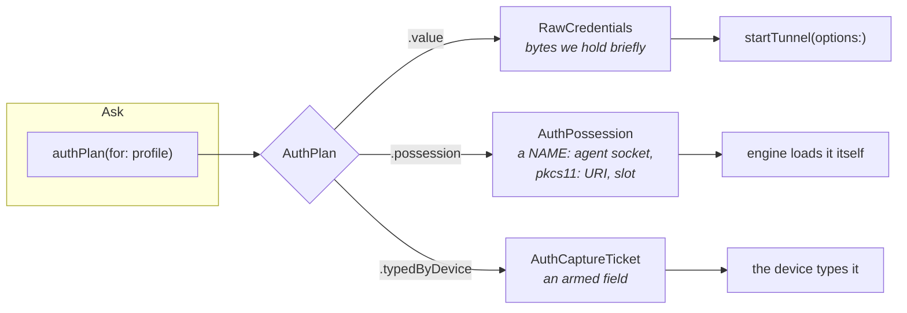
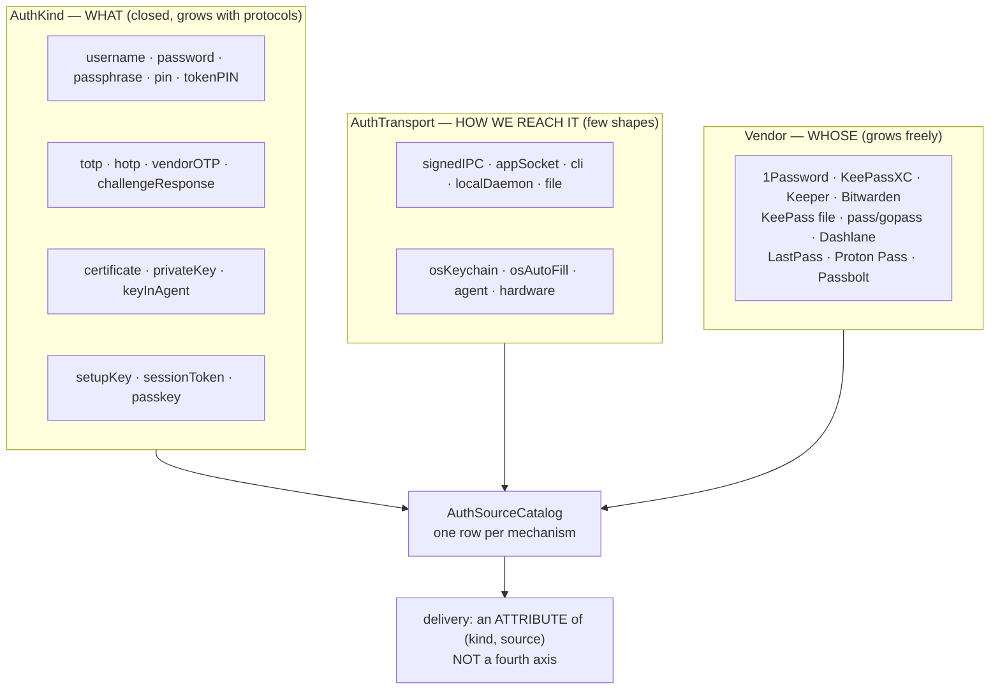
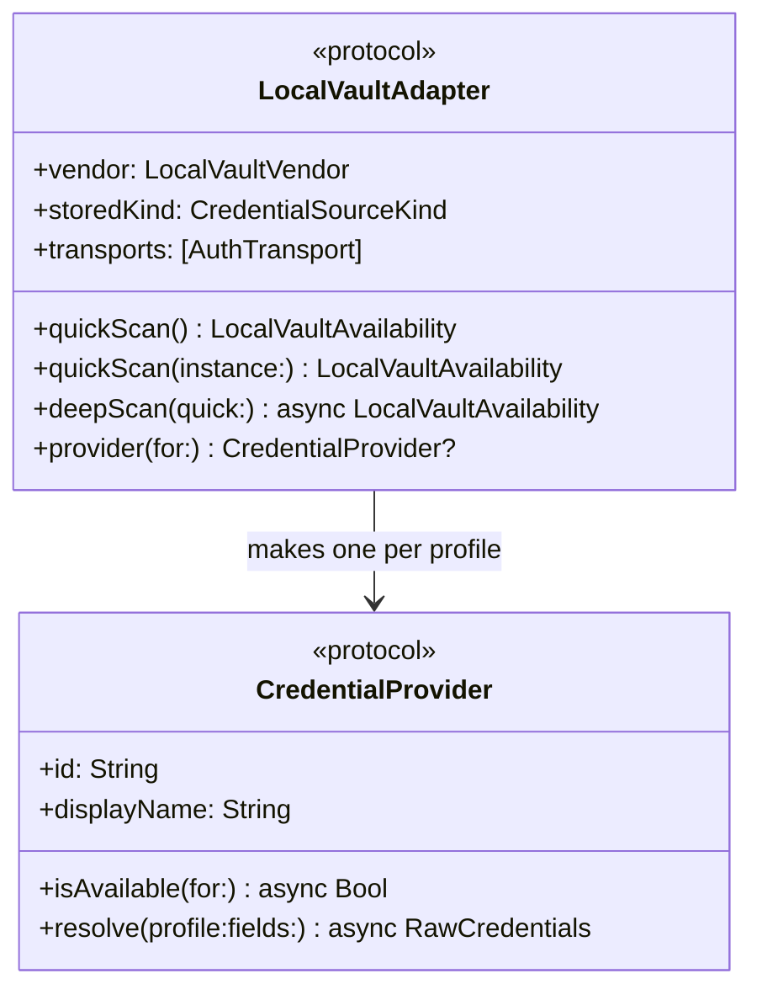
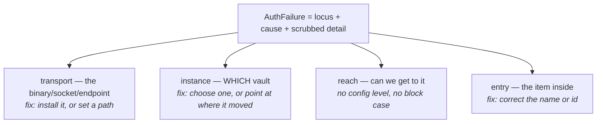
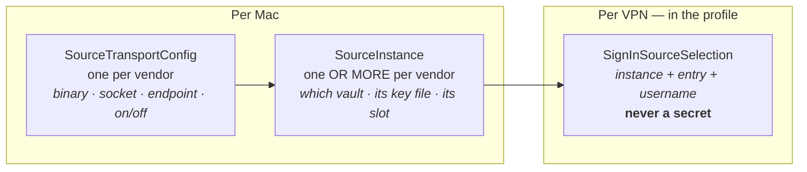
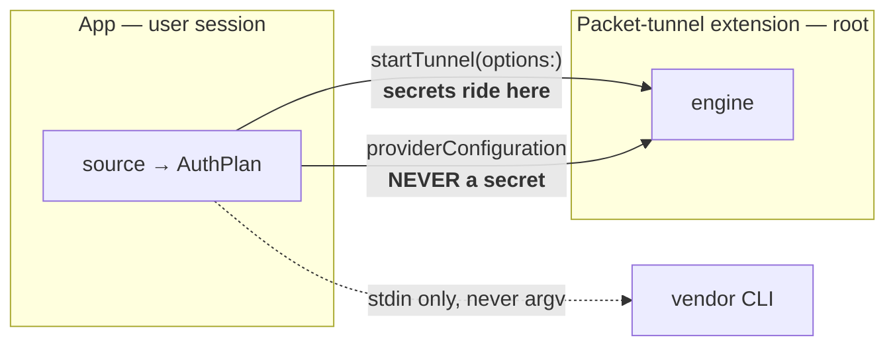

# How authentication is put together

Twelve sign-in sources and four hardware/OS mechanisms, behind one seam. This describes the
abstraction, then each concrete interface.

Naming follows `ONTOLOGY.md`. Vocabulary here is the code's; the user-facing words differ
deliberately (we say "password app", not "vendor adapter").

---

## The problem the shape solves

A naive design has one method — *give me the credentials* — returning bytes. That works for nine of
the sixteen mechanisms and cannot express the other seven at all:

- **The SSH agent never hands over a key.** It signs a challenge. The key stays in 1Password or the
  Secure Enclave.
- **A PKCS#11 token never hands over its key either.** `openconnect` loads the module itself; we pass
  a `pkcs11:` URI and a PIN.
- **A YubiKey in OTP mode types into the focused field.** Nothing is returned to anybody; the keyboard
  emits characters.

Forcing those outside the abstraction is what produced the special cases the abstraction existed to
remove. So the call returns a **plan**, not a secret.

`.possession` is the load-bearing case: the plan carries **a name, not a secret**, and the engine or
the agent does the cryptography. That is why the seam can hold a hardware token and a password
manager without either being a special case.

### Migration status — the vocabulary is complete, the routing is not

**`authPlan` returns only `.value` in production today.** Nothing constructs `.possession` or
`.typedByDevice` outside tests. So:

| | Through `authPlan` | Runs on its own path |
|---|---|---|
| The twelve password apps, typed, keychain, Touch ID keychain, Apple Passwords | ✅ | |
| SSH agent, PKCS#11 token, security key (OTP) | | ⚠️ expressible, not routed |
| OpenConnect SSO, Tailscale browser sign-in | | ❌ not modelled at all |

This was deliberate, not an oversight. The three non-`.value` mechanisms are executed correctly by
the code that owns the context — the engine's own configuration for a `pkcs11:` URI, the connect form
for a focused field, `SSHAgent` for a socket — and routing them through the controller would have
relocated working code for no behavioural gain. The value delivered was making them **expressible**,
which the exhaustive `switch` over `AuthPlan` now enforces: a fourth delivery cannot be added without
every consumer acknowledging it.

The consequence to hold: this is a complete **vocabulary** and a partial **implementation**. Anyone
reasoning about "all sources go through one seam" is right about the model and wrong about the call
graph. Finishing the routing is a real piece of work, worth doing when something needs it — a second
consumer of a plan, or a hardware source that must be selectable per profile — and not before.

`.conductedByEngine` is the shape SSO and Tailscale's browser sign-in would take, and is deliberately
absent: the engine authenticates and our role is to open a browser, so there is no credential to plan,
name or arm. **A case with no producer is a promise**, and the three above are already the most of
those this type should carry.

---

## Three axes, not a matrix

A source × type grid explodes because it treats *what* and *how* as jointly enumerated. They are not.

Adding a vendor adds **one row** and touches neither other axis. `AuthKind` grows only when a
protocol introduces a genuinely new kind of secret. The four transports that were always there but
unnamed — the OS keychain, system AutoFill, an agent socket, a hardware token — are named now, and
*that namelessness is why those four mechanisms used to sit outside the seam.*

Each catalogue row declares **supplies**, **proves**, and — deliberately — **withholds**. Apple
Passwords withholds `totp`: it holds verification codes and will not give them to another app. That
is a fact worth stating, not an omission to be discovered.

---

## The two protocols a vendor implements

**`quickScan` must be cheap, prompt-free and spawn nothing.** It runs on every settings refresh, so a
`stat` and a bundle lookup, never a subprocess. **`deepScan` may spawn** — and for several vendors it
honestly adds nothing, which the model can now say rather than implying a probe happened.

The split matters because several feeds arrived independently at the same rule: **check state first,
and refuse to spawn a fetch that could prompt.** `pass` (a pinentry that cannot draw), Dashlane (a
master-password prompt on stdin), LastPass (an expired agent) all found it separately. That
convergence is why it belongs in the seam rather than in each adapter.

---

## Where failure lives: four loci, not one error enum

Failure attribution **follows the configuration levels**. A missing binary is transport; a moved
database is instance; a renamed entry is entry. Different fixes, different owners — which is why a
flat error enum kept growing: it was mixing three vocabularies.

`.reach` deliberately has **no config level and no block case**. For a file, `stat` proves
readability. For a server, nothing short of a real sign-in proves anything — and that is an
authentication attempt against someone else's machine, spending their rate limiter. So there is
nothing to correct, and inventing a block would mean inventing the probe we refuse to run.
`AuthProbeCeiling` says which: `.checkOwedOnUse` (the check is coming) versus `.wouldSignInToServer` /
`.wouldPromptTheUser` / `.wouldSpendSingleUseCode` (it never will).

---

## Three configuration levels

Cardinality is a **fact about the vendor**, not a preference: one `bw` and one signed-in account, but
legitimately several `.kdbx` files or `pass` stores. A test asserts a single-instance vendor declares
no instance-level fields, so a meaningless one-row list cannot appear.

---

## The concrete mechanisms

| Mechanism | Transport | Supplies | Withholds | Delivery |
|---|---|---|---|---|
| Type it each time | — | everything typed | — | `.value` |
| Save in SimpleVPN | `osKeychain` | username, password, totp | — | `.value` |
| Save + Touch ID | `osKeychain` | username, password, totp | — | `.value` |
| Apple Passwords | `osAutoFill` | username, password | **totp** | `.value` |
| 1Password | `signedIPC` | username, password, totp | master password | `.value` |
| KeePassXC | `appSocket` | username, password, totp | database password | `.value` |
| Keeper | `localDaemon` → `cli` | username, password | master password | `.value` |
| Bitwarden | `localDaemon` (`bw serve`) | username, password, totp code | master password, session key | `.value` |
| KeePass file | `file` | username, password | totp | `.value` |
| pass / gopass | `file` (gpg) | username, password, totp code | GPG passphrase | `.value` |
| Dashlane | `cli` | username, password, totp seed | passkeys | `.value` |
| LastPass | `cli` | username, password | **totp — its tool has no field for one** | `.value` |
| Proton Pass | `cli` | username, password, totp code | passkeys | `.value` |
| Passbolt | `cli` | username, password, totp sometimes | the OpenPGP private key | `.value` |
| **SSH agent** | `agent` | — *(proves `keyInAgent`)* | the private key, always | **`.possession`** |
| **PKCS#11 token** | `hardware` | tokenPIN (stdin only) | the private key, always | **`.possession`** |
| **Security key (OTP)** | `hardware` | vendorOTP | slot secret, OATH seeds | **`.typedByDevice`** |

### The three that are not `.value`, and why each matters

**SSH agent.** `ssh_userauth_agent` asks the agent to sign. We never see a key, so 1Password's agent,
Secretive's Secure Enclave keys and hardware keys all work without us handling key material at all —
strictly better than reading a key *out* of a vault. One catch established by measurement: a
Dock-launched app inherits **macOS's own** ssh-agent, never the vendor socket a shell profile points
at, so the socket is an explicit setting.

**PKCS#11.** We pass a `pkcs11:` URI; `openconnect` loads the module. We never `dlopen` a provider —
the library-validation relaxation that needs is the one AMFI forbids for an app embedding a system
extension, so enumeration shells out instead, and **never logs in**, because filling a picker must
not spend a PIN counter whose exhaustion destroys the key.

**Security key, OTP mode.** The key is a USB keyboard; **focus management is the feature**. The plan
is an armed capture, and the single-use code lives in `SingleUseCode` — read-once, no getter, no
`Codable`, no `description`, asserted by test, because that is what keeps a code out of a log line.

---

## What crosses the process boundary

Two invariants, both test-enforced:

- **`providerConfiguration` carries no secret.** Tests grep the encoded blob. (This was *asserted*
  before it was *true*: inline `.ovpn` private keys were being stored, and are now stripped to the
  keychain — see the regression suite that fails if inlining returns.)
- **A secret going to a tool goes on stdin, never argv.** `argv` is world-readable through `ps`.
  `LocalToolRunner` provides the channel and never consults `PATH`.

---

## Adding a vendor

1. Look the concepts up in `ONTOLOGY.md` first — the naming decision precedes the code.
2. One `LocalVaultAdapter`, one `CredentialProvider`, one catalogue row, one copy block.
3. Declare cardinality with a reason. Declare `withholds` honestly.
4. `suppliesOTP` is a **promise** Connect relies on: false unless verified against a real vault.
   Being wrong costs a failed sign-in *and* a burned code, which some gateways count toward lockout.
5. Use `LocalToolRunner` and `ToolDiscovery`; never re-derive binary resolution.
6. Register maturity honestly. New means untested, and untested is not an insult.
