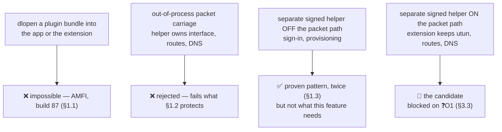
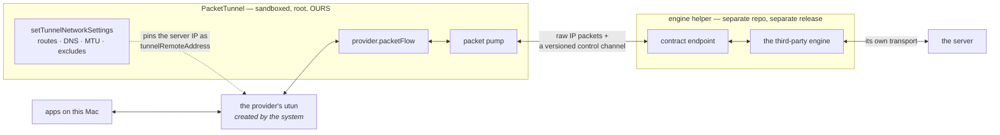

# Engine Extensibility — third-party VPN engines

Design doc, 2026-08-07. Status: **📐 DESIGNED / DEFERRED to a future release.**

**Nothing here is built and nothing here is scheduled work.** No mechanism, no loader, no
engine, no entitlement change, no new repository. This is a **decision record**: the
constraints were established from this repo's own code and history, the obvious designs were
evaluated against them, and the survivors are written down so the question does not have to be
re-derived. It is deliberately **not** a specification — that comes later, if at all.

Read `Docs/Networking.md` §2 and §3 first. The process boundaries and packet path recorded
there are the premises for everything below, and this document does not repeat them.

---

## The question

> "I'd rather build an extension mechanism so it's separate from the main app … the
> justification for the extension mechanism is **to allow other developers to add their own VPN
> types into SimpleVPN**."

The concrete case that prompted it — and the running example throughout — is **an obfuscated
WireGuard variant**: a third-party fork of `wireguard-go` that adds DPI-resistant framing
(junk packets, header randomisation, padding). It is a good example precisely because it looks
like it should be nearly free, given that this project already builds `wireguard-go`.

### Short answers

1. **A loadable-plugin mechanism inside the app or the packet-tunnel extension is impossible**
   on this platform. AMFI forbids the required entitlement on anything embedding a system
   extension, and this project has already shipped a notarized build that would not launch for
   exactly that reason (§1.1). This is not a trade-off to weigh; it is a wall.

2. **A separate signed helper process hosting the engine is architecturally sound, and the
   per-packet cost is survivable** (§3). It is blocked today on a single unverified platform
   question — whether the sandboxed packet-tunnel extension can reach *any* process outside
   itself (§3.3, ❓O1). That one question decides the feature and could not be answered without
   a notarization cycle.

3. **An obfuscated `wireguard-go` fork is NOT a modest delta on the engine we already build**
   (§2). This was expected to go the other way, and it is the most durable finding here.

4. **Trust is the hard part, not the plumbing** (§4). macOS lets us enforce *identity*, never
   *behaviour*. The honest recommendation is a narrow, consent-gated, Team-ID-pinned
   arrangement — **not** an open plugin ecosystem, which is a safety claim this architecture
   cannot stand behind (§4.5).

### Markers

✅ verified in this repo's code/docs, or from the upstream sources described · 📐 designed, not
built · ❓ open, stated with what would have been checked.

---

## 1. Constraints, established before designing anything

These were confirmed first because they had the power to decide the answer. Two of them did.

### 1.1 AMFI forbids the library-validation relaxation on this app ✅

`SimpleVPN/SimpleVPN.entitlements` carries the finding as a comment in the file it governs:

> NOTE (learned fatally): the app must NEVER carry hardened-runtime relaxation entitlements
> (e.g. `com.apple.security.cs.disable-library-validation`). AMFI kills any app embedding a
> System Extension that has one at launch: "Hardened Runtime relaxation entitlements
> disallowed on System Extensions" (**build 87 was dead on arrival this way**).

Corroborated in four other places, which is why it is treated as settled:

| Where | What it says |
|---|---|
| `AGENTS.md`, targets table | `OPNativeHelper` is "the **only** binary carrying the library-validation relaxation (AMFI forbids it on a sysext-embedding app) — **that is why it is a separate process at all**" |
| `Docs/AuthSecPKCS11.md` §"Obstacle 2" | "the **single relaxation AMFI refuses on a system-extension-embedding app** — SimpleVPN embeds `PacketTunnel`, so neither the app nor the extension may carry it" |
| `Docs/AuthArchitecture.md` | "we can never `dlopen` a provider ourselves: the library-validation relaxation that needs is the one AMFI forbids for an app embedding a system extension" |
| `Docs/AuthPwd1Password.md` | the cross-team dylib load is out-of-process for exactly this reason |

**Consequence, absolute:** `dlopen`ing a third-party engine **into the app or into the
packet-tunnel extension is not available**. Any design whose first step is "load the plugin
bundle" dies on this line, regardless of how the plugin is signed.

`Docs/AuthSecPKCS11.md` also forecloses the obvious escape hatch: linking a *loader* library
into the extension "changes the failure from *this binary built without support* to *could not
load the module*, and buys nothing. **Obstacle 2 is upstream of obstacle 1.**" That sentence
applies verbatim to an engine loader.

### 1.2 The rule about who owns the packet path ✅ — restated correctly

`Docs/Networking.md:391` states it compressed, in passing: "the rule that **sign-in may leave
the process while carrying traffic must not**."

Read literally, that forbids §3 outright. Read for what it protects, it does not — and the
distinction matters enough to record, because it was got wrong once in the course of this
design:

> **What the rule protects is that SimpleVPN owns the interface, the routes and the DNS.** The
> reason the subprocess `openconnect` path is unsatisfactory is *not* that it is a separate
> process. It is that `ocproxy -D <port>` hands back a **SOCKS listener on `127.0.0.1` with no
> interface, no routes and no DNS at all** — `Docs/Networking.md` §3.3 marks that row's
> local-network carve-out **inert** for precisely that reason.

A helper that receives IP packets and returns IP packets, while the extension keeps
`packetFlow`, `setTunnelNetworkSettings`, `includedRoutes`, `excludedRoutes` and `dnsSettings`,
**satisfies what the rule protects**. A helper that hands back a SOCKS port does not. That is
the test, and it is the test because upcoming work (PBR, the mediators) depends on the packet
path being ours.

### 1.3 The established extension pattern is a separate signed *executable* ✅

This codebase already extends itself out-of-process, twice, and both are whole executables
rather than loadable bundles:

| Helper | Entitlements | Why separate |
|---|---|---|
| `opnative-helper` (`OPNativeHelper`) | `disable-library-validation`, nothing else | it `dlopen`s a cross-team dylib; the app legally cannot |
| `ocauth-helper` (`OCAuthHelper`) | **"HARD POLICY: no entitlements, ever"** (`AGENTS.md`) | libopenconnect is statically linked and **dlopens nothing** |

`ocauth-helper` is the more instructive precedent, and its policy line does real work later:
**a helper that statically links its engine needs no entitlement at all** (§3.2).

### 1.4 The packet-tunnel extension is sandboxed, runs as root, and spawns nothing ✅

`PacketTunnel/PacketTunnel.entitlements` carries `com.apple.security.app-sandbox`,
`application-groups`, `network.client` and `network.server`. Three recorded consequences bear
directly on §3:

1. **It cannot open `PF_ROUTE`** — `SimpleVPN/Mediators/PFRouteMonitor.swift` and
   `Docs/Networking.md:1195`; that is why the route-drift monitor lives app-side.
2. **Forking a child is already refused here on these grounds.** `Docs/Networking.md:360`, on
   why a host-checker wrapper forces the subprocess path: "`openconnect_setup_csd` works by
   forking a child, and **the extension is sandboxed *and* root**".
3. **`Process()` appears zero times anywhere under `PacketTunnel/`** ✅ (grep). Every subprocess
   this app spawns is spawned by the **app**, which is unsandboxed.

The sandbox is not total: the extension does successfully write `/Library/Application
Support/SimpleVPN/tailscale/<profile>` at 0700, with a fallback whose comment reads "**the
sandbox profile, not root-ness, is what can refuse this path**"
(`PacketTunnelProvider.swift:846`). Filesystem reach exists but is uncharacterised.

### 1.5 Nothing crosses the app↔extension boundary except plists and strings ✅

`Docs/Networking.md` §2: **app → extension** is `startTunnel(options:)` (a dictionary) at start
and `handleAppMessage` (strings) while running; **extension → app** is only ever a reply, plus
`os_log` and `TunnelIncidentStore`. "The extension cannot push to the app at all." App-group
files and `UserDefaults` "do not cross the root/system-context ↔ user boundary".

**There is therefore no way to pass a file descriptor from the app to the extension.** This
constraint reshapes §3 more than any other, and it is the one most likely to be assumed away.

---

## 2. What an obfuscated `wireguard-go` fork actually costs ✅

Worth recording in full, because the intuition is wrong and the correction is durable
regardless of when — or whether — the work happens.

### 2.1 Our WireGuard engine is already built on a fork

`Vendor/tailscale-engine/src/wireguard.go` drives `device.NewDevice` + `device.IpcSet(uapi)`
from **`github.com/tailscale/wireguard-go`** — *Tailscale's* fork, pinned in
`Vendor/tailscale-engine/src/go.mod`. It is in the tree because Tailscale needs it; the plain
WireGuard kind rides along in the same Go c-archive, and the file says why: "two Go c-archives
cannot be linked into one binary, and `PacketTunnel` already links this one."

A DPI-resistant obfuscated variant is a **different, independent fork of the same upstream**
(`golang.zx2c4.com/wireguard`). Comparing the `device/` package of one such fork against
Tailscale's, file by file (sizes in bytes, from each project's source listing):

| File | Tailscale's fork | the obfuscated fork | Note |
|---|---:|---:|---|
| `uapi.go` | 11,740 | **22,542** | nearly double — where the obfuscation parameters are parsed |
| `noise-types.go` | 1,601 | **3,704** | more than double |
| `device.go` | **23,023** | 14,923 | Tailscale's own divergence, in the *other* direction |
| `allowedips.go` | **11,922** | 7,300 | ditto |
| `peer.go` | **10,908** | 7,598 | ditto |
| nine `obf*.go` files | absent | ~7,600 total | the obfuscation machinery |
| `aead_arm.go`, `deadlock_test.go`, `lookup_test.go`, `sessionstate_test.go` | present | absent | Tailscale-only |

Read the middle rows carefully. **Tailscale's fork is itself heavily diverged from upstream, in
several of the same files the obfuscated fork modifies.** There is no merge here and no "same
engine with a flag". Adopting one means carrying a **third lineage of the same codebase** in
the same product, with a third set of security updates to track.

> This reverses the hopeful case. It was expected that such a fork might be a small delta on an
> engine we already build, which would have made the extensibility question *less* urgent. It
> is not — which makes an out-of-tree engine the only shape that avoids a third `wireguard-go`
> in our build, and therefore makes the extensibility question **more** urgent.

### 2.2 What such a config carries beyond a `wg-quick` file

The obfuscation parameters arrive as additional **device-level** UAPI keys alongside the
standard ones. In the fork examined they fall into four groups:

| Group | Shape | What it does |
|---|---|---|
| junk packets | three uint32 (count, min size, max size) | send N junk datagrams of random size before the handshake |
| message padding | four uint32, one per message type | pad handshake-init / handshake-response / cookie / **transport** messages |
| header values | four ranges (`x-y` or a single value) | replace WireGuard's four plaintext message-type values |
| custom signature packets | five slots, each a small **tag language** (`<b>` bytes, `<t>` timestamp, `<r>` random, …) parsed into a chain applied in sequence | arbitrary decoy/prelude packets |

Newer revisions of that fork add three more classes, and these are the ones that matter
architecturally:

- a **32-byte header-protection cipher key** — the header transform becomes *cryptographic*;
- **content padding**, reaching into transport-message framing;
- **WireGuard's protocol timers made configurable** (rekey-after, rekey-timeout,
  reject-after, keepalive-timeout, max-handshake-attempts) — values that are `const` upstream.

**The attractive shortcut, and why it fails.** The *first* three groups look like a pure
transformation of the **outer UDP datagrams**: junk packets are separate datagrams, padding
prepends bytes to handshake packets, and the header values rewrite a plaintext 4-byte field.
If that were all of it, the whole feature could be a small **UDP relay** between our existing
plain-WireGuard engine and the server — no new engine, no new lineage, a few hundred lines.
The three newer classes close that door: a keyed header transform means reimplementing crypto,
transport padding means touching framing, and configurable timers change behaviour compiled in
as constants. Chasing that outside the device means tracking someone else's protocol revision
by revision.

❓**O2** — this is drawn from the UAPI key list and the obfuscation-chain structure, **not**
from reading `noise-protocol.go`/`send.go`/`receive.go` in full. If the relay shortcut is ever
re-litigated, that is the diff to read, and the answer may well differ for a config that uses
only the original three groups.

**Could `WireGuardConfig` carry these?** Mechanically yes, and cheaply —
`Shared/WireGuardConfig.swift` already round-trips a `wg-quick` file, and `renderWGUAPI`
already builds a UAPI string; optional fields would follow `OpenVPNOverrides`' invariant
("every field Optional, `nil` = engine default, never touched"). **But it must not.**
`tailscale/wireguard-go`'s `IpcSet` **rejects unknown keys**, so a `WireGuardConfig` carrying
them would be a config surface with no engine behind it — precisely the promise
`AuthPlan.swift` warns about. Those parameters belong to whatever runs that device, and travel
in that engine's own config.

### 2.3 Licensing a fork we would link ✅

`wireguard-go` and its forks are **MIT** ("Copyright (C) 2017-2025 WireGuard LLC"). SimpleVPN
is **GPL-3.0-only** (`LICENSE`, and the SPDX header on every source file). **MIT is compatible
with GPL-3.0** — MIT code may be combined into a GPL-3.0 work provided the notice is preserved.
That is the same relationship the tree already has with the MIT-licensed Go SDK credited in
`AboutView.swift`, and the acknowledgements surface is where such a component would be named.

Two cautions:

- A fork's **own dependency set** is not the parent's. The one examined pulls in transport and
  serialisation libraries the upstream does not. ❓**O3** — their licences were not checked,
  and a static link makes them ours to account for.
- **Nothing here bundles or installs a third-party tool.** That policy is unchanged and is not
  in tension with any of this: a helper built from source in a separate repository under the
  user's own account is not a vendor's shipped tool, and `AboutView.swift`'s standing sentence
  ("SimpleVPN never bundles or installs a vendor's tool") stays true.

### 2.4 Out of scope, permanently

Clients of this class typically also **provision servers** — standing up containers running
several protocols and handing back configurations. **SimpleVPN does not provision servers**,
has no account integration of any kind, and `SimpleVPN/Providers/VPNServiceProviders.swift`
exists to keep that honest ("a list saves typing, it never signs anyone in"). Scope here is
**consuming a configuration the user already has**, and nothing more.

---

## 3. Can an engine live outside the packet-tunnel extension?

Four shapes. One impossible, one rejected on merits, one real but off-target, one candidate.

### 3.1 Out-of-process packet carriage — evaluated, rejected 📐

The shape where the helper owns the interface, installs routes and configures DNS. **Rejected**,
and not for the per-packet cost:

- It fails §1.2 on the thing the rule actually protects. The mediators
  (`Docs/StateMediators.md`), the divert plan (`Docs/PolicyRouting.md`) and gateway arbitration
  (`Docs/Networking.md` §4–5) all assume a single owner, and that owner is us.
- It is the `ocproxy` failure mode with extra steps — see §1.2.
- It cannot work anyway: only the extension has `packetFlow`, and the utun is created by the
  system when `setTunnelNetworkSettings` succeeds. A helper cannot be handed it (§1.5).

Recorded rather than skipped, because it is the design people reach for first.

### 3.2 The candidate — extension keeps the interface, helper transforms packets 📐

Why this is the right shape if any shape works:

- **Routes, DNS and the interface stay entirely ours.** The helper never calls
  `setTunnelNetworkSettings`, never installs a route, never touches the resolver. §1.2 is
  satisfied on substance.
- **It is an increment on an existing boundary.** `Docs/Networking.md` §3.2 records that
  **`openvpn3` and `libopenconnect` never see a utun** — each holds one end of a
  `socketpair(AF_UNIX, SOCK_DGRAM)` while a pump copies between the other end and `packetFlow`.
  This moves that same seam across a process line.
- **No entitlement change, and no library validation anywhere.** Because the unit of extension
  is a **whole executable that statically links its engine**, not a loadable bundle,
  `disable-library-validation` is needed by **nobody**. This is `ocauth-helper`'s "no
  entitlements, ever" applied to the packet path — and it means **AMFI is not what blocks
  this**, which is the pleasant surprise of the whole exercise.
- **The helper may need no privilege at all** (§3.5).

### 3.3 What blocks it: the channel ❓**O1** — the decisive question

The assumption going in was "packets cross a socketpair". **They cannot, on this boundary.**

A socketpair is only shareable with a process you `fork`/`posix_spawn`. So:

| Who spawns the helper? | Can it hand over a socketpair? | Verdict |
|---|---|---|
| the **extension** | yes — *if it may spawn at all* | ❓ unverified |
| the **app** (unsandboxed; spawns everything else today) | to the helper yes; **to the extension no** — `startTunnel(options:)` is a plist, `handleAppMessage` is `Data`, and **no fd passing exists** (§1.5) | ❌ closed |

The design therefore reduces to one question:

> **Can a sandboxed `NEPacketTunnelProvider` system extension, running as root in the system
> context, either `posix_spawn` a helper outside its bundle, or `connect()` to a rendezvous
> that helper is listening on?**

What is known is suggestive and insufficient:

- `Process()` is used **nowhere** under `PacketTunnel/` ✅ — absence of use is not proof of
  denial.
- `Docs/Networking.md:360` refuses the CSD host-checker because forking a child from a
  "sandboxed *and* root" extension is unacceptable ✅ — but that sentence is doing double duty
  as a **security** judgement (running a vendor script as root) as much as a capability claim,
  and must not be read as a measured result.
- The extension **can** write under `/Library/Application Support/SimpleVPN/` ✅, so a
  unix-domain rendezvous at a system path is genuinely open.
- The extension holds `network.client` **and** `network.server` ✅, so a **loopback** rendezvous
  is the likeliest to survive the sandbox — and it is the worst outcome for trust. A socketpair
  is unforgeable and needs no authentication; a loopback port can be connected to, or raced
  for, by any local process. `ControlServer.swift` solves the analogous problem with
  "`chmod(path, 0o600)` — same-user only — **this IS the auth boundary**", and **that trick
  does not exist for a TCP port**. A loopback design needs a shared secret minted by the app
  and handed to both sides: more moving parts, weaker boundary.

**How to answer it:** one throwaway notarized build whose provider attempts, at `startTunnel`,
(a) `posix_spawn` of a bundled no-op, (b) `connect()` to an `AF_UNIX` socket under
`/Library/Application Support/SimpleVPN/`, (c) `connect()` to `127.0.0.1` — logging each
`errno`, then reading `log stream` plus Console's sandbox denials. That is one
`./Tools/build-notarize-install.sh` cycle, and it was not run here.

### 3.4 Per-packet cost — the strongest argument against, estimated honestly 📐

**What is added:** one extra process hop each way; every inner IP packet crosses the helper
boundary twice per round trip.

**What it is added to:** the boundary is **not new in kind**. `packetFlow` is already a
queue-and-copy between the kernel utun and our sysext, and the fd-shaped engines already copy
through a socketpair pump on top of that. The helper roughly **doubles an existing cost**
rather than introducing a novel one — the fair statement, in both directions.

Budgeting ~1–2 µs of syscall plus copy per crossing on Apple silicon, so ~2–4 µs added per
packet round trip:

| Throughput | Packets/s at 1500 B | Added CPU | Verdict |
|---:|---:|---:|---|
| 100 Mbps | ~8,300 | ~2–3% of a core | negligible |
| 1 Gbps | ~83,000 | **~17–33% of a core** | acceptable, noticeable |
| 2.5 Gbps | ~208,000 | ~40–80% of a core | marginal |
| 10 Gbps | ~830,000 | exceeds a core | **unacceptable** |

**It stops being acceptable around 1–2.5 Gbps sustained**, and sooner for small-packet
workloads where the ceiling is packets/s rather than bits/s. Batching amortises the syscall but
not the copy, and cannot be pushed far without adding latency to an interactive path.

**Judgement:** acceptable *for this class of feature* — DPI-resistant access on censored or
constrained links, where throughput sits well below the point where this bites. It would **not**
be acceptable as the path for the mainstream engines, and the design must never drift that way.

❓**O4** — every number above is budgeted, **not measured**. A loopback ping-pong benchmark at
64/512/1500 B is the check, and it should precede any commitment.

### 3.5 Privilege — the best property of the design 📐

If the extension owns the utun, the routes and the DNS, what does the helper need?

- **No root.** It creates no interface and installs no route. It runs as the user.
- **No entitlements.** It statically links its engine and `dlopen`s nothing — `ocauth-helper`
  exactly (§1.3).
- **Network access: yes — and that is the limit of the good news.** A full engine holds the
  real protocol session and speaks to the server itself, so it *must* reach the network. **An
  engine helper cannot be denied the network**; reaching the network is what an engine is for.

That bounds the security story and should be stated rather than glossed: the architecture can
make an engine helper **unprivileged**, but it cannot make it **non-exfiltrating**. A process
holding plaintext packets and a socket can, by construction, send them elsewhere (§4.4).

A *pure transformer* — an obfuscation layer with no server of its own — could be denied the
network and sandboxed hard, which would be a genuinely strong position. The motivating example
is not that (§2.2), so it does not get the benefit. ❓**O5** — whether a two-tier contract is
worth it (network-less transformers sandboxed hard; full engines not) was not worked through.

### 3.6 Supervision — a crashed helper mid-tunnel 📐

The worst failure available is a tunnel that reads "connected" and silently carries nothing.

- **Detection is free and must be mandatory.** Whatever the channel turns out to be, a dead
  helper closes its end and a read returns EOF — unambiguous and immediate. A liveness
  heartbeat on the control channel covers the hung-but-alive case, which EOF does not.
- **Fail the tunnel; do not paper over it.** The provider already tears down unconditionally on
  a fatal engine error and calls the completion handler. **No silent restart** — a restarted
  device has lost its session state and needs a fresh handshake anyway, so reconnect is both
  the honest and the correct behaviour.
- **Tell the user, in the vocabulary already used.** `TunnelIncidentStore` is the existing
  channel for "explain a failure that has already happened", and the incident must name the
  third-party helper and its developer: "your VPN dropped" and "the engine *someone else wrote*
  crashed" are different facts, and the user is entitled to the second.
- **The neither-crashed-nor-working case** is covered by machinery that already exists — the
  app "judges live link health passively from byte counters" (`AGENTS.md`).

**Supervision does not kill the design.** It is ordinary work and the primitives are all here.

---

## 4. Trust — the part that should worry us

The stated purpose is **to let other developers add VPN types**. So the honest framing is:
**code we did not write, processing the user's traffic in the clear.**

### 4.1 What a third-party engine can see, stated plainly

**It sees every packet the user sends and receives, decrypted.** Not metadata — the packets.
Every unencrypted request, every DNS query routed through the tunnel, the plaintext of anything
not independently encrypted, and the full traffic pattern of everything that is. For a
full-tunnel profile that is the user's entire network life for the duration.

That is not a footnote. It is the feature.

### 4.2 What macOS lets us **enforce** ✅ / ❓

Because the unit of extension is an executable rather than a dylib, the available checks are
code-signing checks on that binary:

| Requirement | Enforceable? | How |
|---|---|---|
| Signed at all / untampered | ✅ | `SecStaticCodeCheckValidity`; and on the *running* process via `SecCodeCopyGuestWithAttributes` |
| **A specific Team ID** | ✅ | requirement string — `anchor apple generic and certificate leaf[subject.OU] = "<TEAMID>"` |
| Developer ID (not ad-hoc, not self-signed) | ✅ | same mechanism, plus the Developer ID CA marker OID |
| Hardened runtime enabled | ✅ | signature flags |
| Notarized | ✅ *with care* | ticket is checkable via Gatekeeper/`SecAssessment`. ❓**O6** — which API suits a non-quarantined helper we launch ourselves, and **whether it works offline**, is unestablished. This matters: a VPN client must work when the network doesn't |
| Which identities are acceptable | ✅ | it is our list |
| **That it behaves** | ❌ | nothing in code signing constrains behaviour |
| **That it does not exfiltrate** | ❌ | §3.5 — an engine needs the network by definition |

**The load-bearing distinction:** signing establishes **who** wrote it and that it has not been
altered. It says **nothing about what it does**. Identity is accountability, not containment.
Any design leaning on "it's signed" as a *safety* argument is leaning on the wrong thing.

❓**O7** — whether the sandboxed extension can perform these `SecCode` checks and read the
helper's binary to do so is unverified, and entangled with ❓O1.

### 4.3 Consent — what the user must see and agree to 📐

Installing a third-party VPN engine is more consequential than adding a password source. This
tree's existing rule — permissions and lookups opt-in, off by default, requested only on toggle
— applies with more force, not less.

1. **Never a side effect of importing a configuration.** Opening a config file must never
   install, enable, or one-click-offer an engine. The two acts stay separate, always. This is
   the most important rule here, because "import a config, get an engine" is exactly how this
   goes wrong.
2. **Explicit, informed consent naming the developer** — identity and Team ID **as read from
   the signature**, never as claimed by the helper's own metadata. The sentence must say what
   §4.1 says.
3. **Revocable, and revocation must bite** — stop the helper and refuse to start it, not merely
   hide a row.
4. **Marked third-party in every surface** — profile row, editor, traffic log, diagnostics
   bundle. A user must never have to remember which engines are ours.
5. **Maturity registered honestly.** `FeatureMaturityRegistry` has exactly the right vocabulary
   (`.tested` / `.partlyVerified(checked:)` / `.untested`, with badge, symbol *and* word so
   colour is never the only carrier). A third-party engine is `.untested` by us, permanently.
   ❓**O8** — the registry is keyed by `VPNKind`, a closed enum with a totality test; how a
   third-party kind registers at all is unresolved.
6. **`ONTOLOGY.md` needs a row first.** There is no agreed noun for "the thing another developer
   writes", and "extension", "plugin", "engine" and "backend" are all already loaded here —
   "extension" especially, where it means the system extension. ❓**O9**.

### 4.4 Blast radius — claiming no more than the design earns

| Failure | Prevented? | Detected? | Notes |
|---|---|---|---|
| Helper crashes | no | ✅ immediately | EOF; fails closed; incident names the developer |
| Helper hangs, passes nothing | no | ✅ | heartbeat + passive byte-counter health |
| Silently drops *some* traffic | no | ⚠️ partially | hard to distinguish from a bad network |
| Corrupts packets | no | ⚠️ partially | shows up as a broken tunnel, not a security event |
| **Exfiltrates the user's traffic** | ❌ **no** | ❌ **no** | holds plaintext and a socket. **The architecture cannot prevent or detect this** |
| Tampers with routes/DNS | ✅ **yes** | ✅ | it has no route or DNS API; the extension owns `setTunnelNetworkSettings`. **This is the design's real security win** |
| Escalates privilege | ✅ mostly | — | unprivileged, no entitlements, no root (§3.5) |
| Loads a malicious dylib | ✅ **yes** | — | nobody carries `disable-library-validation` in this design |
| A local process impersonates the helper | depends on ❓O1 | — | a socketpair makes it impossible; **a loopback port does not** (§3.3) |

**Exfiltration is the one that cannot be mitigated**, and no amount of signing changes it.

### 4.5 Recommendation — what I would ship, and what I would refuse

**Refuse:** an open plugin ecosystem. Anything the user can drop in a folder; any "install this
engine" flow reachable from a config import or a URL; any design whose answer to "can this
engine see my traffic?" is a shrug. The exfiltration row makes an open ecosystem a promise we
cannot keep, and a VPN client that loads arbitrary traffic-handling code is making a safety
claim it cannot stand behind.

**Ship, if anything — the narrow version:**

- a **Team-ID allow-list we control**, checked at **every launch**, not once at install;
- **Developer ID + hardened runtime + notarization** required (subject to ❓O6 — if it cannot
  be checked offline it cannot be a hard gate, and that must be *stated*, not fudged);
- **off by default, per-engine**, behind the §4.3 consent sheet naming the developer;
- **marked third-party everywhere**, permanently `.untested` by us;
- a **published contract** (§5) implementable without reading our source — which is what makes
  a first out-of-tree engine a *proof* rather than a special case.

Stated plainly for whoever reads this next: **this is "we decide what loads", not "third-party
plugins".** Those are different features, and the difference must never be blurred in the UI or
in how the feature is described. If the intent is genuinely the open version, the honest answer
is that this architecture does not make it safe, and the answer should be no.

---

## 5. The cross-boundary contract — sketch only 📐

Full specification is explicitly deferred. What follows is the shape and the two hazards.

### 5.1 The dead-code objection, and how it is answered

The standing rule against adding a loader "for later" applies. The answer is not "the mechanism
is nice to have", it is:

> **The mechanism lands together with a consumer that exercises it end to end, plus a test
> double in-tree that pins the wire format.**

The precedent is exact: **`ControlSurface.swift`** is "commands/queries/events as pure data;
**the wire format is a public contract pinned by `ControlSurfaceTests`**", consumed
out-of-process by the `simplevpn` CLI. Same shape — a published contract, a consumer that is
not the app, tests holding our half honest. An out-of-tree producer is a real producer.

### 5.2 Framing — the hazard this section exists to carry

`Docs/Networking.md` §3.2 records that **our two existing socketpair users already disagree**:
`openvpn3`'s fd is framed like a real utun (a 4-byte big-endian address-family prefix, both
directions), while `libopenconnect`'s carries **raw IP with no prefix**, inferring the family
from the IP version nibble. The OpenConnect bridge carries an explicit note that if that ever
changes, **the read and write must change together**.

That is one inconsistency, inside one repository, between two engines written by the same
people. Across many repositories and many authors it is a certainty unless nailed down. So the
contract must state, normatively and once:

- **raw IP packets, no address-family prefix, both directions** — matching the Go/netstack
  engines (`WGPacketIn`/`WGSetCallbacks`), which is already the majority convention here;
- **one packet per message with an explicit length**, so framing never depends on
  datagram-boundary preservation (which varies by channel type, and the channel is undecided);
- **a maximum packet size**, echoing `maxPacketSize` in the Go shim;
- **a worked hex example.** A contract without one gets implemented two ways.

### 5.3 Everything else, in outline

Model it on `WGStart` / `WGStop` / `WGStatus` in `Vendor/tailscale-engine/src/wireguard.go` — a
good contract, already proven across a language boundary:

- **Handshake before any packet**: contract version + helper identity.
- **Version mismatch is a refusal naming both versions**, never best-effort. A silent mismatch
  in a packet path is the worst outcome available.
- **Config**: one JSON object, engine-defined, opaque to SimpleVPN — *not* `WireGuardConfig`
  (§2.2). Secrets ride in memory as `startTunnel(options:)` does it; never
  `providerConfiguration`, never disk, never logs.
- **Start reply** `{ok, endpoint}` or `{error:{kind,message}}` with an **enumerated** kind set
  so failures are classified without string-matching (`WGStart`'s
  `badRequest | alreadyRunning | endpoint | engine | other` is the model). The **resolved
  endpoint** must come back, because it becomes `tunnelRemoteAddress` — the literal address NE
  uses to route the tunnel's own traffic *around* the tunnel (`Docs/Networking.md` §3.1 calls
  this out as load-bearing).
- **Status**: a **strict whitelist** payload. `parseWGIpcStatus`'s comment says why — it is
  "the one place that guarantees" key material never crosses.
- **Teardown**: idempotent stop; **EOF authoritative** in both directions.
- **Logging**: relayed to `os_log`, tagged third-party, never trusted as UI copy.

### 5.4 Absence is the ordinary state 📐

Almost nobody will have a helper installed, and that must be **quiet**: no error, no nag, no
dead button, no empty list with an apology. The tree's own idiom is **absence, never a disabled
item** (`AGENTS.md`, on export formats: "Absence, never a disabled item, for a format that can
never exist"). An uninstalled engine's kind simply is not offered.

The one case that must speak is a **profile referring to a missing engine**, because the user
made that deliberately. It gets the `SettingNeeds` / `toolOnlyCaveat` treatment already used
for an uninstalled subprocess tool: a specific sentence, on that profile, at connect time — not
a global banner.

---

## 6. Open questions ❓

| # | Question | How to answer it |
|---|---|---|
| **O1** | **Can the sandboxed extension `posix_spawn`, or `connect()` to a unix socket outside its container, or to loopback?** *This decides the feature* (§3.3) | one throwaway notarized build logging `errno` for all three, plus Console sandbox denials |
| **O2** | Is the outer-UDP-relay shortcut really dead, or only for the newer revisions? (§2.2) | read `noise-protocol.go` / `send.go` / `receive.go` in the fork; check whether an original-parameters-only config is transformable outside the device |
| **O3** | Licences of the fork's *own* dependencies (§2.3) | read each `LICENSE`; a static link makes them ours to acknowledge |
| **O4** | §3.4's cost numbers are budgeted, **not measured** | loopback ping-pong benchmark at 64/512/1500 B |
| **O5** | Is a two-tier contract worth it — network-less transformers sandboxed hard, full engines not? (§3.5) | design; depends on whether any plausible consumer is a pure transformer |
| **O6** | Can notarization be verified **offline** for a helper we launch ourselves? (§4.2) | `SecAssessment` with the network down; if not, it cannot be a hard gate |
| **O7** | Can the sandboxed extension perform `SecCode` checks and read the helper's binary? (§4.2) | same build as O1 |
| **O8** | How does a third-party kind register in `FeatureMaturityRegistry`, keyed by the closed `VPNKind` enum with a totality test? (§4.3) | design; touches `VPNKind`, the editors, `SettingSurface`, `ManualAnchorParityTests` |
| **O9** | **What is this thing called?** `ONTOLOGY.md` needs a row; the obvious words are all taken (§4.3) | settle **before** publishing a contract — the contract fixes the vocabulary |
| **O10** | Everything downstream of a third-party kind: global `SettingSurface` namespaces, two-way manual-anchor parity, MDM policy, CLI addressing | not started; plausibly comparable in size to the mechanism itself |

---

## 7. Decisions

| Decision | Status |
|---|---|
| `dlopen` a third-party engine into the app or the extension | ❌ **impossible** — AMFI; build 87; four corroborating records (§1.1) |
| Out-of-process packet *carriage* (helper owns routes/DNS) | ❌ **rejected** — fails what §1.2 protects; the `ocproxy` failure mode |
| Statically linking an obfuscated `wireguard-go` fork into `libtsengine.a` | ❌ it would mean a **third `wireguard-go` lineage** in one product (§2.1) |
| Carrying such a fork's parameters in `WireGuardConfig` | ❌ **no** — `IpcSet` rejects them; a config surface with no engine behind it (§2.2) |
| A separate signed helper **off** the packet path | ✅ **proven pattern**, twice (§1.3) — not what this feature needs |
| A separate signed helper **on** the packet path, extension keeping utun/routes/DNS | 📐 **the candidate.** Not blocked by AMFI, not blocked by cost — **blocked on ❓O1** (§3) |
| An **open** third-party plugin ecosystem | ❌ **would refuse** — exfiltration can be neither prevented nor detected (§4.4–4.5) |
| A **Team-ID allow-list we control**, consent-gated, marked third-party | 📐 the narrow version, and the only recommendable one (§4.5) |
| Licence compatibility for linking an MIT `wireguard-go` fork into this GPL-3.0-only work | ✅ **compatible** (§2.3) |
| Server provisioning | ❌ **out of scope**, permanently (§2.4) |

**If ❓O1 comes back negative — the extension can reach nothing outside itself — the mechanism
is not viable at all, and third-party engines are not supportable on this platform under the
current entitlement set.** That would be a legitimate answer rather than a failure, and it is
the single thing worth checking first.
