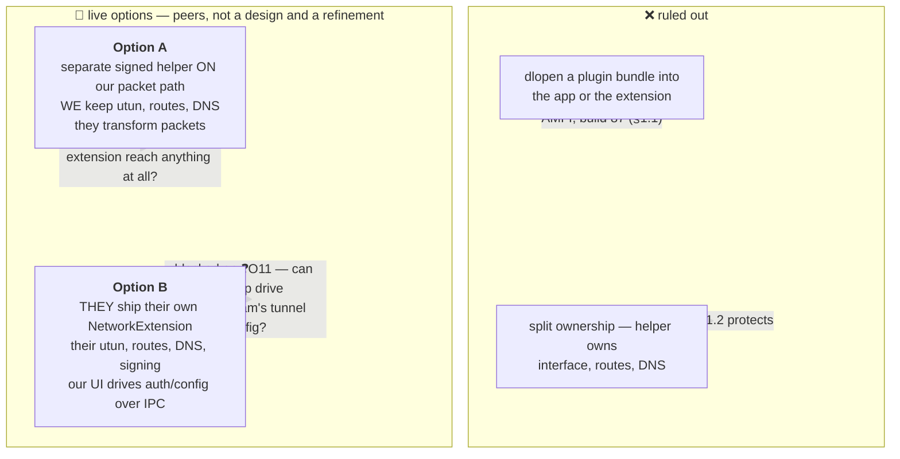
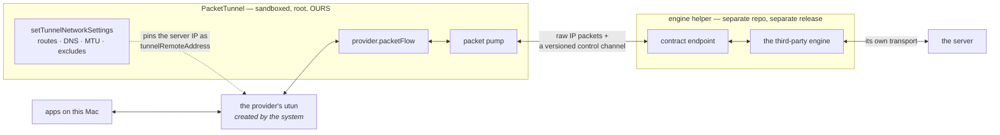
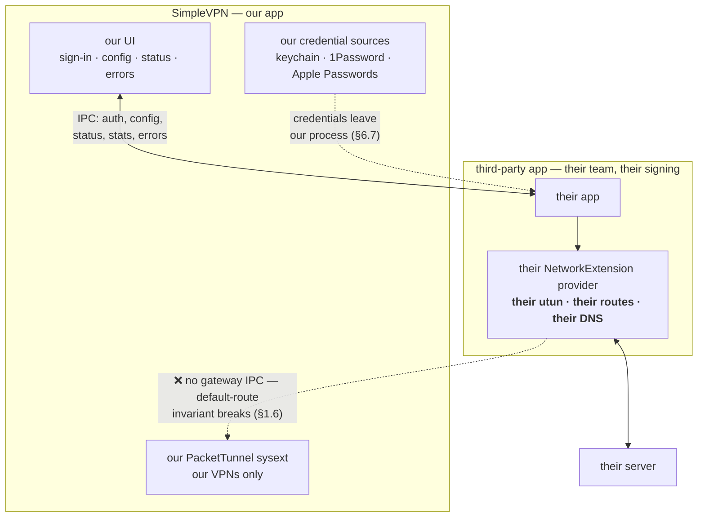

# Engine Extensibility — third-party VPN engines

Design doc, 2026-08-07. Status: **📐 DESIGNED / DEFERRED to a future release.**

**Nothing here is built and nothing here is scheduled work.** No mechanism, no loader, no
engine, no entitlement change, no new repository. This is a **decision record**: the
constraints were established from this repo's own code and history, the plausible designs were
evaluated against them, and the survivors are written down so the question does not have to be
re-derived. It is deliberately **not** a specification.

Read `Docs/Networking.md` §2 and §3 first. The process boundaries and packet path recorded
there are the premises for everything below, and this document does not repeat them.

---

## Prerequisite — a threat model, and it does not exist yet ⏸

**A threat model analysis is a gate on building any of this, not a companion to building it.** The
user has deliberately deferred both, in that order:

> "anyway, largely academic for now, we need to spend time writing a TMA and I don't want to do
> that before the next release"

This is written down rather than left as an aside because the document below now carries two
worked options, a trust model and a mechanism sketch — which is exactly the shape of thing a later
reader mistakes for a plan ready to implement. **It is not one. Everything here is 📐 or ❓.**

The record already names three of the questions such an analysis would have to resolve, and all
three are acceptability judgements about risk rather than engineering problems waiting to be
solved — which is precisely why the gate sits where it does:

- **Exfiltration can be neither prevented nor detected**, because an engine holds plaintext and a
  socket by definition (§4.5, §6.5).
- **macOS lets us enforce identity, never behaviour** (§6.3).
- **Under Option B, credentials cross into another developer's process**, and nothing constrains
  what happens to them afterwards (§6.7).

Until those have been answered deliberately, nothing below should be started.

---

## The question

> "I'd rather build an extension mechanism so it's separate from the main app … the
> justification for the extension mechanism is **to allow other developers to add their own VPN
> types into SimpleVPN**."

and, later, an alternative shape for the same goal:

> "things to think through in the future — throughput cost, if we could **let a 3rd party make
> their own vpn network extension and then IPC to our UI for auth/config/etc**. a lot to think
> of but all for later."

Those are two genuinely different architectures, not a design and a refinement. They are
recorded here as **Option A** and **Option B**, as peers (§3).

The concrete case that prompted the question — and the running example — is **an obfuscated
WireGuard variant**: a third-party fork of `wireguard-go` adding DPI-resistant framing (junk
packets, header randomisation, padding). It is a good example precisely because it looks like
it should be nearly free, given this project already builds `wireguard-go`.

### Short answers

1. **A loadable-plugin mechanism inside the app or the packet-tunnel extension is impossible.**
   AMFI forbids the required entitlement on anything embedding a system extension, and this
   project already shipped a notarized build that would not launch for exactly that reason
   (§1.1). Not a trade-off — a wall. Both options below are shaped by routing around it.

2. **Option A** — a separate signed helper on our packet path — is architecturally sound and
   its per-packet cost is survivable, but it is blocked on one unverified platform question:
   whether the sandboxed extension can reach *any* process outside itself (§4.3, ❓O1).

3. **Option B** — the third party ships their own NetworkExtension provider and uses our UI for
   sign-in and configuration — **eliminates** the per-packet cost, the AMFI question and the
   supervision problem outright. It pays for that by **giving up our routing model for their
   VPNs** (§5.3), and it has its own likely blocker: our app probably cannot drive another
   developer's tunnel configuration at all (§5.4, ❓O11).

4. **An obfuscated `wireguard-go` fork is NOT a modest delta on the engine we already build**
   (§2). This was expected to go the other way, and it is the most durable finding here.

5. **Trust is the hard part in both options** (§6) — it does not disappear in B, it *moves*,
   from "what code do we host" to "who holds the user's credentials".

### Markers

✅ verified in this repo's code/docs, or from the upstream sources described · 📐 designed, not
built · ❓ open, stated with what would have been checked.

---

## 1. Constraints, established before designing anything

### 1.1 AMFI forbids the library-validation relaxation on this app ✅

`SimpleVPN/SimpleVPN.entitlements` carries the finding as a comment in the file it governs:

> NOTE (learned fatally): the app must NEVER carry hardened-runtime relaxation entitlements
> (e.g. `com.apple.security.cs.disable-library-validation`). AMFI kills any app embedding a
> System Extension that has one at launch: "Hardened Runtime relaxation entitlements
> disallowed on System Extensions" (**build 87 was dead on arrival this way**).

Corroborated in four other places, which is why it is settled:

| Where | What it says |
|---|---|
| `AGENTS.md`, targets table | `OPNativeHelper` is "the **only** binary carrying the library-validation relaxation (AMFI forbids it on a sysext-embedding app) — **that is why it is a separate process at all**" |
| `Docs/AuthSecPKCS11.md` §"Obstacle 2" | "the **single relaxation AMFI refuses on a system-extension-embedding app** — SimpleVPN embeds `PacketTunnel`, so neither the app nor the extension may carry it" |
| `Docs/AuthArchitecture.md` | "we can never `dlopen` a provider ourselves: the library-validation relaxation that needs is the one AMFI forbids for an app embedding a system extension" |
| `Docs/AuthPwd1Password.md` | the cross-team dylib load is out-of-process for exactly this reason |

**Consequence, absolute:** `dlopen`ing a third-party engine **into the app or into the
packet-tunnel extension is not available**. Any design beginning "load the plugin bundle" dies
here, regardless of how the plugin is signed.

`Docs/AuthSecPKCS11.md` forecloses the escape hatch too: linking a *loader* library into the
extension "changes the failure from *this binary built without support* to *could not load the
module*, and buys nothing. **Obstacle 2 is upstream of obstacle 1.**" That applies verbatim to
an engine loader.

### 1.2 The rule about who owns the packet path ✅ — restated correctly

`Docs/Networking.md:391` states it compressed, in passing: "the rule that **sign-in may leave
the process while carrying traffic must not**."

Read literally, that forbids Option A outright. Read for what it protects, it does not — and
the distinction matters enough to record, because it was got wrong once in the course of this
design:

> **What the rule protects is that SimpleVPN owns the interface, the routes and the DNS.** The
> reason the subprocess `openconnect` path is unsatisfactory is *not* that it is a separate
> process. It is that `ocproxy -D <port>` hands back a **SOCKS listener on `127.0.0.1` with no
> interface, no routes and no DNS at all** — `Docs/Networking.md` §3.3 marks that row's
> local-network carve-out **inert** for precisely that reason.

A helper that receives IP packets and returns IP packets, while the extension keeps
`packetFlow`, `setTunnelNetworkSettings`, `includedRoutes`, `excludedRoutes` and `dnsSettings`,
**satisfies what the rule protects**. A helper that hands back a SOCKS port does not.

**Option B does not satisfy it, and does not try to** — it hands the whole interface to someone
else. That is the trade, stated in §5.3 rather than hidden.

### 1.3 The established extension pattern is a separate signed *executable* ✅

| Helper | Entitlements | Why separate |
|---|---|---|
| `opnative-helper` (`OPNativeHelper`) | `disable-library-validation`, nothing else | it `dlopen`s a cross-team dylib; the app legally cannot |
| `ocauth-helper` (`OCAuthHelper`) | **"HARD POLICY: no entitlements, ever"** (`AGENTS.md`) | libopenconnect is statically linked and **dlopens nothing** |

`ocauth-helper` is the instructive precedent, and its policy line does real work in §4.2: **a
helper that statically links its engine needs no entitlement at all.**

### 1.4 The packet-tunnel extension is sandboxed, runs as root, and spawns nothing ✅

`PacketTunnel/PacketTunnel.entitlements` carries `com.apple.security.app-sandbox`,
`application-groups`, `network.client` and `network.server`. Three recorded consequences bear
on Option A:

1. **It cannot open `PF_ROUTE`** — `SimpleVPN/Mediators/PFRouteMonitor.swift` and
   `Docs/Networking.md:1195`; that is why the route-drift monitor lives app-side.
2. **Forking a child is already refused here on these grounds.** `Docs/Networking.md:360`:
   "`openconnect_setup_csd` works by forking a child, and **the extension is sandboxed *and*
   root**".
3. **`Process()` appears zero times anywhere under `PacketTunnel/`** ✅ (grep). Every subprocess
   this app spawns is spawned by the **app**, which is unsandboxed.

The sandbox is not total: the extension does write `/Library/Application
Support/SimpleVPN/tailscale/<profile>` at 0700, with a fallback commented "**the sandbox
profile, not root-ness, is what can refuse this path**" (`PacketTunnelProvider.swift:846`).
Filesystem reach exists but is uncharacterised.

### 1.5 Nothing crosses the app↔extension boundary except plists and strings ✅

`Docs/Networking.md` §2: **app → extension** is `startTunnel(options:)` (a dictionary) and
`handleAppMessage` (strings); **extension → app** is only ever a reply, plus `os_log` and
`TunnelIncidentStore`. "The extension cannot push to the app at all." App-group files and
`UserDefaults` "do not cross the root/system-context ↔ user boundary".

**There is therefore no way to pass a file descriptor from the app to the extension.** This
reshapes Option A more than any other constraint, and it is the one most likely to be assumed
away.

### 1.6 macOS will not arbitrate two tunnels over the default route ✅

Directly load-bearing for Option B, and already settled in this tree.
`Docs/Networking.md` §5.3, on `Docs/PolicyRouting.md` tier 2:

> "argues that two NE tunnels fighting over `0.0.0.0/0` is something **macOS will not
> arbitrate** … The shipped implementation … several ordinary NE tunnels run in parallel, the
> routing table merges their routes by specificity, and **the app guarantees that at most one
> of them advertises a default route by demoting the others live**."

The mechanism is `MultiTunnelRealizer` — **per-tunnel gateway IPC**. We keep that invariant
only because every tunnel is ours and answers our `gateway:full` / `gateway:split` messages.
**We have no such IPC into another developer's extension** (§5.3).

---

## 2. What an obfuscated `wireguard-go` fork actually costs ✅

Recorded in full because the intuition is wrong and the correction is durable regardless of
which option — if either — is ever built.

### 2.1 Our WireGuard engine is already built on a fork

`Vendor/tailscale-engine/src/wireguard.go` drives `device.NewDevice` + `device.IpcSet(uapi)`
from **`github.com/tailscale/wireguard-go`** — *Tailscale's* fork, pinned in
`Vendor/tailscale-engine/src/go.mod`. It is in the tree because Tailscale needs it; the plain
WireGuard kind rides along in the same Go c-archive, and the file says why: "two Go c-archives
cannot be linked into one binary, and `PacketTunnel` already links this one."

A DPI-resistant variant is a **different, independent fork of the same upstream**
(`golang.zx2c4.com/wireguard`). Comparing the `device/` package of one such fork against
Tailscale's, file by file (sizes in bytes, from each project's source listing):

| File | Tailscale's fork | the obfuscated fork | Note |
|---|---:|---:|---|
| `uapi.go` | 11,740 | **22,542** | nearly double — where the obfuscation parameters are parsed |
| `noise-types.go` | 1,601 | **3,704** | more than double |
| `device.go` | **23,023** | 14,923 | Tailscale's own divergence, in the *other* direction |
| `allowedips.go` | **11,922** | 7,300 | ditto |
| `peer.go` | **10,908** | 7,598 | ditto |
| nine `obf*.go` files | absent | ~7,600 total | the obfuscation machinery |
| `aead_arm.go`, `deadlock_test.go`, `lookup_test.go`, `sessionstate_test.go` | present | absent | Tailscale-only |

Read the middle rows carefully. **Tailscale's fork is itself heavily diverged from upstream, in
several of the same files the obfuscated fork modifies.** No merge, and no "same engine with a
flag". Adopting one means a **third lineage of the same codebase** in one product, with a third
set of security updates to track.

> This reverses the hopeful case. Such a fork was expected to be a small delta on an engine we
> already build, which would have made extensibility *less* urgent. It is not — which makes an
> out-of-tree engine the only shape that avoids a third `wireguard-go` in our build, and
> therefore makes the extensibility question **more** urgent.

### 2.2 What such a config carries beyond a `wg-quick` file

Obfuscation parameters arrive as additional **device-level** UAPI keys beside the standard ones.
In the fork examined, four groups:

| Group | Shape | What it does |
|---|---|---|
| junk packets | three uint32 (count, min, max) | send N junk datagrams of random size before the handshake |
| message padding | four uint32, one per message type | pad handshake-init / response / cookie / **transport** messages |
| header values | four ranges (`x-y` or single) | replace WireGuard's four plaintext message-type values |
| custom signature packets | five slots, each a small **tag language** (`<b>` bytes, `<t>` timestamp, `<r>` random, …) parsed into a chain applied in sequence | arbitrary decoy/prelude packets |

Newer revisions add three more classes, and these are the architecturally decisive ones:

- a **32-byte header-protection cipher key** — the header transform becomes *cryptographic*;
- **content padding**, reaching into transport-message framing;
- **WireGuard's protocol timers made configurable** (rekey-after, rekey-timeout, reject-after,
  keepalive-timeout, max-handshake-attempts) — `const` upstream.

**The attractive shortcut, and why it fails.** The first three groups look like a pure
transformation of the **outer UDP datagrams**: junk packets are separate datagrams, padding
prepends bytes to handshake packets, header values rewrite a plaintext 4-byte field. If that
were all, the feature could be a small **UDP relay** between our existing plain-WireGuard
engine and the server — no new engine, no new lineage, a few hundred lines. The three newer
classes close that door: a keyed header transform means reimplementing crypto, transport
padding means touching framing, configurable timers change behaviour compiled in as constants.
Chasing it outside the device means tracking someone else's protocol revision by revision.

❓**O2** — drawn from the UAPI key list and the obfuscation-chain structure, **not** from
reading `noise-protocol.go` / `send.go` / `receive.go` in full. That is the diff to read if the
relay shortcut is ever re-litigated, and the answer may differ for a config using only the
original three groups.

**Could `WireGuardConfig` carry these?** Mechanically yes and cheaply — `Shared/WireGuardConfig.swift`
already round-trips a `wg-quick` file and `renderWGUAPI` already builds a UAPI string; optional
fields would follow `OpenVPNOverrides`' invariant ("every field Optional, `nil` = engine
default, never touched"). **But it must not.** `tailscale/wireguard-go`'s `IpcSet` **rejects
unknown keys**, so a `WireGuardConfig` carrying them is a config surface with no engine behind
it — precisely the promise `AuthPlan.swift` warns about.

### 2.3 Licensing a fork we would link ✅

`wireguard-go` and its forks are **MIT** ("Copyright (C) 2017-2025 WireGuard LLC"). SimpleVPN
is **GPL-3.0-only** (`LICENSE`, and the SPDX header on every source file). **MIT is compatible
with GPL-3.0** — MIT code may be combined into a GPL-3.0 work provided the notice is preserved.
Same relationship the tree already has with the MIT-licensed Go SDK credited in
`AboutView.swift`.

Two cautions:

- A fork's **own dependency set** is not the parent's; the one examined pulls in transport and
  serialisation libraries upstream does not. ❓**O3** — their licences were not checked, and a
  static link makes them ours to account for.
- **Nothing here bundles or installs a third-party tool.** Policy unchanged, and not in tension:
  a helper built from source in a separate repository is not a vendor's shipped tool, and
  `AboutView.swift`'s standing sentence stays true. **Note this cuts differently for Option B**,
  where the third party ships an *app* the user installs themselves — not us bundling anything,
  but a new distribution story (§5.3).

### 2.4 Out of scope, permanently

Clients of this class typically also **provision servers** — standing up containers and handing
back configurations. **SimpleVPN does not provision servers**, has no account integration, and
`SimpleVPN/Providers/VPNServiceProviders.swift` keeps that honest ("a list saves typing, it
never signs anyone in"). Scope is **consuming a configuration the user already has**.

---

## 3. The option space — two live options

### 3.1 The trade, in one line each

> **Option A keeps our routing model and pays for it per packet.**
> **Option B gives up our routing model for their VPNs and pays nothing per packet.**

| | Option A | Option B |
|---|---|---|
| Who owns utun / routes / DNS | **us** ✅ | **them** |
| Per-packet cost on our side | one extra process hop each way (§4.4) | **none** |
| AMFI / library validation | **does not apply** — whole executable, static link (§4.2) | **does not apply** — nothing of theirs is in our process |
| Supervision of their code | ours to do (§4.6) | **theirs** — their extension crashing is their problem |
| Policy routing, carve-outs, route graph, guest networks apply to their VPN? | **yes** | **no**, unless they reimplement it (§5.3) |
| Default-route arbitration (§1.6) | ours, works | **breaks** — we have no gateway IPC into them (§5.3) |
| System-extension approvals the user faces | one (ours) | **two** — ours and theirs, different developers |
| IPC contract | per-packet + control | **larger**, but not per-packet: auth, config, status, errors, live stats |
| Who holds the user's credentials | secrets stay ours — the helper gets packets, not credentials | **we hand credentials to their process** (§6.7) |
| "Only the one VPN the user approved, and nothing else" (§6.2) | **enforceable by construction** — we build the channel and omit the verb | **a contract term and a consent statement**, not a guarantee — and isolating engines from each other is much weaker too |
| Blocked on | ❓O1 (§4.3) | ❓O11 (§5.4) |

### 3.2 The product question this turns on — pose it, do not decide it

Both options are technically defensible. Choosing between them is **not** an engineering
judgement, and should not be made by whoever implements it:

> **Should a third-party VPN participate in SimpleVPN's routing model at all?**
>
> If **yes** — a third-party VPN should honour policy routing, the local-network carve-out,
> guest-network control, the divert plan and the route graph, and appear in them as a
> first-class tunnel — then **Option A is the only shape that delivers it**, and the per-packet
> cost is the price.
>
> If **no** — a third-party VPN is its own island that our UI merely signs into and reports on,
> and users understand it will not appear in the routing features — then **Option B is strictly
> better**: cheaper, cleaner, less code, less trust surface in our process.

That question has not been answered, and the rest of the app leans hard toward *yes* — the
routing model is what most of `Docs/PolicyRouting.md`, `Docs/StateMediators.md` and
`Docs/Networking.md` §4–5 are about. But leaning is not deciding, and Option B's advantages are
real enough to deserve a deliberate answer rather than an inherited one.

---

## 4. Option A — a separate signed helper on our packet path 📐

### 4.1 The variant that is rejected outright

Where the helper owns the interface, installs routes and configures DNS. **Rejected** — not for
cost:

- It fails §1.2 on the thing the rule protects. The mediators, the divert plan and gateway
  arbitration all assume a single owner, and that owner is us.
- It is the `ocproxy` failure mode with extra steps (§1.2).
- It cannot work anyway: only the extension has `packetFlow`, and the utun is created by the
  system when `setTunnelNetworkSettings` succeeds. A helper cannot be handed it (§1.5).

This is **not** Option B. Option B moves the whole provider out, coherently. This variant splits
ownership incoherently, which is worse than either.

### 4.2 The shape

- **Routes, DNS and the interface stay entirely ours.** §1.2 satisfied on substance.
- **It is an increment on an existing boundary.** `Docs/Networking.md` §3.2: `openvpn3` and
  `libopenconnect` **never see a utun** — each holds one end of a `socketpair(AF_UNIX,
  SOCK_DGRAM)` while a pump copies to `packetFlow`. This moves that seam across a process line.
- **No entitlement change and no library validation anywhere.** The unit of extension is a
  **whole executable that statically links its engine**, so `disable-library-validation` is
  needed by **nobody** — `ocauth-helper`'s "no entitlements, ever" applied to the packet path.
  **AMFI is not what blocks this**, which is the pleasant surprise of the exercise.

### 4.3 What blocks it: the channel ❓**O1**

The assumption going in was "packets cross a socketpair". **They cannot on this boundary.** A
socketpair is only shareable with a process you `fork`/`posix_spawn`:

| Who spawns the helper? | Can it hand over a socketpair? | Verdict |
|---|---|---|
| the **extension** | yes — *if it may spawn at all* | ❓ unverified |
| the **app** (unsandboxed; spawns everything else today) | to the helper yes; **to the extension no** — `startTunnel(options:)` is a plist, `handleAppMessage` is `Data`, **no fd passing** (§1.5) | ❌ closed |

> **Can a sandboxed `NEPacketTunnelProvider` system extension, running as root in the system
> context, either `posix_spawn` a helper outside its bundle, or `connect()` to a rendezvous
> that helper is listening on?**

Known, and insufficient: `Process()` is used nowhere under `PacketTunnel/` ✅ (absence of use is
not proof of denial); `Docs/Networking.md:360` refuses the CSD host-checker on "sandboxed *and*
root" grounds ✅ but that sentence doubles as a **security** judgement and is not a measured
result; the extension **can** write under `/Library/Application Support/SimpleVPN/` ✅ so a
unix-domain rendezvous is open; and it holds `network.client` **and** `network.server` ✅ so
**loopback** is likeliest to survive — and is the worst outcome for trust. A socketpair is
unforgeable; a loopback port can be connected to, or raced for, by any local process.
`ControlServer.swift` solves the analogous problem with "`chmod(path, 0o600)` — same-user only —
**this IS the auth boundary**", and **that trick does not exist for a TCP port**.

**How to answer it:** one throwaway notarized build attempting, at `startTunnel`, (a)
`posix_spawn` of a bundled no-op, (b) `connect()` to `AF_UNIX` under `/Library/Application
Support/SimpleVPN/`, (c) `connect()` to `127.0.0.1` — logging each `errno`, then reading
`log stream` plus Console sandbox denials. One `./Tools/build-notarize-install.sh` cycle; not
run here.

### 4.4 Throughput cost — the objection Option B eliminates ❓**O4**

Named explicitly by the user as a thing to think through, and **it is the measurement that would
settle Option A**. Nobody has taken it.

**What is added:** one extra process hop each way; every inner IP packet crosses the helper
boundary twice per round trip. **What it is added to:** a boundary that is **not new in kind** —
`packetFlow` is already a queue-and-copy, and the fd-shaped engines already copy through a
socketpair pump on top of that. The helper roughly **doubles an existing cost** rather than
introducing a novel one.

Budgeting ~1–2 µs of syscall plus copy per crossing on Apple silicon, so ~2–4 µs added per
packet round trip:

| Throughput | Packets/s at 1500 B | Added CPU | Verdict |
|---:|---:|---:|---|
| 100 Mbps | ~8,300 | ~2–3% of a core | negligible |
| 1 Gbps | ~83,000 | **~17–33% of a core** | acceptable, noticeable |
| 2.5 Gbps | ~208,000 | ~40–80% of a core | marginal |
| 10 Gbps | ~830,000 | exceeds a core | **unacceptable** |

**It stops being acceptable around 1–2.5 Gbps sustained**, sooner for small-packet workloads
where the ceiling is packets/s not bits/s. Batching amortises the syscall but not the copy, and
cannot be pushed far without adding latency to an interactive path.

**Judgement:** acceptable *for this class of feature* — DPI-resistant access on censored or
constrained links, well below where this bites. **Not** acceptable as the path for the
mainstream engines, and the design must never drift that way.

**Every number above is budgeted, not measured.** The settling experiment: a socketpair (and
loopback, per ❓O1) ping-pong benchmark at 64 / 512 / 1500 B, reporting packets/s and CPU, on
representative hardware. **If the real figure lands materially worse than the estimate, Option A
loses its main advantage over Option B and the choice in §3.2 changes.**

### 4.5 Privilege — the best property of Option A

- **No root.** It creates no interface and installs no route; it runs as the user.
- **No entitlements.** Statically linked, `dlopen`s nothing — `ocauth-helper` exactly.
- **Network access: yes, and that bounds the good news.** A full engine holds the real protocol
  session and speaks to the server, so it must reach the network. **An engine helper cannot be
  denied the network.**

The architecture can make an engine helper **unprivileged** but not **non-exfiltrating** (§6.5).
A *pure transformer* — obfuscation with no server of its own — could be denied the network and
sandboxed hard, a genuinely strong position; the motivating example is not that (§2.2).
❓**O5** — a two-tier contract was not worked through.

### 4.6 Supervision

The worst failure available is a tunnel reading "connected" that silently carries nothing.

- **Detection is free and mandatory.** A dead helper closes its end; a read returns EOF —
  unambiguous, immediate. A heartbeat on the control channel covers hung-but-alive.
- **Fail the tunnel; do not paper over it.** The provider already tears down unconditionally on
  a fatal engine error. **No silent restart** — a restarted device has lost session state and
  needs a fresh handshake anyway.
- **Tell the user in the existing vocabulary.** `TunnelIncidentStore` explains "a failure that
  has already happened", and the incident must name the third-party helper and its developer:
  "your VPN dropped" and "the engine *someone else wrote* crashed" are different facts.
- **Neither-crashed-nor-working** is covered already — the app "judges live link health
  passively from byte counters" (`AGENTS.md`).

Ordinary work; the primitives all exist. **In Option B this section does not exist at all.**

---

## 5. Option B — their own network extension, our UI 📐

The user's alternative, and **not** a lesser version of A. It inverts the model: instead of
hosting their engine inside our boundary, **they ship their own NetworkExtension provider —
their own system extension, their own signing, their own utun — and use our UI for sign-in,
configuration and status over IPC.**

### 5.1 What it removes outright — and these are not small

- **All per-packet cost on our side.** No socketpair, no copy, no context switch; their packets
  never touch our process. This is the objection most likely to kill Option A, and Option B does
  not reduce it — it **eliminates** it.
- **The library-validation problem, completely.** Nothing of theirs loads into our process. We
  never host code we did not sign, so the AMFI constraint simply stops applying rather than
  being routed around as in §4.2.
- **The supervision problem.** Their extension crashing is *their extension crashing* — the
  system reports it, their code restarts it, our UI reports what it observes. §4.6 vanishes.
- **The channel question ❓O1.** Our sandboxed extension is not involved at all; the IPC is
  app↔app, in user context.
- **Our exfiltration exposure via the packet path.** We never hold their plaintext packets,
  because we never see them. (It reappears differently in §6.7.)

### 5.2 It fits the codebase's existing IPC posture

`ControlServer.swift` already hosts a **unix-socket JSON-lines** interface for the `simplevpn`
CLI, with `chmod(path, 0o600)` as an explicit auth boundary, and `ControlSurface.swift` is
already "commands/queries/events as pure data" whose "wire format is a public contract pinned by
`ControlSurfaceTests`". Option B's IPC is the same shape as something that already works — a
genuine argument in its favour, and a better starting point than Option A's channel.

### 5.3 What it costs — stated as plainly as the benefits

**1. We no longer own the interface, the routes or the DNS for their VPNs.** This is the whole
price and it should not be softened. Concretely, for a third-party VPN:

| Feature | Applies? |
|---|---|
| Policy routing / the Tcl flow router (`Docs/PolicyRouting.md`) | **no** |
| The divert plan — route a destination around or into it (`Shared/RoutingRule.swift`) | **no** |
| Local-network carve-out (`Shared/LocalNetworkCarveOut.swift`) | **no** |
| Guest-network / virtualization control | **no** |
| The route graph and the routes UI | **no** — at best whatever they report |
| The state mediators — route, DNS, proxy arbitration (`Docs/StateMediators.md`) | **no** |

…unless the third party implements each themselves, in their own extension, correctly. That is
not a small ask, and nothing makes them do it.

**2. The default-route invariant breaks (§1.6).** The sharpest concrete consequence, and already
documented in our own tree. `Docs/PolicyRouting.md` tier 2 concluded that two NE tunnels
fighting over `0.0.0.0/0` is "something **macOS will not arbitrate**", and the shipped answer is
that "the app guarantees that **at most one of them advertises a default route by demoting the
others live**" — via `MultiTunnelRealizer`'s **per-tunnel gateway IPC**. That holds only because
every tunnel is ours and honours our `gateway:full` / `gateway:split` messages. **A third-party
extension answers to nobody.** Either the demotion protocol becomes part of the published
contract and they implement it faithfully, or a third-party VPN running alongside one of ours is
an unarbitrated fight the OS will not settle. ❓**O12** — whether gateway demotion can be made a
contract obligation with any enforcement behind it, or is purely advisory, is unresolved and is
the most important design question inside Option B.

**3. The user approves a second system extension**, from a different developer, with all the
consent friction that carries — System Settings ▸ Login Items & Extensions, and a second "add
VPN configurations" prompt. Our onboarding walks a user through this **once** today and it is
already the roughest part of setup (`AGENTS.md` runbook, `Docs/Onboarding.md`).

**4. The IPC contract becomes larger, not smaller.** No longer per-packet, but it must now carry
sign-in (including interactive/SSO flows, OTP, credential-source selection), configuration
(their settings, which we must render without knowing them), status, live statistics and errors.
**Different shape, not obviously less work** — and rendering settings we do not define collides
with `EngineSettingCatalog`, `SettingSurface` global namespaces, manual anchors and
`ManualAnchorParityTests` (❓O10) at least as hard as Option A does.

**5. A new distribution story.** The user installs someone else's app. We bundle nothing —
policy intact — but "SimpleVPN works with X, install X separately" is a support and trust
surface that does not exist today.

### 5.4 The likely blocker ❓**O11** — can our app drive their configuration at all?

Option A's blocker is ❓O1. Option B has its own, and it may be harder.

NetworkExtension configurations are managed through `NETunnelProviderManager`, and **a VPN
configuration is associated with the app that created it** — an app's `loadAllFromPreferences()`
returns *its own* configurations. If that scoping is what it appears to be, then:

> **SimpleVPN cannot enumerate, configure, start or stop another developer's tunnel provider.**

Our UI could not drive their extension **directly**. The IPC would have to be **our app ↔ their
app**, with *their* app driving *their* extension — so "let a third party make their own network
extension and IPC to our UI" is really "…and ship an app alongside it that we talk to". Still
viable — close to how our own CLI talks to our own app — but a third process, an app the user
must have running or launchable, and a larger surface than the phrase suggests.

**How to answer it:** confirm the cross-team scoping of
`NETunnelProviderManager.loadAllFromPreferences()`, and whether any supported mechanism permits
one app to manage another's tunnel configuration. Not verifiable here. **If the answer is "no
cross-app management", Option B is app↔app IPC and should be described that way from the
outset**, not discovered late.

---

## 6. Trust

The stated purpose is **to let other developers add VPN types**. In Option A that means code we
did not write processing the user's traffic in our boundary. In Option B it means the user's
**credentials** leaving our process. Trust does not disappear in B; it **moves**.

### 6.1 What a third-party engine can see

**Every packet the user sends and receives, decrypted.** Not metadata — the packets. Every
unencrypted request, every DNS query routed through the tunnel, the plaintext of anything not
independently encrypted, and the traffic pattern of everything that is. For a full-tunnel
profile that is the user's entire network life for the duration. Not a footnote — the feature.

In **Option B** they see the same thing, but as *their own VPN*, which the user installed and
approved as a separate product. A meaningfully different consent story, and an easier one to
explain honestly.

### 6.2 Scope — one VPN's configuration and sign-in material, and nothing else 📐

**The rule, and it is core rather than a refinement:** an engine gets **exactly the configuration
and sign-in material for the one VPN the user approved it for, and nothing else.** Never another
VPN's configuration, never another VPN's password or key passphrase, and never the means to find
out that another VPN exists. §6.1 bounds what an engine sees of the traffic it carries; this
bounds what it sees of everything else the user has set up.

**It bounds the blast radius; it does not close the hole.** §4.5 and §6.5 record that an engine
holds plaintext and a socket *by construction* and can therefore send what it holds elsewhere,
undetectably. That stays true. This rule changes only *how much there is to send* — one VPN the
user explicitly chose, rather than every VPN they have configured. That is the difference between
a bad day and a catastrophe, and worth designing in, but it must never be written up, or shown to
a user, as though it were a solution to the problem it only contains.

**Under Option A it is enforceable by construction, which is the strong form.** We build the
channel, so we can decline to give it any verb that could return another VPN's data:

- **Capability by construction, not a permission check.** The central point. Not a
  `getConfig(id:)` whose implementation validates the id, but a channel that only ever carries the
  one configuration it was created for. A check can be bypassed, mis-scoped, or quietly forgotten
  by whoever adds the next message; **an absent verb cannot be any of those things.**
- **Push, never pull.** Material is handed over at start (§7.3); there is no request path for more.
  The helper gets **no keychain access of its own**, so it could not read another VPN's password
  even knowing the account name. This is the app↔extension boundary's own shape extended one hop —
  `startTunnel(options:)` pushes, and the extension has no lookup either (§1.5).
- **One channel per tunnel, never a shared bus.** A shared control channel invites precisely the
  "list the profiles" verb this forbids, and makes the boundary a matter of discipline rather than
  of structure.
- **Scope ends when the tunnel does.** No cached configuration, no reusable channel, no warm helper
  kept for the next start.

**Under Option B it is largely a promise we cannot enforce, and that counts against B.** §6.7
records why: our keychain group is scoped to our team prefix, so nothing can be shared as an
item — material crosses **over IPC, in memory**, into a process we do not control, and what
happens to it afterwards is entirely theirs. Under B, "they only ever get what the user approved"
is a **contract term and a consent statement, not a guarantee**. That belongs in the trade (§3.1)
beside credential custody, not presented as a property of the design.

**Approval is per VPN, not per engine**, in both options. Installing an engine is not consent for
it to carry everything the user has configured; §6.4 carries what that means for the sheet.

#### 6.2.1 The mechanism, as sketched 📐

> "it'd be something like a uuid for each extension, along with allow-listing and verification of
> the internal engines vs a 3rd party one so we can definitely protect them from others"

Three parts, and the caveat on the first is the one that matters:

1. **A stable per-extension UUID** — binds a configuration to the engine allowed to carry it, keys
   the allow-list, and makes "which engine touched what" auditable. **A UUID is an identifier, not
   a credential.** It is guessable, loggable and observable, so it must never be the fact that
   *authorises* access, or anything that learns it can impersonate the engine. The split is
   three-way: **the UUID names the party, the code signature proves it** (§6.3 — Team ID,
   Developer ID, hardened runtime, tamper-freedom, which is all macOS will actually enforce),
   **and the channel bounds it.** "Each extension has a UUID" reads like a security control and is
   not one on its own.
2. **Allow-listing as a tier, not a boolean.** Our own engines are signed by us and ship inside the
   app, so their identity is fixed at **build time** and can be pinned exactly. A third party's is
   established at **install time**, by Team ID and consent, and can change under us between
   launches. Different evidence, different confidence — and the UI must not present the two as
   equivalent. This is the concrete shape of §6.8's "we decide what loads".
3. **Engine-to-engine isolation** — the part the rule did not previously cover. Several VPNs can
   run at once, so two engines can be live simultaneously, and an engine must be isolated **from
   its siblings** as well as from data we hold: no shared channel, no shared scratch state, no way
   to enumerate or address another engine. A third-party engine must not reach an internal one's
   material, and an internal one must not become a path to a third party's. **Separate processes
   make this mostly structural rather than policy, which is a point in Option A's favour** — under
   Option B the siblings are the OS's peers rather than our children, so "protect them from others"
   is much weaker there, in the same way and for the same reason that default-route arbitration is
   (§1.6, §5.3, ❓O12).

### 6.3 What macOS lets us **enforce** ✅ / ❓

Both options reduce to code-signing checks on a binary we did not build:

| Requirement | Enforceable? | How |
|---|---|---|
| Signed at all / untampered | ✅ | `SecStaticCodeCheckValidity`; running process via `SecCodeCopyGuestWithAttributes` |
| **A specific Team ID** | ✅ | requirement string — `anchor apple generic and certificate leaf[subject.OU] = "<TEAMID>"` |
| Developer ID (not ad-hoc, not self-signed) | ✅ | same mechanism plus the Developer ID CA marker OID |
| Hardened runtime enabled | ✅ | signature flags |
| Notarized | ✅ *with care* | ❓**O6** — which API suits something we launch ourselves, and **whether it works offline**. Matters: a VPN client must work when the network doesn't |
| Which identities are acceptable | ✅ | it is our list |
| **That it behaves** | ❌ | nothing in code signing constrains behaviour |
| **That it does not exfiltrate** | ❌ | §4.5 — an engine needs the network by definition |

**Signing establishes who wrote it and that it is unaltered. It says nothing about what it
does.** Identity is accountability, not containment. Any design leaning on "it's signed" as a
*safety* argument is leaning on the wrong thing — in **either** option.

❓**O7** — whether the sandboxed extension can perform these `SecCode` checks at all is
unverified and entangled with ❓O1. **Option B does not have this problem**: the checks happen
app-side, unsandboxed.

### 6.4 Consent — what the user must see

Applies to both options; the tree's rule (opt-in, off by default, requested only on toggle) has
more force here, not less.

1. **Never a side effect of importing a configuration.** Opening a config file must never
   install, enable or one-click-offer an engine. The most important rule here, because "import a
   config, get an engine" is exactly how it goes wrong.
2. **Explicit consent naming the developer** — identity and Team ID **as read from the
   signature**, never as claimed by the component's own metadata.
3. **Revocable, and revocation must bite** — stop it and refuse to start it, not hide a row.
4. **Marked third-party in every surface** — profile row, editor, traffic log, diagnostics
   bundle. **In Option B this must additionally say what does *not* apply**: that policy routing,
   carve-outs and the route graph do not cover this VPN (§5.3). A user who assumes otherwise has
   a security-relevant wrong belief.
5. **Maturity registered honestly.** `FeatureMaturityRegistry` has the right vocabulary
   (`.tested` / `.partlyVerified(checked:)` / `.untested`, with badge, symbol *and* word).
   Third-party is `.untested` by us, permanently. ❓**O8** — the registry is keyed by `VPNKind`,
   a closed enum with a totality test.
6. **`ONTOLOGY.md` needs a row first.** No agreed noun exists for "the thing another developer
   writes"; "extension", "plugin", "engine" and "backend" are all taken here — "extension"
   especially. ❓**O9**.

### 6.5 Blast radius — Option A

| Failure | Prevented? | Detected? | Notes |
|---|---|---|---|
| Helper crashes | no | ✅ immediately | EOF; fails closed; incident names the developer |
| Hangs, passes nothing | no | ✅ | heartbeat + passive byte-counter health |
| Silently drops *some* traffic | no | ⚠️ partially | hard to distinguish from a bad network |
| Corrupts packets | no | ⚠️ partially | shows as a broken tunnel, not a security event |
| **Exfiltrates the user's traffic** | ❌ **no** | ❌ **no** | holds plaintext and a socket. **Cannot be prevented or detected** |
| Tampers with routes/DNS | ✅ **yes** | ✅ | no route or DNS API; we own `setTunnelNetworkSettings`. **The design's real security win** |
| Escalates privilege | ✅ mostly | — | unprivileged, no entitlements, no root |
| Loads a malicious dylib | ✅ **yes** | — | nobody carries `disable-library-validation` |
| Local process impersonates it | depends on ❓O1 | — | socketpair impossible; **loopback not** (§4.3) |

### 6.6 Blast radius — Option B

| Failure | Prevented? | Detected? | Notes |
|---|---|---|---|
| Their extension crashes | no | ✅ | the OS reports it; our UI shows what it observes. **Not ours to fix** |
| **Exfiltrates traffic** | ❌ no | ❌ no | same as A — but it is *their* VPN, installed knowingly |
| **Tampers with routes/DNS** | ❌ **no** | ⚠️ partially | **the row that flips.** They own the interface; `PFRouteMonitor` would *see* route changes but cannot prevent or arbitrate them |
| Fights us for the default route | ❌ **no** | ⚠️ | §1.6 / ❓O12 — macOS will not arbitrate and we have no IPC to demote them |
| **Misuses credentials we hand over** | ❌ **no** | ❌ **no** | §6.7 — the central Option B risk |
| Loads a malicious dylib in *our* process | ✅ **yes** | — | nothing of theirs is in our process at all |
| Compromises our extension | ✅ **yes** | — | no shared process boundary |

**The two tables differ exactly as the trade predicts.** A protects routes and DNS and exposes
our process; B protects our process and exposes routes, DNS and credentials.

### 6.7 The Option B pivot — who holds the secret

In Option A secrets never leave us: the helper gets packets, not credentials. In Option B **our
UI signs the user in and must then hand the result to another developer's process.**

- Our keychain group is `$(AppIdentifierPrefix)com.bragi0.SimpleVPN.shared` — **scoped to our
  team prefix**. We cannot share keychain items across teams, so a credential reaches them **over
  IPC, in memory**, and what happens to it afterwards is entirely theirs. They may persist it
  anywhere, in any form.
- That collides with promises the credential surface makes today. `Docs/CredentialSources.md`
  and the 1Password / Apple Passwords providers rest on secrets read once and handed to *our
  own* extension in memory via `startTunnel(options:)`. "We fetched this from your password
  manager and gave it to a third party" is a different promise needing different words.
- **The consent sheet must say so explicitly**, as a *separate* grant from installing the
  engine: signing in is not the same act as authorising a third party to hold the credential.

❓**O13** — whether SimpleVPN should ever hand a password-manager-sourced credential to another
developer's process, or whether third-party VPNs must do their own sign-in entirely (our UI
merely launching it), is a **policy** question, not a technical one. The narrower answer — never
relay a manager-sourced secret — costs Option B much of its appeal, since "IPC to our UI for
auth" was the point.

### 6.8 Recommendation

**Refuse, in both options:** an open plugin ecosystem. Anything a user can drop in a folder; any
"install this engine" flow reachable from a config import or URL; any design whose answer to
"can this see my traffic?" is a shrug.

**If Option A:** a **Team-ID allow-list we control**, checked at **every launch**; Developer ID +
hardened runtime + notarization (subject to ❓O6); off by default per-engine behind the §6.4
sheet; marked third-party everywhere; a published contract (§7).

**If Option B:** the same allow-list and consent discipline, **plus** an explicit statement in
the UI of which SimpleVPN features do not apply to that VPN (§5.3), **plus** a resolved position
on ❓O13 before any credential crosses.

Stated plainly for whoever reads this next: **this is "we decide what loads", not "third-party
plugins".** Different features; the difference must never be blurred in the UI or in how this is
described. If the intent is genuinely the open version, the honest answer is that neither
architecture makes it safe.

---

## 7. The cross-boundary contract — sketch only 📐

Full specification deferred. The two options need **different** contracts — A's is per-packet
plus control, B's is auth/config/status only — but the hazards below apply to both.

### 7.1 The dead-code objection

The standing rule against adding a loader "for later" applies. The answer:

> **The mechanism lands together with a consumer that exercises it end to end, plus a test double
> in-tree that pins the wire format.**

Precedent is exact: **`ControlSurface.swift`** is "commands/queries/events as pure data; **the
wire format is a public contract pinned by `ControlSurfaceTests`**", consumed out-of-process by
the `simplevpn` CLI. An out-of-tree producer is a real producer.

### 7.2 Framing — the hazard this section exists to carry (Option A)

`Docs/Networking.md` §3.2 records that **our two existing socketpair users already disagree**:
`openvpn3`'s fd is framed like a real utun (4-byte big-endian AF prefix, both directions), while
`libopenconnect`'s carries **raw IP with no prefix**, inferring family from the version nibble —
with an explicit note that if that changes, **read and write must change together**.

One inconsistency, one repository, two engines by the same people. Across many repositories it is
a certainty unless nailed down. So Option A's contract must state, normatively and once: **raw
IP, no AF prefix, both directions** (matching the Go/netstack engines, already the majority
convention); **one packet per message with an explicit length**, so framing never depends on
datagram-boundary preservation; **a maximum packet size** echoing `maxPacketSize`; and **a worked
hex example** — a contract without one gets implemented two ways.

### 7.3 Everything else, in outline

Model on `WGStart` / `WGStop` / `WGStatus` in `Vendor/tailscale-engine/src/wireguard.go` — a good
contract already proven across a language boundary:

- **Handshake before anything**: contract version + identity. **Version mismatch is a refusal
  naming both versions**, never best-effort.
- **Config**: one JSON object, engine-defined, opaque to us — *not* `WireGuardConfig` (§2.2).
- **Secrets** in memory as `startTunnel(options:)` does it; never `providerConfiguration`, never
  disk, never logs. **In Option B, see ❓O13 first.**
- **Start reply** `{ok, endpoint}` or `{error:{kind,message}}` with an **enumerated** kind set so
  failures are classified without string-matching. The **resolved endpoint** must come back — in
  Option A it becomes `tunnelRemoteAddress`, the literal address NE uses to route the tunnel's own
  traffic *around* the tunnel (`Docs/Networking.md` §3.1 calls this load-bearing).
- **Status**: a **strict whitelist** payload. `parseWGIpcStatus`'s comment says why — "the one
  place that guarantees" key material never crosses.
- **Teardown**: idempotent stop; **EOF authoritative** both directions.
- **Logging**: relayed to `os_log`, tagged third-party, never trusted as UI copy.
- **Option B only**: gateway demotion (§5.3 / ❓O12), and a declaration of which routing features
  the provider does or does not honour, so the UI can say so (§6.4).

### 7.4 Absence is the ordinary state 📐

Almost nobody will have one installed, and that must be **quiet**: no error, no nag, no dead
button, no empty list with an apology. The tree's idiom is **absence, never a disabled item**
(`AGENTS.md`, on export formats). An uninstalled engine's kind simply is not offered.

The one case that must speak is a **profile referring to a missing engine**, because the user
made it deliberately: the `SettingNeeds` / `toolOnlyCaveat` treatment already used for an
uninstalled subprocess tool — a specific sentence, on that profile, at connect time, not a global
banner.

---

## 8. Open questions ❓

| # | Question | How to answer it |
|---|---|---|
| **O1** | **Option A blocker.** Can the sandboxed extension `posix_spawn`, or `connect()` to a unix socket outside its container, or to loopback? (§4.3) | one throwaway notarized build logging `errno` for all three, plus Console sandbox denials |
| **O4** | **Throughput cost — named by the user, and the measurement that settles Option A.** §4.4's numbers are budgeted, **not measured** | socketpair (and loopback) ping-pong benchmark at 64 / 512 / 1500 B; report packets/s and CPU. If materially worse than estimated, Option A loses its edge and §3.2 changes |
| **O11** | **Option B blocker.** Can our app drive another team's `NETunnelProviderManager` configuration at all, or must the IPC be app↔app? (§5.4) | confirm cross-team scoping of `loadAllFromPreferences()`; look for any supported cross-app NE management path |
| **O12** | **Option B's hardest design question.** Can gateway demotion (§1.6) be a contract obligation with enforcement, or only advisory? Two unarbitrated default routes is a real failure mode | design; depends on O11 |
| **O13** | **Option B policy question.** Should SimpleVPN ever hand a password-manager-sourced credential to another developer's process — or must third parties do their own sign-in? (§6.7) | product/policy decision. The safe answer removes much of Option B's appeal |
| **O2** | Is the outer-UDP-relay shortcut really dead, or only for newer revisions? (§2.2) | read `noise-protocol.go` / `send.go` / `receive.go`; check an original-parameters-only config |
| **O3** | Licences of the fork's *own* dependencies (§2.3) | read each `LICENSE`; a static link makes them ours to acknowledge |
| **O5** | Two-tier contract — network-less transformers sandboxed hard, full engines not? (§4.5) | design; depends on whether any plausible consumer is a pure transformer |
| **O6** | Can notarization be verified **offline** for something we launch ourselves? (§6.3) | `SecAssessment` with the network down; if not, it cannot be a hard gate |
| **O7** | Can the sandboxed extension perform `SecCode` checks? (§6.3) — Option A only | same build as O1 |
| **O8** | How does a third-party kind register in `FeatureMaturityRegistry`, keyed by the closed `VPNKind` enum with a totality test? (§6.4) | design; touches `VPNKind`, editors, `SettingSurface`, `ManualAnchorParityTests` |
| **O9** | **What is this thing called?** `ONTOLOGY.md` needs a row; the obvious words are taken (§6.4) | settle **before** publishing a contract — the contract fixes the vocabulary |
| **O10** | Downstream of a third-party kind: global `SettingSurface` namespaces, two-way manual-anchor parity, MDM policy, CLI addressing. **Both options**, and in B we must render settings we do not define | not started; plausibly comparable in size to the mechanism itself |

---

## 9. Decisions

| Decision | Status |
|---|---|
| `dlopen` a third-party engine into the app or the extension | ❌ **impossible** — AMFI; build 87; four corroborating records (§1.1) |
| Split ownership: helper owns routes/DNS while we own the provider | ❌ **rejected** — incoherent; the `ocproxy` failure mode (§4.1) |
| Statically linking an obfuscated `wireguard-go` fork into `libtsengine.a` | ❌ it would mean a **third `wireguard-go` lineage** in one product (§2.1) |
| Carrying such a fork's parameters in `WireGuardConfig` | ❌ **no** — `IpcSet` rejects them; a config surface with no engine behind it (§2.2) |
| A separate signed helper **off** the packet path | ✅ **proven pattern**, twice (§1.3) — not what this feature needs |
| **Option A** — signed helper on our packet path, we keep utun/routes/DNS | 📐 **live.** Not blocked by AMFI or by cost — **blocked on ❓O1**, settled by ❓O4 (§4) |
| **Option B** — their own NetworkExtension, our UI over IPC | 📐 **live, and a genuine peer.** Removes per-packet cost, AMFI and supervision outright; costs the routing model, the default-route invariant and credential custody — **blocked on ❓O11** (§5) |
| Choosing between A and B | ⏸ **not an engineering decision** — turns on whether third-party VPNs should participate in our routing model at all (§3.2). **Posed, not decided** |
| An **open** third-party plugin ecosystem | ❌ **would refuse** — exfiltration can be neither prevented nor detected in either option (§6.5–6.6, §6.8) |
| A **Team-ID allow-list we control**, consent-gated, marked third-party | 📐 the narrow version, and the only recommendable one, in either option (§6.8) |
| **An engine gets one VPN's configuration and sign-in material, and nothing else** — including isolation from sibling engines | 📐 **core design rule** (§6.2). Enforceable by construction under A; a contract term only under B, which counts against B |
| A **threat model analysis** before any of this is built | ⏸ **prerequisite, not a companion** — deferred by the user until after the next release (front matter) |
| Licence compatibility for linking an MIT `wireguard-go` fork into this GPL-3.0-only work | ✅ **compatible** (§2.3) |
| Server provisioning | ❌ **out of scope**, permanently (§2.4) |

**Two independent blockers, one per option, each one experiment away from an answer:** ❓O1 for A
(one notarized build), ❓O11 for B (one API question). **Neither has been run.** If both come back
negative, third-party engines are not supportable on this platform under the current entitlement
set — a legitimate answer rather than a failure, and far cheaper to establish than either
implementation.
