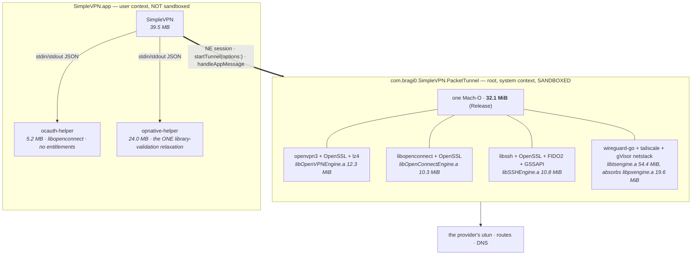
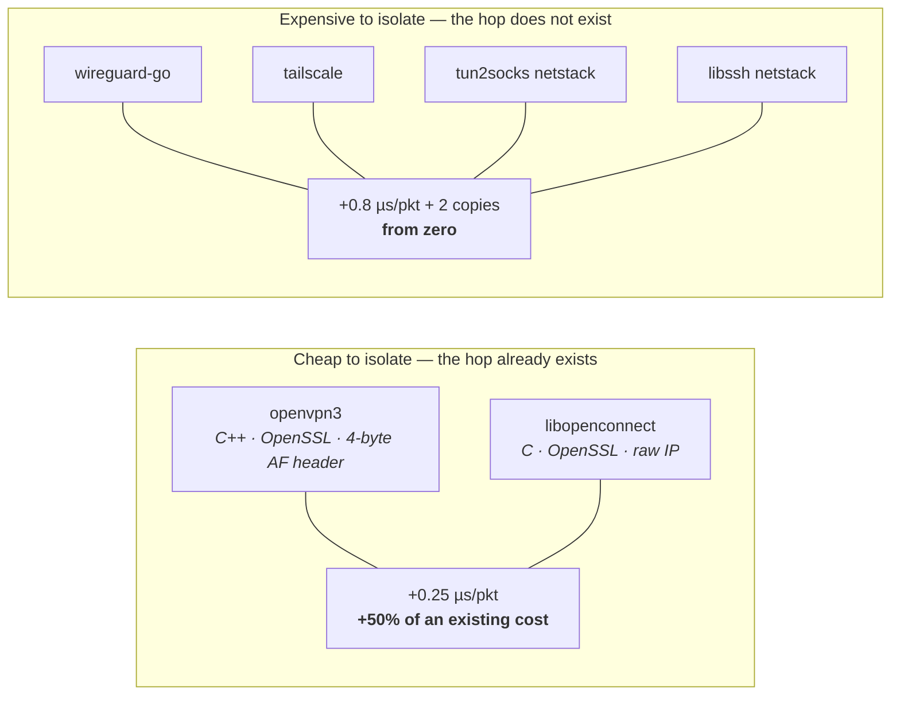
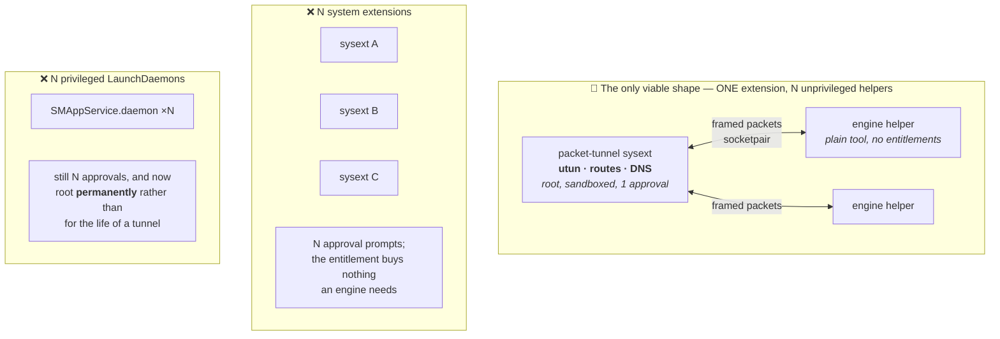

# Engine isolation — should each VPN engine be its own process?

**This is a decision record, not a specification. A full plan and spec come later, if at all.** This
document answers only "is this worth doing?", and records the measurements that answer it so a later
plan can be built *from* these numbers rather than re-deriving them. It deliberately does not stage a
migration, draft the IPC contract field by field, or enumerate build-system changes.

**Nothing here is scheduled work.** No target, entitlement, `Info.plist` or build script is changed by
this document, and none should be until the verdict below is overturned.

- ✅ **MEASURED** — established from the code or from this machine, with the command or file named.
- 📐 **REASONED** — a conclusion argued from measured facts, not itself measured.
- ❓ **OPEN** — could not be determined here; what it would take is stated.

Read `Docs/Networking.md` §2 and §3 first. This document assumes its vocabulary: the **provider's
utun**, the **fd-shaped** engines (`openvpn3`, `libopenconnect`, each holding one end of a
`socketpair(AF_UNIX, SOCK_DGRAM)`), and the **callback-shaped** engines (`wireguard-go`, Tailscale,
`tun2socks`, the libssh netstack), which cross no descriptor at all.

---

## 0. The verdict 📐

**Do not do this now.**

Two findings decide it, and both are the opposite of what the question assumes:

1. **There is no memory ceiling to escape.** ✅ The tighter memory budget a packet-tunnel provider
   runs under is an **iOS** constraint. On this Mac, macOS 26.6, a live third-party packet-tunnel
   system extension is resident at **127 MiB** and has not been touched; thirty days of logs contain
   no `EXC_RESOURCE`, jetsam or `memorystatus` event naming any packet tunnel. Our own extension's
   Release Mach-O is **32.1 MiB before it runs** and would be dead on arrival under an iOS-style
   budget — it ships and works. This was the one argument that could have made isolation *necessary*
   rather than merely tidy, and it is not there. §2.2.

2. **The `OPENSSL_PIN` argument inverts on inspection.** 📐 Isolation would genuinely dissolve the
   coupling — but the coupling is a *linker-enforced guarantee that we ship exactly one OpenSSL*, and
   it costs one line per build script plus a CI installer that already exists. Splitting the engines
   replaces a build-time hard failure with three independently-versioned copies of OpenSSL kept
   aligned by discipline. For a VPN client that is a bad trade — the strongest "for" argument, examined,
   points the other way. §2.3.

The remaining arguments are real but smaller than they look. **Crash isolation buys leak-prevention,
not uptime** — no engine of ours can resume a session across a restart, so a crashed helper produces a
reconnect, which is what a crashed extension already produces; what it *adds* is that the utun and
routes stay up during the gap, so traffic is refused rather than handed back to the physical path
(§3.1). And **the per-packet cost is not the killer it is usually assumed to be** — for the two
fd-shaped engines it is close to free, because the socketpair and its copies already exist and only
the peer changes (§2.1).

**The right shape, if it is ever built, is the one the question guessed at**: ONE packet-tunnel system
extension keeping the utun, the routes and the DNS, with N *ordinary unprivileged bundled tools*
hosting engines — not N system extensions. That preserves the governing rule and costs no extra user
approval. It is blocked on one unanswered question, and that question is the cheapest thing here to
test: **can the sandboxed, root system extension spawn and speak to a bundled helper at all?** §2.4.

§4 lists exactly what would have to change for the answer to flip.

---

## 1. What is in the process today ✅

`PacketTunnel/` is one system extension, sandboxed (`com.apple.security.app-sandbox`) and running as
root, holding at most one engine alive per session. Every engine is statically linked into it.

Three facts from that picture are load-bearing for everything below.

**The helper pattern already exists and already works.** `ocauth-helper` links the *same*
`OpenConnectEngine.xcframework` the extension links, in its own process, carrying **no entitlements at
all** (a HARD POLICY written into `project.yml`'s target comment). It is the working proof that an
engine archive can live outside the extension. It is also the working proof of the governing rule:
sign-in left the process; the tunnel did not.

**The three OpenSSL-bearing archives are `libOpenVPNEngine.a`, `libOpenConnectEngine.a` and
`libSSHEngine.a`**, built by `Tools/build-openvpn3-xcframework.sh`,
`Tools/build-openconnect-xcframework.sh` and `Tools/build-libssh-xcframework.sh`. All three set
`OPENSSL_PIN="3.6.3"` and abort the build if Homebrew disagrees. `project.yml` states the mechanism
exactly: because the pins match, the OpenSSL object files are byte-identical and ld64's lazy archive
loading pulls **exactly one copy**; a divergent pin surfaces as a duplicate-symbol link failure at the
`SSHEngine.xcframework` dependency.

**The two engine families have opposite per-packet costs, and the sandbox is on.** `openvpn3` and
`libopenconnect` already pay a `socketpair` datagram per packet in each direction plus an allocate-and-
copy on the outbound side (`OpenVPN3Bridge.mm:772-810`, `OpenConnectBridge.mm:415-460`). The Go and
netstack engines pay nothing — a direct `@convention(c)` call from the `readPackets` completion
handler. §2.1 turns that into numbers.

---

## 2. The four questions that decide it

### 2.1 Per-packet IPC cost ✅ — measured, and it is not the killer

Measured on **Apple M5 Max, macOS 26.6 (25G72), arm64**, with a purpose-written C benchmark: one
process `send()`s N datagrams into a `socketpair(AF_UNIX, SOCK_DGRAM, 0)` while a forked child
`recv()`s them — the *exact* primitive the two fd-shaped bridges already use, differing only in that
the far end is another process rather than another thread. Buffers set to 4 MiB each side, so the
sender is genuinely flow-controlled rather than filling a queue. The `same` row is the control: one
thread doing `send()` then `recv()` on both ends, which is what the extension does today.

| Peer | Datagram | Throughput | Per packet | Wire rate at that size |
|---|---:|---:|---:|---:|
| **cross-process** | 64 B | 1,489,100 /s | **0.67 µs** | 0.76 Gbit/s |
| **cross-process** | 590 B | 1,419,178 /s | **0.70 µs** | 6.70 Gbit/s |
| **cross-process** | 1400 B | 1,301,034 /s | **0.77 µs** | 14.57 Gbit/s |
| **cross-process** | 32 KiB (a batch) | 660,454 /s | **1.51 µs** | 173 Gbit/s |
| *same-process control* | 1400 B | 1,936,333 /s | *0.52 µs* | 21.69 Gbit/s |

Read across that table three times, because it says three different things.

**First — for the fd-shaped engines the marginal cost is roughly +50 % of a cost already being
paid.** 📐 Today `openvpn3` and `libopenconnect` pay the control row: **0.52 µs/packet**. Isolation
does not add a hop; it changes who is on the far end of the hop that exists. Measured, that is
**0.52 → 0.77 µs**, i.e. **+0.25 µs per packet**. At 1 Gbit/s of 1400-byte packets (≈89 kpps) the
*added* cost is **2.2 % of one core**. That is not an argument against anything.

**Second — for the callback-shaped engines the cost is the entire hop, from zero.** 📐 `wireguard-go`,
Tailscale, `tun2socks` and the SSH netstack cross no descriptor today. Isolating them adds
~0.8 µs/packet and two copies where there were none. In percentage terms that is not "+50 %", it is
unbounded; in absolute terms:

| Offered load (1400 B packets) | Packets/s | One-hop CPU |
|---|---:|---:|
| 100 Mbit/s | 8,929 | 0.7 % of a core |
| 1 Gbit/s | 89,286 | **6.9 %** of a core |
| 2.5 Gbit/s | 223,214 | 17 % of a core |
| 10 Gbit/s | 892,857 | **69 %** of a core |
| ceiling, unbatched | 1,301,034 | 100 % of a core = **14.6 Gbit/s** |

**Third — small packets, not big ones, are where it stops being acceptable.** ✅ The hop costs
essentially the same per *datagram* regardless of size, so the ceiling is a packet rate, not a bit
rate: **≈1.3–1.5 Mpps on one core**. At 64 bytes that is only **0.76 Gbit/s**. A VoIP, gaming, DNS or
SYN-heavy workload therefore hits the wall an order of magnitude earlier in bits than a bulk transfer
does. **The honest threshold: unbatched, per-process-hop isolation stops being acceptable somewhere
around 1 Mpps sustained**, which real tunnels reach only under small-packet flood.

**Batching moves the wall by ~12× and costs nothing.** 📐 At 32 KiB per datagram — about 23 × 1400-byte
packets — the cost falls to **0.065 µs/packet**. Crucially this needs no added latency:
`readPacketsWithCompletionHandler:` *already* hands the pump an `NSArray` of packets, so coalescing
whatever the OS grouped is free, and the batch grows with offered load, which is exactly the right
shape. Note in passing that the inbound direction does **not** take that win even today — every bridge
writes one packet at a time (`writePackets:@[ip]`, `OpenVPN3Bridge.mm:806` and its four peers). ❓
Worth measuring as a standalone in-process improvement regardless of isolation.

**The cost and the benefit are anti-correlated in the convenient direction, with one exception.** 📐
The two engines that are nearly free to isolate — `openvpn3` and `libopenconnect` — are C/C++ with a
long CVE history and a shared OpenSSL, i.e. exactly the ones crash isolation is *for*. Three of the
four that are expensive to isolate are memory-safe Go, i.e. the ones that need it least. The exception
is the **SSH network tunnel**: C (libssh, plus FIDO2 and GSSAPI linked in), callback-shaped, so it
carries the attack surface *and* the full hop cost. It is also TCP-only through a userspace netstack
with SSH channel windows in front of it, so its throughput ceiling is low enough that the hop hardly
matters — which is why §4 names it as the proving ground if this is ever attempted.

### 2.2 The NE memory limit ✅ — there isn't one on macOS, and that decides a lot

The question was worth asking because if the extension were near a ceiling, isolation would stop
being optional. It is not near one, because on macOS there is no ceiling of that kind.

**What was measured on this machine (macOS 26.6, 25G72):**

| Observation | Command | Result |
|---|---|---|
| A **live** packet-tunnel system extension's resident size | `ps -Ao pid,rss,comm` | `io.tailscale.ipn.macsys.network-extension` — a *different vendor's shipping app*, not our Tailscale engine — resident at **130,624 KiB ≈ 127 MiB**, running, not killed |
| Any memory kill of a packet tunnel in 30 days | `log show --last 30d --predicate 'eventMessage CONTAINS "memorystatus" OR … "EXC_RESOURCE" OR … "jetsam"'` | **no entry naming any packet-tunnel process** |
| Whether the containing app is even memory-managed | same log | `runningboardd`: *"Ignoring jetsam update because this process is not memory-managed"* |
| Our extension's static size | `ls` on the Release build | `com.bragi0.SimpleVPN.PacketTunnel` = **33,684,224 B = 32.1 MiB** |

**The decisive inference.** 📐 The commonly-quoted packet-tunnel budget — 15 MB originally, raised to
50 MB — is an **iOS/iPadOS** jetsam limit on an `NEPacketTunnelProvider` app extension. On macOS the
provider is a **system extension**: an ordinary launchd-managed process, not a jetsam-managed app
extension. Two independent observations confirm the limit does not apply here. Our own extension's
Mach-O is 32.1 MiB *on disk before it starts*, and once the Go runtime for Tailscale + gVisor netstack
is resident it clears 50 MB before a single packet moves — yet it ships, runs and passes a live tunnel.
And a shipping third-party provider from another vendor sits at 2.5× that supposed budget indefinitely.

❓ **What could not be established here.** The exact statement of Apple's macOS policy. `launchctl
procinfo <pid>`, which would print the process's jetsam properties directly, **requires root** and was
not run. That is the one command that would turn 📐 into ✅, and it is cheap: run it against a live
provider pid. Also unmeasured: our own extension's peak RSS under load, because it was not running
during this work. Neither gap changes the conclusion — a 127 MiB provider that is not being killed is
sufficient disproof of a 50 MiB ceiling.

**Consequence.** This removes the only argument that could have made isolation *necessary*. Every
remaining argument is a preference, and preferences get weighed against §2.1's cost and §3's
complexity rather than overriding them.

### 2.3 Does isolation dissolve `OPENSSL_PIN`? 📐 Yes — and that is an argument *against*

**The coupling, exactly.** Three archives statically carry OpenSSL and all three co-link into one
binary. `build-openvpn3-xcframework.sh:18`, `build-openconnect-xcframework.sh:25` and
`build-libssh-xcframework.sh:33` each set `OPENSSL_PIN="3.6.3"` and hard-fail:

> `FATAL: openssl@3 is $have_ssl but the pin is $OPENSSL_PIN.`
> `Align Homebrew or bump OPENSSL_PIN in ALL THREE engine scripts, then rebuild all three.`

`project.yml` records why it works: matching pins make the OpenSSL object files byte-identical, so
ld64's lazy archive loading pulls exactly one copy. A divergent pin appears as a duplicate-symbol
failure at the `SSHEngine.xcframework` dependency — which the comment names as the exact site.

**Does isolation dissolve it? Yes, genuinely, and we already have the proof in the tree.** ✅
`ocauth-helper` links `OpenConnectEngine.xcframework` *in its own process*, and its OpenSSL never has
to agree with the extension's, because there is no co-link. Put `openvpn3`, `libopenconnect` and
`libssh` in three processes and the pin's *reason for existing* is gone: three links, three OpenSSLs,
no duplicate symbols, no cross-script coupling, three engines bumpable independently.

**And that is worse, not better.** 📐 The pin is not overhead we are paying for nothing; it is a
**linker-enforced guarantee that this app ships exactly one OpenSSL and its version is a single
grep-able constant**. Trading it away means:

* **Three OpenSSLs in one shipped app.** Three to audit, three to bump when a CVE lands, three
  versions in a crash log, and roughly +10 MB of duplicated crypto in the bundle.
* **Alignment by discipline instead of by the linker.** Today "all three agree" is checked by ld64 on
  every build and cannot be forgotten. After a split, nothing checks it. The failure mode is not a
  build error, it is shipping one engine on a patched OpenSSL and another on an unpatched one, and
  nobody noticing.
* **For a cost that is already automated.** `Tools/ci/install-pinned-openssl.sh` parses the pin out of
  the script and installs the matching Homebrew build, so CI does not trip on it. What remains is a
  developer's local Homebrew drift and the "bump all three, rebuild all three" ritual — real friction,
  but friction on a build machine, not on a user's tunnel.

**Net.** Isolation converts a build-time hard failure into a runtime possibility of three divergent
crypto libraries. For a VPN client that is the wrong direction. ❓ *One caveat that could reverse
this:* if an engine ever *requires* an OpenSSL version another engine cannot accept, the pin stops
being a ritual and becomes a wall — and isolating **that one engine** is then the cheapest way
through. That is a targeted, single-engine action, not a reason to adopt the whole scheme (§4).

### 2.4 System extensions or plain helpers? 📐 Helpers — and one spike decides whether even that works

The question's phrasing ("helper + extension … maybe") is right to be unsure, because the two answers
have wildly different costs and only one of them is viable.

**Multiple system extensions would each need their own approval, and that alone rules them out.** ✅
`systemextensionsctl list` on this Mac enumerates **per bundle identifier**, with an independent
`enabled` / `active` flag on each row — nine entries, several stale copies of ours awaiting uninstall,
plus another vendor's provider, each tracked separately. Each distinct bundle id needs its own
`OSSystemExtensionRequest.activationRequest` and its own approval in *System Settings ▸ General ▸
Login Items & Extensions ▸ Network Extensions*. `AGENTS.md`'s runbook already treats that approval as
a discrete user step. **Six engines as six system extensions = six approval prompts**, on an app whose
onboarding already asks for an extension approval and an "add VPN configurations" prompt. ❓ Not
tested by actually activating a second extension — the per-bundle-id `enabled`/`active` columns are
the evidence, not a live trial.

**And they would not buy anything.** 📐 A system extension exists here for exactly one reason: the
`packet-tunnel-provider-systemextension` entitlement, which is what makes NetworkExtension hand us
`packetFlow` and let `setTunnelNetworkSettings` create the utun. An engine that only turns plaintext
IP into ciphertext on a socket needs none of that. So an engine host is an **ordinary bundled tool** —
the `ocauth-helper` / `opnative-helper` shape, `SKIP_INSTALL: YES`, hardened runtime on, no
entitlements — and that is one approval total, unchanged from today.

**This satisfies the governing rule, for the same reason `ocauth-helper` does.** 📐 The rule is
*sign-in may leave the process; we must own the interface, the routes and the DNS.* One extension
keeps `packetFlow`, `setTunnelNetworkSettings`, `includedRoutes`/`excludedRoutes` and `dnsSettings`; a
helper is handed framed bytes and hands framed bytes back. It never learns an interface name, never
sees the routing table and cannot apply DNS. That is why this is acceptable and `ocproxy` is not —
`ocproxy` takes the *data path* out of our control by making the tunnel a userspace SOCKS port. The
distinction has never been about process count.

**The blocker: who spawns the helper, and how does the descriptor get there?** ❓ This is unresolved
and it is the single cheapest thing to test. Three candidates, and none is obviously clean:

1. **The extension spawns it.** The natural design, and it needs `posix_spawn` from inside the App
   Sandbox as root. **The codebase has already reasoned about this once and stopped.**
   `SubprocessTunnelManager.swift:226-231` refuses OpenConnect's host-checker precisely because
   `openconnect_setup_csd` "works by *forking a child* — the packet-tunnel extension is
   `com.apple.security.app-sandbox` AND runs as root, so this would mean executing a user-nominated
   script as root from inside the sandbox. Not a plumbing job; a decision with an entitlement
   attached." A helper *we* build and sign is a far weaker case than a user-nominated script, but the
   sandbox question is the same one and it is still unanswered. **Spike this first: can the sysext
   `posix_spawn` a sibling binary from inside its own installed bundle, and does the child inherit a
   sandbox that still permits the socket it needs?**
2. **The app spawns it and passes the descriptor in.** Attractive — the app is **not** sandboxed
   (`SimpleVPN.entitlements` has no `app-sandbox` key) and already spawns two helpers. It does not
   work: the app→extension channel is `startTunnel(options:)`, a property-list dictionary, and
   `handleAppMessage`, `Data`→`Data`. **Neither can carry a file descriptor**, and there is no
   `SCM_RIGHTS` path across NE's IPC. Nor is there a shared filesystem to rendezvous on —
   `Docs/Networking.md` §2 is explicit that app-group defaults and files do not cross the
   root/system-context ↔ user boundary. ❓ Whether a registered Mach service could bridge it is
   untested, and if it could, the helper would have to be a launchd job the root sysext can look up —
   which lands on option 3.
3. **A privileged LaunchDaemon per engine**, installed via `SMAppService.daemon`. Strictly worse on
   every axis this project cares about: still one approval per daemon, and each runs as root
   *permanently* instead of for the life of a tunnel. Rejected.

**If option 1 fails, the whole scheme fails**, because 2 has no descriptor path and 3 is worse than
what it replaces. That makes it the first thing to run and the last thing this document can say about
feasibility.

---

## 3. The rest of the ledger, weighed briefly

### 3.1 Crash isolation 📐 — it buys leak-prevention, not uptime

The usual framing is "one engine faulting need not take the tunnel down". That is half true and the
untrue half matters.

**What it does not buy: uptime.** None of the six engines can resume a session across a restart.
`openvpn3` would renegotiate; `libopenconnect` would re-run `setup_tun` (its bridge already tears down
and rebuilds the pump on every CSTP reconnect, `Docs/Networking.md` §3.5); WireGuard would rehandshake;
Tailscale would re-fetch the netmap. Restarting a crashed helper therefore produces **a reconnect** —
which is exactly what a crashed extension already produces today, and which the user already
understands.

**What it does buy, and it is real: the routes stay up during the gap.** ✅ When the extension dies the
session ends, the utun goes away and traffic falls back to the physical path. When a *helper* dies the
extension is still holding `setTunnelNetworkSettings`, so the routes and DNS remain installed and
traffic is **refused rather than leaked** while the engine restarts. That is the same principle the
SSH network tunnel's delegate already enforces for transport drops — "cancelling would hand the
traffic back to the physical path, which is the leak this kind of tunnel exists to prevent."

**And it introduces the worst failure mode available if done carelessly.** 📐 A dead helper behind a
live extension is a tunnel that is *up*, routed, showing Connected, and silently passing nothing.
Today process death is the liveness signal and NE delivers it for free. After a split, liveness must
be built: helper exit detected, surfaced as an incident (`TunnelIncidentStore` is the existing
instrument), and either recovered or cancelled — never left showing Connected. **That is a
requirement, not a nice-to-have**, and it is a meaningful share of the work.

### 3.2 Signing, notarization and AMFI 📐 — multiplied, and this project has been bitten

The bundle already carries four signed Mach-Os. Each helper adds a fifth, sixth, … each needing
hardened runtime, `--timestamp` (notary rejects signatures without a secure timestamp), correct
entitlements, and its own place in the signing order before the outer bundle is sealed.

The specific hazard is not "more work", it is **that entitlements on a bundled binary can kill the
app at launch**. `SimpleVPN.entitlements` carries the scar in a comment: AMFI kills any app embedding
a system extension if it carries a hardened-runtime relaxation — *"Hardened Runtime relaxation
entitlements disallowed on System Extensions"* — and **build 87 shipped notarized and dead on arrival
this way.** `OCAuthHelper`'s target comment is a HARD POLICY: no `CODE_SIGN_ENTITLEMENTS`, and none
may be added. Every new engine helper is another binary that policy must hold for, and another
opportunity for someone to add an entitlement to fix a local problem. Manageable, and not decisive —
but it is a per-artefact tax paid forever, and the AMFI launch check becomes a mandatory gate on each.

### 3.3 Independent build, sign and update per engine 📐 — smaller than it sounds

True, and mostly already true of the *build*: each engine is already an independently rebuilt vendored
archive with its own script. What isolation would add is independent *shipping* — and SimpleVPN ships
as one Sparkle-signed app. A helper cannot be updated without updating the app, so "update one engine
independently" is not actually on offer unless the delivery mechanism changes too. Discount this
argument heavily.

### 3.4 Proving the contract before a third party depends on it 📐 — the strongest strategic argument

If a third-party engine mechanism is ever wanted, its shape is precisely the shape above: one
extension owning the utun, an out-of-process engine handed framed packets. Doing it for **our own**
engines first would prove the contract while both sides are still ours to change — the sequencing is
plainly correct. But it is a reason to do this *in a particular order*, not a reason to do it *now*:
the third-party mechanism is deferred, and paying §2.1's cost and §3.1's supervision work today to
de-risk deferred work is speculative. Revisit when a third-party engine is actually wanted (§4).

### 3.5 The framing contract ❓ — the one warning to carry forward

The single best evidence for what an unwritten contract costs is already in the tree, and
`Docs/Networking.md` §3.2 calls it "the most surprising thing in the packet path": `openvpn3`'s
socketpair carries a **4-byte big-endian address-family prefix** on every packet in both directions,
while `libopenconnect`'s carries **raw IP with no prefix**, inferring the family from the version
nibble inbound. Two engines, one pattern, two framings — inside a *single binary*, where both sides
are compiled together and `AGENTS.md` records what getting it wrong looks like: *"Without it the
tunnel connects but silently carries zero traffic."*

Across a process line that asymmetry stops being a quirk and becomes a **wire format** between
independently built, independently signed artefacts that can version-skew. **If this is ever built,
the framing must be one contract compiled into both sides** — the pattern the project already uses for
`ocauth-helper`, where `SimpleVPN/Credentials/OpenConnectAuthWire.swift` is listed in *both* targets'
sources so "app and helper can never disagree about the format". Anything less reproduces today's
asymmetry with a silent-zero-traffic failure and no linker to catch it.

---

## 4. What would flip the answer ❓

The verdict is "not now", not "never". Four things would change it, and each has a named trigger so
nobody has to re-argue the whole case:

1. **A third-party engine is actually wanted.** The moment an engine we did not build and cannot audit
   is on the table, "it may not crash the tunnel and may not see the routing table" stops being a
   preference and becomes a security requirement. Then §3.4's sequencing argument governs: do it for
   our own engines first, because proving the contract while both sides are still ours is far cheaper
   than discovering its gaps with an outside consumer attached.
2. **An engine's crash rate becomes measurable in the field.** The instrument already exists —
   `TunnelIncidentStore` is written by the root process and read by the app. ❓ **Nobody has looked.**
   Checking whether any engine is actually faulting in the wild is the second-cheapest action in this
   document and should precede any reconsideration. If one engine is responsible for most incidents,
   isolate *that one* and stop.
3. **`OPENSSL_PIN` becomes a wall rather than a ritual.** If one engine ever needs an OpenSSL version
   another cannot take, §2.3's trade reverses for that engine only. Isolate the one engine, keep the
   pin across the remaining two.
4. **The macOS memory picture changes.** ❓ If a future macOS starts jetsam-managing NE system
   extensions — and `launchctl procinfo` against a live provider is the way to check, requiring root —
   §2.2's finding is void and this becomes urgent. Re-run that check when the extension's resident
   size grows materially, and record the number here.

**If it is ever built, start with the SSH network tunnel.** 📐 Fewest live consumers, so the smallest
blast radius; TCP-only through a userspace netstack behind SSH channel windows, so the lowest
throughput ceiling and the least exposure to §2.1's cost; and a C engine (libssh, with FIDO2 and
GSSAPI linked in) carrying real attack surface, so the isolation is worth something. **Not OpenVPN**,
which has the most users — the proving ground should be the engine with the fewest, not the most
important one. Second choice is **OpenConnect**, on the grounds that half the artefact already exists:
`ocauth-helper` links the same archive out of process today.

Whatever the first stage is, the measurement that decides whether to continue is fixed in advance by
§2.1: **sustained packets-per-second through the isolated engine under real load, and the CPU cost of
the hop as a fraction of one core.** If the hop exceeds a few percent at the throughputs users
actually see, stop and revert — which is possible only if each stage is independently shippable, and
that is a constraint on any later plan rather than something this document specifies.

---

## 5. What could not be determined ❓

Recorded so the next reader does not mistake absence for a negative finding:

| Unknown | Why it matters | What would settle it |
|---|---|---|
| Whether the sandboxed root system extension can `posix_spawn` a bundled sibling and keep a socketpair to it | **Decides the whole question.** If it cannot, no viable shape remains (§2.4) | A spike: a stub tool in the sysext bundle, spawned from `startTunnel`, echoing one datagram back |
| The exact statement of Apple's macOS jetsam policy for NE system extensions | Turns §2.2 from 📐 into ✅ | `sudo launchctl procinfo <live provider pid>` — needs root, not run here |
| Our own extension's peak RSS under real load | Would quantify the headroom rather than merely establishing it exists | `ps`/`footprint` against the extension during a saturated tunnel; it was not running during this work |
| Whether a second system extension genuinely prompts a second approval | §2.4 rests on the per-bundle-id `enabled`/`active` columns, not a live trial | Activate a trivial second extension and watch System Settings |
| Whether a Mach service could bridge app-spawned helper to root sysext | The only untested escape if the spawn spike fails | Register a service from the non-sandboxed app and attempt lookup from the sysext |
| Field crash rates per engine | §4 item 2 — would turn "crash isolation" from a hypothesis into a number | Read `TunnelIncidentStore` across installs |
| Whether inbound packet batching helps *today*, independent of isolation | Every bridge writes one packet at a time (`writePackets:@[ip]`); §2.1 suggests coalescing is ~12× cheaper per packet | An in-process A/B on `writePackets:` array size — a small change with no isolation attached |

`WebSearch` was unavailable for this work, so nothing here rests on documentation retrieved from the
internet; every ✅ was taken from this repository or this machine, and every claim that could not be
so taken is marked 📐 or ❓ above.
