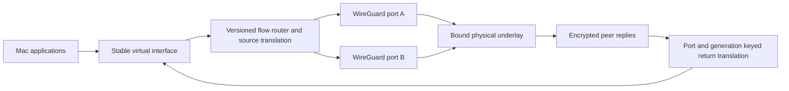
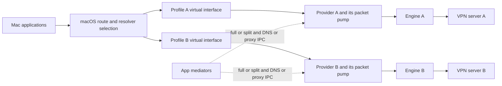
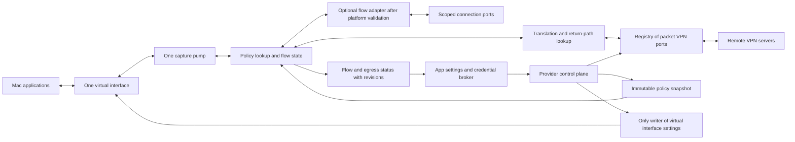

# Network architecture review

## Implementation follow-up — 2026-10-05

The analysis below describes the pre-fix architecture and the longer-term target.
The current change implements its first packet-routing slice and repairs the existing
control plane: one acknowledged OS settings writer; complete filtered route plans;
serialized route/DNS/proxy apply and forced drift; scoped Go engine handles and callback
contexts; and an explicit WireGuard composition running through one virtual interface.

The virtual mode captures IPv4/IPv6, selects destination prefixes by longest match,
pins existing flows across policy changes, translates source/return addresses, handles
bounded fragments and ICMP/PMTU, and drops unsupported or unavailable egress. A complete
route plan changes the OS capture once and commits one Go revision after acknowledgement.
Stopped private routes stay captured; default loss stays captured until explicit Direct.
Physical WireGuard UDP sockets are scoped before bind; a missing physical path blackholes.

Real encrypted two-peer tests cover IPv4/IPv6 TCP/UDP, overlapping assigned addresses,
policy switches and isolated member stop. Race and malformed-packet fuzz tests cover the
core. Swift delayed/failing hosts cover acknowledged ownership and supersession. This is
not a provider-crash kill-switch proof or complete platform acceptance.

**Visible compatibility boundary:** virtual compositions support two to sixteen
single-peer WireGuard members. Other engines retain independent sessions. Distinct DNS
resolvers, custom proxy/local exclusion combinations, chains, native packet ports,
per-app/fake-IP/L7/Tcl routing are gated. `Docs/Drift.md` §18 and
`NetworkArchitectureBoundaryTests` guard this boundary. Notarized live capture,
sleep/wake/provider crash, Tailscale enrollment and macOS 26/27 remain platform checks;
keep these checks open until actual evidence exists.

Reviewed 5 October 2026 against commit `802bd99`. The objective is a stable virtual
interface that receives the user's traffic, with an internal routing layer selecting
the VPN tunnel for each flow. This is a source and architecture review; the proposed
router has not been implemented or deployed by this change.

**The right boundary is one interface owner and multiple egress engines. The current
app coordinates independent VPN interfaces instead.** Its packet bridges and pure
arbiters are useful starting points, but adding `PBRRealizer` alone cannot produce the
desired architecture. Engine ownership, instance addressing, source translation,
transport routing, DNS and the status contract all need changes.

The existing policy proposal also includes a broader local traffic interception
product. Its Direct, local proxy, system DNS interception and firewall assumptions
need a platform decision before implementation. Preserve the single-interface VPN
objective while resolving those extra capabilities separately.

## Current architecture

1. `VPNController` holds a `NETunnelProviderManager` for each packet VPN profile.
   Native IKEv2/IPsec use `NEVPNManager`; some SSH and OpenConnect paths run app-side.
2. Each packet provider starts one active engine from its profile's `vpnType`.
3. OpenVPN and OpenConnect receive a socketpair standing in for their TUN device.
   Their bridge pumps connect that socketpair directly to `provider.packetFlow`.
4. WireGuard and Tailscale receive raw packets through Go callbacks. Their Swift
   wrappers also read and write `provider.packetFlow` directly.
5. Proxy Tunnel and SSH Network Tunnel terminate TCP/UDP in gVisor and dial an
   upstream. Their packet pumps own their respective provider flows too.
6. Each provider or bridge builds and applies its own routes, addresses, DNS and MTU.
7. App-side Route, DNS and Proxy mediators coordinate those providers over IPC.
   The route realizer changes full/split roles rather than forwarding packets.
8. Routing diverts install destination exclusions on one VPN and inclusions on
   another. Port and protocol fields are informational, not live flow predicates.
9. The routing graph primarily describes kernel routes. Public-IP lookups describe
   the route taken by those lookups, not every tunnel's exit.
10. `SimpleVPN/PBR` contains a README only. There is no shared capture pump, egress
    registry, policy forwarding table, NAT table or fake-IP routing service.

Evidence: [provider engine dispatch](../PacketTunnel/PacketTunnelProvider.swift#L180),
[WireGuard pump](../PacketTunnel/Engines/WireGuardEngine.swift#L169),
[OpenVPN settings and pump](../PacketTunnel/Bridges/OpenVPN3Bridge.mm#L652),
[gateway realizer](../SimpleVPN/Mediators/RouteMediator.swift#L87),
[divert application](../SimpleVPN/ControlPlane/VPNController+Gateway.swift#L197),
[routing-rule semantics](../Shared/RoutingRule.swift#L5).

## Findings in the current implementation

These findings are confirmed source paths. The timing-dependent consequences need
the integration tests listed below; this review did not alter the host's live routes.

### High priority route filters do not reach the live route applier

`installCustomRoutingHooks` rewrites `RouteIntent`, including `canOwnDefault` and
`advertisedPrefixes`. `RouteMediator.plan` consumes that intent. However,
`effectiveGatewayOwner` and `reconcileGateway` select the owner from unfiltered live
profiles through `GatewayPolicy.resolveOwner`. They do not apply that filtered plan.
`RoutePlan` itself contains only owner/roles/order, so it cannot carry edited prefixes
to an engine at all.

For example, Ignore-default can remove an engine from the preview plan while the
live coordinator still sends it `gateway:full`. Ignoring, replacing or adding a
specific prefix edits the model without an equivalent live prefix update. OpenVPN
and OpenConnect advertised prefixes are also absent from `gatewaySubnets`.

Use one authoritative plan for preview and execution, with complete route updates
and engine acknowledgements. Preserve that compiler when the backing becomes the
internal router. Pure filter/arbiter tests currently exercise the preview path and
cannot detect the missing connection to the live applier.

Evidence: [installed hooks](../SimpleVPN/ControlPlane/VPNController.swift#L242),
[filtered route intent](../SimpleVPN/Mediators/CustomRouting.swift#L136),
[role-only plan](../SimpleVPN/Mediators/RouteArbiter.swift#L66),
[live owner selection](../SimpleVPN/Mediators/RouteMediator.swift#L335),
[live reconciliation](../SimpleVPN/Mediators/RouteMediator.swift#L441),
[prefix projection](../SimpleVPN/ControlPlane/VPNController+Gateway.swift#L168).

### High priority gateway changes are neither serialized nor failure gated

`setDefaultGateway` persists the new preference before applying it. It awaits the
old owner's split operation, but `applyGatewayRole` discards `.failed`, so the new
owner can receive full even when the old owner has not relinquished the default.
An await is not confirmation of successful demotion.

`reconcileGateway` creates a new `Task` on every call. Replacing the stored task
handle does not queue, cancel or invalidate earlier work. MainActor isolation allows
other operations to enter at each await. Two owner changes can therefore complete
in an order different from the user's latest choice. Even a successful sequential
strip/add has a window without a VPN default; ordinary defaults here are not an
independent fail-closed boundary.

Immediately use one application loop with a latest desired revision, check each
acknowledgement and abort promotion after failed demotion. In the virtual router,
switch one immutable policy snapshot without rewriting OS defaults. Existing flows
need an explicit drain/reset policy rather than being silently moved.

Evidence: [switch sequence](../SimpleVPN/Mediators/RouteMediator.swift#L398),
[discarded outcome](../SimpleVPN/Mediators/RouteMediator.swift#L427),
[replacement tasks](../SimpleVPN/Mediators/RouteMediator.swift#L441),
[role cache and acknowledgements](../SimpleVPN/Mediators/RouteMediator.swift#L113).

### High priority reassert can succeed in the UI without performing a repair

Route application skips an unchanged cached role. DNS and Proxy realizers skip an
unchanged cached plan, and set that cache before the asynchronous operations succeed.
External drift changes the OS, not the desired plan, so a reassert can take the
unchanged-plan early return. DNS logs any non-nil reply as applied, including an
`error: ...` reply. Drift events set `reasserted: true` before repair finishes.

Separate desired, submitted, acknowledged and observed revisions. Invalidate an
applied cache on session generation changes or verified drift. Forced repair must
actually write and confirm the state; failures must remain eligible for retry.

Evidence: [route cache](../SimpleVPN/Mediators/RouteMediator.swift#L115),
[DNS realization](../SimpleVPN/Mediators/DNSMediator.swift#L105),
[Proxy realization](../SimpleVPN/Mediators/ProxyMediator.swift#L100),
[DNS drift event](../SimpleVPN/Mediators/DNSMediator.swift#L301).

### High priority engine status is not proof of the route actually applied

OpenVPN/OpenConnect `effectiveDefaultOwned` is calculated from captured defaults
and a suppression flag. Proxy/WireGuard/SSH Network Tunnel report a similar config
calculation. Those flags change before `setTunnelNetworkSettings` succeeds. A
failure can thus leave the reported role different from the installed settings.

The route monitor compares tunnel-versus-physical ownership, with no expected
interface identity. A different VPN's `utun` can satisfy that comparison. Its
snapshot selects only an IPv4 default, despite parsing IPv6 route messages. DNS
observations read the global dictionary, so they do not confirm each scoped resolver.

Publish the last successful settings revision and the actual capture interface,
then observe IPv4 and IPv6 separately. In router mode, distinguish OS capture
health from each engine's readiness and from the policy's selected egress. A
configuration being accepted is also distinct from a successful remote handshake.

Evidence: [OpenVPN status calculation](../PacketTunnel/Bridges/OpenVPN3Bridge.mm#L417),
[flag update before apply](../PacketTunnel/Bridges/OpenVPN3Bridge.mm#L379),
[provider status calculations](../PacketTunnel/PacketTunnelProvider.swift#L1037),
[expected interface omitted](../SimpleVPN/Mediators/RouteMediator.swift#L566),
[IPv4-only observation](../SimpleVPN/Mediators/PFRouteMonitor.swift#L150),
[global DNS observation](../SimpleVPN/Mediators/DNSMediator.swift#L332).

### High priority DNS mediation loses intent and cannot apply several edits

`dnsProfiles` supplies resolvers for Proxy, WireGuard and SSH Network Tunnel, but
empty intent for OpenVPN, OpenConnect and Tailscale. It supplies no search domains
for any profile. `DNSPlan.applyRequests` independently replaces every search list
with an empty list.

Only OpenVPN and OpenConnect handle live `dns:apply`. The other four packet engines
return nil, triggering reconnect. Reconnect rebuilds their original config; the
arbitrated DNS request is not passed to that rebuild. Reconnection therefore does
not implement arbitrary DNS Add/Replace/Ignore edits. Clearing an override also
restores the engine's original DNS, which is different from explicitly disabling
DNS contribution. A virtual router needs separate inherit, disable and replace
states, not a nil value standing for all three.

Capture authoritative pushed DNS from each engine, preserve search/match domains,
and apply a complete resolver policy. Resolver addresses and answers must be scoped
to their egress, including reconnects and overlapping private address spaces.

Evidence: [DNS projection](../SimpleVPN/ControlPlane/VPNController+Gateway.swift#L334),
[search-list loss](../SimpleVPN/Mediators/DNSArbiter.swift#L107),
[unsupported live applications](../PacketTunnel/PacketTunnelProvider.swift#L1398),
[reconnect fallback](../SimpleVPN/Mediators/DNSMediator.swift#L122),
[restore-on-clear](../PacketTunnel/Bridges/OpenVPN3Bridge.mm#L624).

### Medium priority settings operations can outlive the app acknowledgement

App IPC expires after eight seconds. OpenConnect and Tailscale settings calls may
wait fifteen seconds; OpenVPN waits indefinitely. An app timeout neither cancels
the underlying apply nor prevents its eventual completion. Netmap callbacks,
gateway and proxy updates also have separate paths to whole-interface settings.
Locks protect snapshots but do not make the asynchronous apply sequence atomic.

Use a provider-owned serialized settings writer with revision/session identifiers,
bounded completion and stale-result handling. Keep the last confirmed settings
separate from the next requested settings. This remains necessary during migration,
even though policy-only changes eventually avoid settings writes altogether.

Evidence: [app timeout](../SimpleVPN/ControlPlane/VPNController+Telemetry.swift#L24),
[OpenVPN wait](../PacketTunnel/Bridges/OpenVPN3Bridge.mm#L652),
[OpenConnect wait](../PacketTunnel/Bridges/OpenConnectBridge.mm#L631),
[Tailscale netmap apply](../PacketTunnel/Engines/TailscaleEngine.swift#L257),
[Tailscale proxy apply](../PacketTunnel/Engines/TailscaleEngine.swift#L304).

### High priority composition dependency currently means start order only

`dependsOn` makes `connectComposition` wait for another profile. It does not route
the dependent engine's transport through that profile. The wait returns without a
success result after timeout, and startup proceeds. Cycles are accepted by falling
back to arbitrary remaining order. Member role is not applied in this connect loop.

Treat a composition as orchestration today. Real VPN-on-VPN needs an explicit
transport connector, a validated dependency graph and readiness gating. Missing,
failed or cyclic dependencies must prevent dependent dialing, rather than permit
an unintended physical connection.

Evidence: [composition ordering](../SimpleVPN/ControlPlane/VPNComposition.swift#L43),
[connect loop and timeout](../SimpleVPN/ControlPlane/VPNController+Connect.swift#L711).

## Platform boundaries

Apple's [TN3120](https://developer.apple.com/documentation/technotes/tn3120-expected-use-cases-for-network-extension-packet-tunnel-providers)
supports remote VPN tunneling, but lists selective capture followed by proxying
elsewhere, whole-system DNS interception and local listeners/proxies as unsupported
packet-provider uses. **Inference for this design:** one interface selecting between
remote VPN engines is a substantially narrower goal than the existing proposal's
general local switch. Do not assume a packet provider supports all of that proposal.

Apple's [VPN routing guide](https://developer.apple.com/documentation/networkextension/routing-your-vpn-network-traffic)
distinguishes ordinary routes, `enforceRoutes` and `includeAllNetworks`. The latter
two are mutually exclusive; full capture has system exceptions. A default route
alone is not equivalent to enforced capture. Choose and test the capture contract
before promising that every connection reaches the virtual router.

Apple's [TN3165](https://developer.apple.com/documentation/technotes/tn3165-packet-filter-is-not-api)
says Packet Filter is not a supported product API. The proposed root-extension
`pf` anchor is unimplemented and its sandbox access unproven. Replace that assumption
with a tested NetworkExtension protection design; merely running as root does not
establish the right boundary. Reading a `PF_ROUTE` socket app-side is a different
mechanism from installing firewall rules.

The current destination-mode `readPackets` path provides IP packets and family,
not reliable app identity. App-proxy flows expose
[source metadata](https://developer.apple.com/documentation/networkextension/neappproxyflow).
The newer [virtualInterface API](https://developer.apple.com/documentation/networkextension/nepackettunnelprovider/virtualinterface-9fpgd)
also gives the provider an interface identity; the local SDK documents requiring
that interface for connections through the current tunnel. It does not select an
internal engine when all engines share that interface.

Recommended initial scope: captured IP traffic selects an owned remote packet VPN;
address-based Direct exceptions remain OS exclusions. That is not arbitrary
per-flow Direct routing after capture. If that broader feature, general DNS
interception or app-based selection is required, prototype the appropriate
transparent/DNS/filter provider combination with a shared policy model. Verify its
composition and packet limitations before committing to it. No transparent-proxy
annotator-to-packet identity join is proven in this repository.

## Engine compatibility with one virtual interface

These describe reusable mechanisms, not engines already integrated into a router.

| Engine | Present packet or flow mechanism | Main migration requirement |
|---|---|---|
| OpenVPN 3 | Packet socketpair with a four-byte big-endian family prefix | Detach its NE settings/pump; translate framing inside its adapter; report assigned addresses and pushed intent |
| OpenConnect | Raw IP socketpair; TLS and optional DTLS transport | Same separation; preserve protocol-specific auth and transport controls |
| WireGuard | Raw-IP callback TUN | Replace global WG instance/callbacks; respect peer AllowedIPs and assigned source addresses |
| Tailscale | Raw-IP callback TUN and router/DNS callback | Replace global TS instance/callbacks; retain netmap-authorized destinations, MagicDNS and peer identity |
| Proxy Tunnel | gVisor flow termination and SOCKS/CONNECT dialing | Reuse dialers behind one shared flow router; replace global PX instance/callbacks; negotiate UDP capability |
| SSH Network Tunnel | gVisor plus SSH direct-tcpip | Reuse a scoped SSH connection port; shares PX singleton with Proxy Tunnel today; carries TCP and DNS, not general UDP |
| App SSH and subprocess OpenConnect | App-owned SOCKS/forward surface | Requires a verified authenticated cross-process port or deliberate compatibility mode |
| Native IKEv2/IPsec and L2TP | OS-managed VPN or configuration export | No owned raw-packet engine port in this code; cannot become an internal engine through `NEVPNManager` settings alone |

`TSStart`, `WGStart` and `PXStart` refuse a second instance. Their callbacks are
global and lack a context/instance handle. Swift wrappers route them through static
`current` references. Moving these unchanged into one provider would prevent two
same-kind egresses and make Proxy Tunnel conflict with SSH Network Tunnel. A second
registration can also replace callbacks before its start is refused.

Use opaque instance handles plus session generations on every start, packet,
event, status and stop operation. Late callbacks must be rejected after removal;
stopping one egress must not clear another egress's callbacks. Keep the existing
single Go archive, but remove the one-instance API assumption. Audit upstream
global state as part of the two-instance test, not only these wrappers.

Evidence: [WG singleton](../Vendor/tailscale-engine/src/wireguard.go#L183),
[WG refusal](../Vendor/tailscale-engine/src/wireguard.go#L298),
[TS singleton](../Vendor/tailscale-engine/src/main.go#L453),
[TS refusal](../Vendor/tailscale-engine/src/main.go#L537),
[PX singleton and refusal](../Vendor/proxy-engine/src/engine.go#L273),
[Swift static callback context](../PacketTunnel/Engines/WireGuardEngine.swift#L51),
[SSH registration into PX](../PacketTunnel/Engines/SSHNetworkTunnelEngine.swift#L213),
[native VPN implementation](../SimpleVPN/ControlPlane/NativeVPNManager.swift#L378).

## Proposed ownership and packet path

The virtual interface belongs to the routing session, not whichever VPN currently
wins the default. Its addresses and capture routes stay stable while engines
connect, disconnect and rekey. A macOS `utun` number is not a persistent identity:
the stability promised here is within a routing session, with a logical router ID
across restarts. Egress IP changes must not be copied onto the capture interface.

The existing mediators can retain the app-facing policy, MDM guards and observation
seams. Their generic protocols are not a complete router contract. Replace the
role-only plan with a versioned routing policy, and make the provider authoritative
for runtime decisions even when the UI closes. Polling/IPC must carry multiple
engine states instead of one profile's string commands. On-demand startup also
needs a defined credential-unavailable state; it cannot assume the user app is
running and unlocked.

### Component contracts

| Component | Owns | Must not own |
|---|---|---|
| Interface settings writer | Capture addresses, routes/exceptions, resolver attachment, MTU, successful settings revision | Per-flow egress choices or VPN secrets |
| Engine adapter | One engine session, raw packet or dial port, assigned addresses, advertised routes, DNS intent, negotiated capabilities | `packetFlow`, OS routes/DNS/proxy settings or another engine's credentials |
| Policy compiler | Typed predicates, ordering, capability/dependency checks, immutable revision | Packet I/O or speculative observed state |
| Flow router | Flow creation, pinned decision, rule ID, policy revision, egress generation | OS preferences writes, synchronous credential access or script execution for every packet |
| Translation table | Egress-scoped source/destination mappings and reverse translation | Global unscoped five-tuple ownership |
| Transport connector | Explicit underlay/upstream choice, endpoint resolution, TCP/UDP transport capability and loop prevention | Selection via an incidental host default route |
| Resolver service | Egress-scoped resolution, cache and optional fake-IP lifetime | Unqualified DNS/IP correlations used as security proof |
| Credential broker | Resolve one approved profile's credential role for one session/signature | General Keychain access for scripts or every engine |
| Status publisher | Desired/applied/observed revisions, capture health, egress readiness, flow reasons and counters | Presenting a saved preference as proven packet delivery |

Normalize packet ports to complete raw IPv4/IPv6 packets with explicit length and
instance/generation, without a platform family prefix. OpenVPN's prefix remains
private to its adapter. Bound buffers and queues; report overflow/drop reasons.
Preserve the existing software checksum/no-offload invariants when delivering
packets to the host. An L3 port and a TCP/UDP connection port are distinct
capabilities; neither should be faked by a universal `send(bytes)` method.

## Routing and failure semantics

The following are proposed invariants for implementation, rather than behavior
already present in the app.

- Evaluate explicit user rules in order. Then evaluate engine-advertised prefixes
  by longest prefix, with an explicit priority for equal prefixes. Then use a
  mandatory default action. This resolves the current proposal's ambiguous mixture
  of first-match switch rules and a longest-prefix fast path. Show generated route
  claims separately from user overrides.
- Create a decision once per flow/association, retaining rule ID, policy revision,
  egress ID and egress generation. New policies affect new flows; existing TCP flows
  drain or reset by explicit instruction. UDP associations need expiry and an
  explicit failure/migration policy too.
- Match failure and target failure are different. A rule selecting Corp must not
  become unmatched and fall through to Direct because Corp disconnected. The rule
  needs a configured action such as block, bounded wait or an approved fallback
  list. Reject unsupported address families/protocols before forwarding.
- A default Drop action only protects unmatched traffic while the router runs. It
  cannot protect a matched flow whose target fails, an OS capture exclusion or a
  provider crash. Capture enforcement and target-failure policy are separate.
- Do not infer protocol support from a connected icon. SSH/HTTP CONNECT cannot
  carry general UDP/QUIC/ICMP. SOCKS UDP requires a successful relay grant.
  Tailscale needs an advertised subnet/exit node; WireGuard needs the appropriate
  cryptokey route and remote authorization. Adding an OS route creates neither.
- Reject cycles in routing and DNS bootstrap dependencies. A VPN server reachable
  only through another VPN must wait for that VPN's data path, not just a
  `.connected` status. No hidden physical fallback is permitted for that transport.

### Source translation and the return path

An app's packet now has the source address assigned to its profile's interface.
After virtualization it instead has the capture interface's stable address. That
address is generally not valid as the source on every remote VPN. Forwarding the
same bytes to a selected engine can therefore create a one-way connection.

The router needs stateful source translation to the selected engine's assigned
address, unless that engine explicitly advertises routed-source support. For flows
terminated in a per-egress stack, select that stack's source address; today's PX
stack only dials its single proxy and supplies no multi-VPN stack selection.

Namespace reverse mappings by egress ID and session generation, plus family,
protocol and translated tuple. Two VPNs can use the same client address, remote
address and port without sharing state. Handle TCP/UDP checksums, ICMP identifiers
and quoted packets, IPv4 fragments, IPv6 extension headers/fragments, port
exhaustion and bounded expiry. Reset or drain mappings when an engine gets a new
address; late packets from its prior session must not reach a new flow. Test ICMP
Packet Too Big/fragmentation-needed translation and path MTU instead of relying
only on TCP MSS clamping. This subsystem is unbuilt.

### Transport routing and loop prevention

Current carrier sockets use engine/OS dialers. OpenVPN's `socket_protect` returns
true based on an assumed provider exemption; Proxy and SSH Network Tunnel add
connect-time endpoint exclusions. WG uses `conn.NewDefaultBind`; Tailscale uses its
own dialer and dynamic peer/control/DERP paths. These are not a common connector.

A connector must distinguish physical-underlay sockets from sockets intentionally
carried by another egress. Requiring the one capture interface would enter the
router again, not magically select a particular internal VPN. Use an explicit
engine/upstream context, dependency generation and recursion guard. Resolve server
names in the correct bootstrap context; track endpoint changes and both families.
An IP-wide exclusion can also exempt unrelated app traffic to a shared server IP,
so it is not a substitute for scoped carrier ownership.

Evidence: [OpenVPN socket protection](../PacketTunnel/Bridges/OpenVPN3Bridge.mm#L164),
[proxy OS dialer](../Vendor/proxy-engine/src/proxy.go#L153),
[endpoint exclusion lookup](../Shared/ProxyTunnelNetworkSettings.swift#L143),
[WG bind](../Vendor/tailscale-engine/src/wireguard.go#L327),
[TS engine composition](../Vendor/tailscale-engine/src/main.go#L601).

### DNS names and late protocol information

Keep resolver caches keyed by egress/session and resolver policy, not just hostname.
With fake IP, use `(listener, normalized name, resolution context)` as the allocation
identity and pin the mapping for its active flows. Handle cached addresses across
reload/restart, CNAME, negative answers, A/AAAA, DNS over TCP, reverse lookup and
pool collision/exhaustion. A TTL does not force applications to discard an address.
Ordinary real answers still exist; the existing statement that every captured
application address came from our resolver is incorrect.

Reserve listener, capture and fake-IP addresses without colliding with an attached
VPN's actual ranges. In particular, the proposal's `100.100.53.x` listeners occupy
Tailscale's [CGNAT address space](https://tailscale.com/docs/concepts/tailscale-ip-addresses),
and current proxy/SSH capture addresses already use
the proposed `198.18.0.0/15` fake-IP range. These cannot be independent allocators.

DNS-to-IP correlation is ambiguous on shared IPs and must not authorize a privacy
or security boundary. Missing names must follow a defined literal-IP policy.
Blocking a list of known DoH servers cannot establish complete DNS coverage.
Named listeners need explicit application/container binding; ordinary system DNS
does not give every app an independent listener choice automatically.

SNI/HTTP Host rules also require a different flow setup from today's PX forwarder.
It dials the upstream before accepting the guest TCP endpoint. The remote SYN is
already committed before a later ClientHello can arrive. A flow inspecting L7 must
accept locally and buffer under limits before opening the upstream. Raw-forwarded
TCP cannot be re-pinned after sending its SYN merely because no payload was sent.
Treat absent/encrypted ClientHello information as unknown, and do not promise HTTP
URL or encrypted payload editing without a separate TLS interception design.

Evidence: [upstream dial before guest acceptance](../Vendor/proxy-engine/src/forward.go#L53),
[proposed staged matching](PolicyRouting.md#staged-evaluation--provisional-then-committed).

## Status and user controls

Expose the router session separately from each VPN: capture active, policy applied
revision, last apply error, and per-engine connecting/authentication/ready/degraded/
draining/off states. Show pending changes until the provider acknowledges them.
An engine can remain ready while zero flows select it; that is useful standby state.

The routing editor needs rule order, destination/domain, optional protocol/port,
selected egress, failure behavior and default behavior. It also needs an explicit
choice for whether a change drains or resets existing flows. DNS policy, local
network exceptions, IPv4/IPv6 coverage and engine capability limits must be
inspectable. Keep advanced scripts optional; the user's virtualization objective
does not require Tcl.

The Routes graph must query the provider's routing table/flow decisions as well as
OS capture state. A kernel lookup will otherwise correctly answer only "our utun"
while hiding which VPN carries the flow. A live flow should explain its matching
rule, namespace, original/translated destination, egress, upstream chain and failure
reason. App identity may be unknown. Per-egress exit-IP or health measurements must
actually use that egress; the current global URLSession lookup cannot label all exits.
VM/container identity may also be lost after guest NAT and must not be guessed from
the host's packet source. Retain the existing proven guest-network observations.

Credential ownership must remain with the user. Engine registry config should hold
profile/credential references; runtime delivery must be scoped to one instance and
generation. Review the existing Tailscale file-state and root SSH-agent gaps in
[Drift sections 15 and 16](Drift.md).
Private keys in the user's `.ssh`, Keychain and agent/1Password signing are different
sources. Apple Passwords is not a general private-key store. An authenticated signing
broker must sign for the actual root engine's SSH session, not reuse an app session's
signature or hand every engine a user agent socket.

## Corrections required before implementing the existing policy proposal

`PolicyRouting.md` should be treated as a historical proposal pending these changes:

| Existing assertion | Required correction |
|---|---|
| A second VPN necessarily means one utun | Current implementation already uses multiple interfaces with gateway demotion; one interface is a deliberate migration |
| Only `PBRRealizer` remains | Instance APIs, packet ownership, full route/DNS intent, translation and transport routing are also missing |
| Full capture means applications only see our addresses | Explicit/unruled DNS returns real addresses; cached/literal/independent resolver traffic persists |
| Literal-IP matching has the originating app's audit token | Current destination capture does not provide that identity; the annotator remains unproven |
| Commit occurs at first egress byte | Include upstream SYN/connection establishment; sniffing requires local termination before dial |
| Kill switch is default Drop | That covers unmatched traffic only; target loss and capture lifecycle need separate policies |
| A root provider installs a PF anchor | Unsupported product API assumption and unverified sandbox capability |
| DoH blocking is default off in decisions and on in DNS | Resolve the contradictory defaults; do not imply known-endpoint blocking is complete |
| L3 forwarding avoids the throughput risk entirely | NAT, return tracking, Swift/Go copies and packet batching still need measurement |
| Native VPNs fit the egress abstraction | Their current implementation has no packet port; retain explicit compatibility until a real engine/backend is proven |

## Migration sequence and completion criteria

Each stage should deliver a working consumer and tests rather than an unused
framework. The first functional milestone is two packet VPNs carrying simultaneous
traffic behind one interface, without scripting, nested transports or fake IP.

| Stage | Concrete work | Completion evidence |
|---|---|---|
| 1 Correct current behavior | Fix filtered-plan execution, serialized/failure-gated applications, force-reassert and DNS intent/readback | Slow and failing host tests; latest change wins; failed demotion never promotes; live prefix/DNS edits match the preview |
| 2 Prove platform capture | Small signed/notarized VPN-only capture prototype on macOS 26 and 27; decide Direct/DNS/filter scope and native compatibility | IPv4/IPv6 traffic, underlay binding, exclusions, sleep/wake, provider crash and app-closed behavior observed; capture exceptions documented |
| 3 Introduce real engine ports | Detach one packet engine from `packetFlow`/NE writes; introduce handles/generations and one settings writer, then a second instance | Two same-kind instances; stopping/restarting one leaves the other usable; framed packets and late callbacks validated |
| 4 Build the virtual router | Stable capture addresses, complete packet parsing, flow decisions, egress SNAT/reverse mapping, capability checks | Concurrent flows through two real engines; correct return source; identical private subnets and tuples remain isolated; sustained bidirectional TCP/UDP/ICMP where supported |
| 5 Migrate controls and status | Versioned policy IPC, engine lifecycle/auth, authoritative explain/status, migrate gateway/divert/Custom Routing semantics | UI/CLI/MDM share one compiler; rejected policy retains last applied revision; new rules do not silently move established connections |
| 6 Add domain and flow routing | Scoped resolver/fake-IP lifecycle and optional flow providers after the platform proof | Split-horizon/overlap, cached mappings, resolver failure and UDP limitations exercised; no unintended Direct fallback |
| 7 Add advanced features | Validated upstream DAG, bounded L7 inspection, optional Tcl/PAC | Cycles rejected; nested TCP/UDP dependencies and MTU tested; script failure cannot mutate another session or bypass configured failure behavior |

Do not silently change every stored profile into a new router session on connecting
a second VPN. Provide an explicit migration with preserved profile IDs/credential
roles, a capability report and a reversible compatibility path. Once proven, the
virtual routing session can become the normal connection model while the advanced
editor remains optional. The older "PBR always off" rule concerns the unbuilt
power feature; it should not indefinitely prevent the user's requested core model.

## Required architecture tests

- Drive live mediators with delayed, out-of-order, missing and failed acknowledgements.
  Verify Ignore-default and prefix edits reach execution, and drift repair issues a
  fresh write rather than only publishing a success event.
- Two same-kind engines, mixed WG/TS/PX/SSH engines, and independent start/stop/rekey.
  Reject stale callbacks and reused handles; bound queues and active-flow teardown.
- Two overlapping private networks and identical translated tuples; bidirectional
  traffic must remain attached to the correct egress generation.
- IPv4/IPv6, TCP half-close/reset, DNS TCP/UDP, UDP/QUIC capability refusal, ICMP
  errors, fragments/extension headers and MTU changes. Check complete checksums on
  every host-facing packet.
- Policy reload during long transfers, selected engine loss, default changes,
  target failure, port exhaustion, idle expiry and fake-IP cached after restart.
- Endpoint rebinding and Wi-Fi/Ethernet transitions, sleep/wake, no-network/captive
  portal states, external VPN/route/resolver changes and intentional local exclusions.
- App quits, broker unavailable, user logs out, extension crashes/restarts and
  on-demand launch. Test protection behavior independently of the runtime Drop rule.
- Benchmark release builds for packets/second, bidirectional throughput, latency,
  copies/allocations, CPU and bounded memory, with many flows and two active engines.
  Measure raw packet forwarding and flow termination separately; include small
  packets and loss/MTU conditions, not only a large TCP download.

## Validation and limits of this review

Read the live provider, six in-process engine paths, Go shims/netstack forwarding,
mediator/arbiter hooks and realizers, gateway/divert/composition control paths,
native manager, route/DNS observation, route visualization and existing policy,
isolation and extensibility designs. Reviewed the local Xcode 27 NetworkExtension
headers and current primary Apple guidance linked above.

Networking pattern scans found no SCNetworkReachability, CFSocket, NSStream/CFStream
or NSNetService use in the reviewed app/shared/provider/helper sources. URLSession
serves HTTP services; Network.framework serves probes/app SSH; BSD sockets are
intentional for routing observation, engine bridges and local IPC. Their presence
alone is not a defect. Manual DNS and socket scheduling need to be interpreted in
their actual engine/bootstrap context, not mechanically replaced.

`go test -race ./...` passed for `Vendor/proxy-engine/src` (`pxengine`, 2.773 seconds)
and `Vendor/tailscale-engine/src` (`tsengine`, 6.218 seconds). These cover current
engine mechanisms, including loopback tests; they do not establish the proposed
router's correctness or prove macOS capture behavior. No new virtual interface was
installed, no user's VPN was connected, and no production throughput/crash-leak or
provider-composition experiment was performed. Swift mediator findings are source
review, not a claim that a new failing integration test was executed. Prior app/UI
validation and the missing Metal toolchain limit remain in [AppReview.md](AppReview.md).
