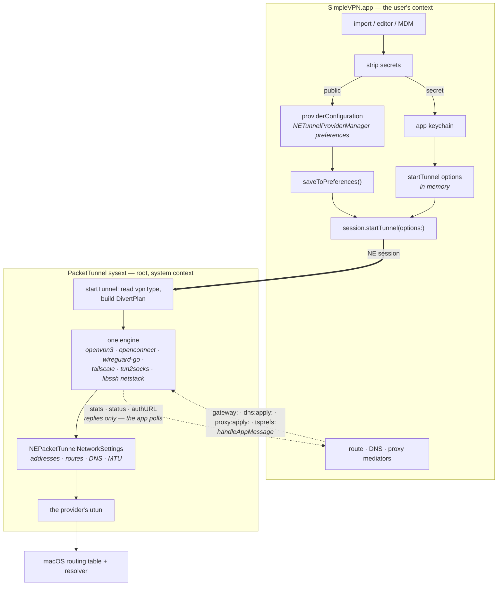
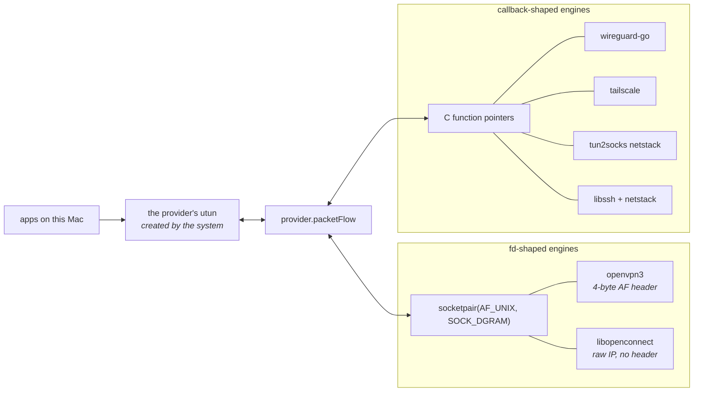
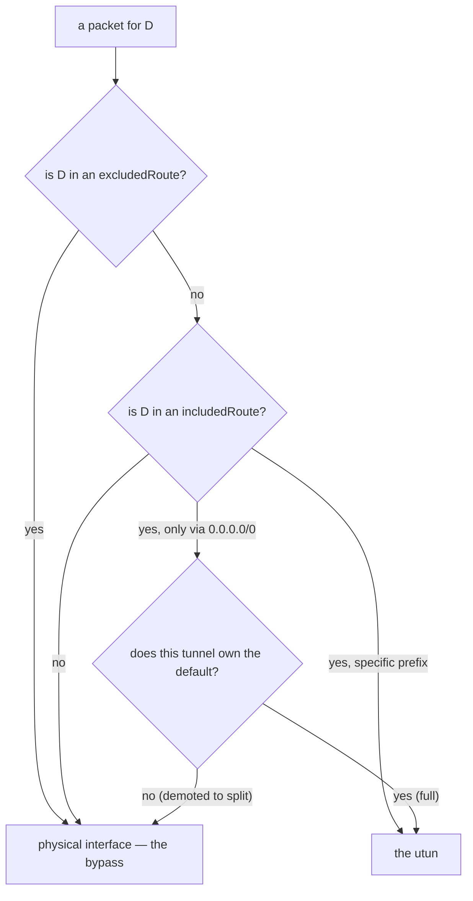
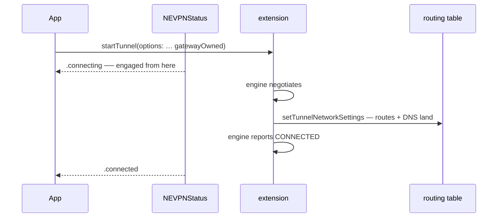
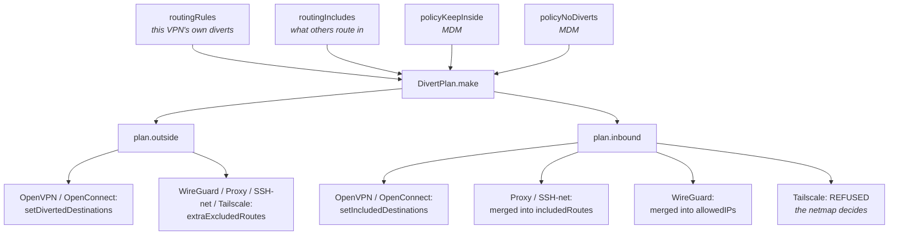

# Networking — how a configuration becomes a working tunnel

The packet path, end to end: where a profile comes from, what the system extension does with it,
which interfaces exist and who opens them, and how a destination ends up on one side of the tunnel
rather than the other.

**Read the status markers.** Most of what follows is shipped; the policy engine at the far end is
not, and the difference matters more here than anywhere else in the docs, because a routing claim
that is only designed is a claim about where someone's traffic goes.

- ✅ **BUILT** — in `main`, tested.
- 📐 **DESIGNED** — decided, with reasoning, not implemented.
- ❓ **OPEN** — needs a decision or a measurement before it can be relied on.

Naming follows `ONTOLOGY.md` — **full tunnel** / "Send All Traffic", **split tunnel**, **route**,
**excluded route** / **bypass**, **server**, and the internal **engaged**. See
`Docs/SecretsAndSync.md` for where secrets live, `Docs/AuthArchitecture.md` for how a sign-in is
resolved before any of this starts, `Docs/PolicyRouting.md` for the policy-routing design,
`Docs/StateMediators.md` for the route/DNS/proxy mediators this document keeps referring to, and
`Docs/LocalVirtualNetworks.md` for the virtual-machine findings summarised at the end.

---

## 0. The whole chain, once



Three claims in that picture are load-bearing and each is defended below: **the configuration never
holds a secret**, **the extension is root and cannot read the user's keychain**, and **every routing
and DNS decision is expressed as `NEPacketTunnelNetworkSettings`** — nothing shells out to `route`,
writes a `pf` rule, or installs a privileged helper. The routing table is only ever *read*
(`PFRouteMonitor`, for drift). The one system-wide write outside NetworkExtension is on a path that
has no tunnel at all: the subprocess SOCKS kinds optionally point the primary network service's SOCKS
proxy at their local port with `networksetup`, which prompts for admin and is restored on
disconnect.

---

## 1. Config in ✅

### Where a profile comes from

| Route in | Entry point | Notes |
|---|---|---|
| A file (`.ovpn`, `wg-quick` `.conf`, Cisco `.pcf`/AnyConnect XML) | `SimpleVPN/Import/ProfileImport.swift` | One pipeline for the Open panel, drag-and-drop onto any window, Finder double-click and File ▸ Import |
| An editor | `SimpleVPN/UI/Editors/*` per kind | The kind decides the form; every field is a descriptor with a manual anchor (`AGENTS.md`) |
| MDM | `SimpleVPN/MDM/ManagedPolicy.swift` | A `com.apple.ManagedClient.preferences` payload — **policy**, not profiles (`Docs/MDM.md`) |

Two things about that table are easy to get wrong. **Content decides the kind, not the file
extension** — `ConfigDetector.detect` sniffs `[Interface]`/`[Peer]`, `<AnyConnectProfile`, `[main]`
+ `host=` before it falls through to "treat it as OpenVPN and let the parser complain". And
**`.mobileconfig` is an export, not an import**: `NativeVPNConfig.mobileconfig` *writes* one for
L2TP (macOS gives apps no programmatic L2TP API), and MDM pushes *managed preferences*. There is no
code path that reads a `.mobileconfig` to create a profile. The import diagram in
`Docs/SecretsAndSync.md` §2 lists it as a source; the code does not have it. ❓ — either that
diagram is aspirational or it means the MDM payload; worth reconciling in that document rather than
here.

An OpenVPN import is validated by **the engine's own parser** (`OVPNProfileEvaluator`) before
anything is stored, de-duplicated by a content hash over the *canonical* text — secret blocks
replaced by a digest of themselves, so the hash survives the secret-stripping described next — and
name-collision-suffixed.

### Where it is stored

A saved VPN is an `NETunnelProviderManager` in the system's VPN preferences. Everything SimpleVPN
knows about it that is not a secret lives in that manager's `providerConfiguration`, as a small set
of keys — one per concern, each independently decodable:

| Key | Holds | Owner |
|---|---|---|
| `profile` | the stable profile id (also the keychain key) | `VPNController` |
| `vpnType` | the `VPNKind` raw value; **absent means `.openVPN`** | `Shared/VPNKind.swift` |
| `ovpn` | the OpenVPN configuration text, **secret blocks removed** | `Shared/OVPNInline.swift` |
| `overrides` | per-VPN engine overrides (JSON) | `Shared/OpenVPNOverrides.swift` |
| `wireguard` · `tailscale` · `proxytunnel` · `sshnet` | that kind's config (JSON) | `Shared/*Config.swift` |
| `routingRules` · `routingIncludes` | divert rules and the destinations other VPNs route in | `Shared/RoutingRule.swift` |
| `customrouting` | the per-VPN route/DNS/proxy rewrite filter | `SimpleVPN/Mediators/CustomRouting.swift` |
| `auth` · `credsource` · `uiprefs` · `endpoints` | how to sign in, which password app, UI state, server list | `SimpleVPN/Credentials/*`, `Geo/VPNEndpoints.swift` |

Every one of those blobs decodes **leniently**: a missing or corrupt value degrades to its default
rather than failing the connect. That is deliberate and stated at each decoder — a settings problem
must never be a connectivity problem.

### The split that everything else depends on

**`providerConfiguration` never holds a secret.** Secrets are stripped at import, written to the
keychain *first*, and ride `startTunnel(options:)` at connect time — `Docs/SecretsAndSync.md` §1–2
is the authority and explains why (including the test that enforces it). The networking consequence
is the one to remember here: the extension gets a configuration that is *incomplete on purpose*,
and reassembles it in memory for the life of the session. For OpenVPN that is literal string
splicing — `OVPNSecretMaterial.merge` puts `<key>`, `<tls-crypt>` and friends back into the
configuration text inside the extension, because `openvpn3` takes its configuration as a string.
Nothing rewritten there is ever persisted.

If the configuration says a block was moved out and the app sent no replacement, the extension
refuses with a sentence naming the fix rather than letting the engine fail with an opaque TLS error
(`PacketTunnelProvider.swift`, code 3).

---

## 2. The network extension ✅

`PacketTunnel/` is a **system extension** containing one `NEPacketTunnelProvider` subclass, and it
runs **as root in the system context**. That single fact shapes the whole boundary:

* **The keychain is reachable from the app and not from the extension.** The user's login keychain
  belongs to the user's session; a root process in the system context cannot read it. So the
  keychain handoff *cannot* work from inside the extension, and every secret arrives as an entry in
  the `startTunnel(options:)` dictionary — in memory, for that session only. (A
  `KeychainCredentialStore.takeSession` fallback survives for an older app driving a newer
  extension. It is a compatibility shim, not the design.)
* **There is no shared-storage channel either.** App-group `UserDefaults` and files do not cross the
  root/system-context ↔ user boundary, which is why telemetry is *polled over IPC* rather than
  written somewhere both sides can see.
* **The extension cannot push to the app at all.** Nothing in `NEPacketTunnelProvider` sends
  unsolicited messages. Tailscale's interactive sign-in is the visible consequence: the engine gets
  a URL, the extension logs "waiting for browser sign-in", and **the app polls `tsauth`** until a URL
  appears and then opens the window itself.

**One provider, every in-process engine.** `PacketTunnelProvider` is not one class per protocol —
it is one class that dispatches on `providerConfiguration["vpnType"]` and holds at most one engine
alive at a time: `OpenVPN3Bridge`, `OpenConnectBridge`, `TailscaleEngine`, `WireGuardEngine`,
`ProxyTunnelEngine`, `SSHNetworkTunnelEngine`. The `handleAppMessage` handlers exploit that — they
`if let` down the list of engine references, and "at most one is non-nil" is the invariant that
makes a single generic message like `gateway:split` route itself.

### What crosses, in each direction

**App → extension**, at start, as `startTunnel(options:)`:

| Option | Why it is an option and not configuration |
|---|---|
| `username`, `password`, `challengeResponse`, `proxyPassword`, `privateKeyPassword` | secrets |
| `ovpnInlineSecrets` | the stripped `<key>`/`<tls-crypt>` blocks |
| `wgPrivateKey`, `wgPresharedKey`, `tailscaleAuthKey` | secrets (for WireGuard the keys *are* the sign-in) |
| `sshPassword`, `sshPrivateKeyPEM`, `sshCertificatePEM` | secrets (`sshUsername` rides along because it is resolved with them) |
| `sshExpectedHostKeySHA256` | **not** a secret — a trust decision the app made and the extension cannot make |
| `cookie`, `servercert`, `connectURL` | the SSO handoff: sign-in happened in the user's context |
| `policyKeepInside`, `policyNoDiverts` | MDM policy, so the *session* carries it |
| `gatewayOwned` | who owns the default route at establish |

Two of those deserve their reasoning restated, because it is a security argument rather than a
plumbing one. **MDM policy travels with the session** so the extension enforces it independently of
whatever the persisted configuration says — a profile saved before the policy was pushed cannot be
used to leak, and the UI gates are explicitly described in the code as "only cosmetic". And the
**SSH host-key fingerprint is not optional**: the extension is PIN-ONLY, having no UI to prompt with
and, as root in a sandbox, no `known_hosts` to consult, so an absent pin is a refusal to connect
rather than a permissive default.

**App → extension**, while running, as `handleAppMessage` strings:

`version` · `stats` · `flows` · `pause:hold` · `pause:bypass` · `resume` · `gateway:full` ·
`gateway:split` · `tsauth` · `tsstatus` · `pxstatus` · `wgstatus` · `sshnetstatus` · `tsforget` ·
`dns:apply:<json>` · `dns:clear` · `proxy:apply:<json>` · `proxy:clear` · `tsprefs:<json>`

**Extension → app**: only ever as the *reply* to one of those, plus two side channels — `os_log`
(deliberately at default level, not `.debug`, because debug messages are not persisted and their
absence silently emptied the diagnostics bundle of the OpenVPN handshake) and `TunnelIncidentStore`,
a file the root process writes and the app reads to explain a failure that has already happened.

Replies never carry key material; the status payloads are whitelisted engine-side. The one shape
worth knowing is that a `nil` reply to `dns:apply:` is **meaningful**: it is the engine saying "I
have no live DNS applier", and the app's documented fallback is to reconnect that tunnel to re-push
its DNS.

---

## 3. The interfaces — how many utuns, and who opens which ✅

This is the part most worth getting exactly right, because the answer is not "one utun per VPN" and
it is not the same answer for every backend.

### 3.1 The provider's utun

For a packet-tunnel kind there is **exactly one utun, and SimpleVPN never creates it**. The system
creates it when `setTunnelNetworkSettings` succeeds, and the *only* handle we ever get to it is
`provider.packetFlow` — a read/write queue of IP packets, not a file descriptor and not an interface
name. Everything about the interface's shape is expressed by the settings object:

| `NEPacketTunnelNetworkSettings` | What it decides |
|---|---|
| `tunnelRemoteAddress` (init) | the address NE keeps *out* of the tunnel so the tunnel's own transport can leave |
| `ipv4Settings.addresses` / `subnetMasks`, `ipv6Settings.addresses` / `networkPrefixLengths` | the interface's own addresses — **applying settings with none tears the tunnel's IP configuration down**, which is why several builders return `nil` rather than build an addressless settings object |
| `includedRoutes` | destinations that enter the tunnel (a **route**; `NEIPv4Route.default()` is the **full tunnel**) |
| `excludedRoutes` | destinations deliberately kept out (an **excluded route** / **bypass**) |
| `dnsSettings.servers`, `.searchDomains`, `.matchDomains` | the resolver, the search list, and *how much* of DNS this tunnel claims |
| `proxySettings` | the system proxy, when this tunnel is the arbitrated owner (`Docs/StateMediators.md`) |
| `MTU` | the largest packet that fits |

`setTunnelNetworkSettings` is called **again**, on the same session, every time any of that changes
— a gateway demotion, a proxy hot-swap, a pause, an OpenConnect reconnect. It is the one write
primitive, and re-applying it is how everything in §4 and §5 happens without a reconnect.

`tunnelRemoteAddress` is the field most often filled in carelessly and it is *load-bearing for
WireGuard*: `WireGuardNetworkSettings` passes the engine's **resolved** `ip:port` (from `WGStart`'s
reply, with the port stripped and IPv6 unbracketed), not the hostname, because NE uses that literal
address to route the tunnel's own encrypted UDP around the tunnel. For a mesh it is honestly
cosmetic — `TailscaleNetworkSettings` reports *this node's own* address rather than inventing a peer.

### 3.2 What the engine on the other side of the flow actually holds

The engines split into two families, and the difference is invisible from the app but decides how
packets are framed and where a bug would show up.



* **`openvpn3` and `libopenconnect` want a tun file descriptor.** They are given **one end of a
  `socketpair(AF_UNIX, SOCK_DGRAM)`** and a pump copies between the other end and `packetFlow`.
  Neither engine ever sees a utun. The framing differs between them and the code says so at both
  sites: openvpn3's fd is framed like a real utun (a 4-byte big-endian address family prefixed on
  every packet in both directions), while `libopenconnect`'s `os_tun` fd path carries **raw IP with
  no prefix**, so inbound the family is inferred from the IP version nibble. That asymmetry is the
  single most surprising thing in the packet path, and the OpenConnect bridge carries an explicit
  note that if a future build switches to AF headers, the read and write must change together.
* **The Go and netstack engines never touch a descriptor.** `wireguard-go`, the Tailscale engine, the
  `tun2socks` proxy engine and the SSH network tunnel are handed raw IP packets across a C callback
  boundary (`WGPacketIn` / `WGSetCallbacks` and their equivalents). Because the callbacks are plain
  `@convention(c)` pointers that cannot capture Swift context, each engine routes them through a
  single lock-guarded static — legitimate precisely because **only one tunnel runs per provider
  process**.
* **The netstack engines are not carrying IP at all.** The proxy tunnel and the SSH network tunnel
  terminate the guest's TCP in a userspace stack (gVisor netstack, `Vendor/proxy-engine`) and
  re-originate each flow as a SOCKS/CONNECT dial or an SSH `direct-tcpip` channel. Two consequences
  are written down in `SSHNetworkTunnelNetworkSettings`: there is **no MTU reduction and no MSS
  clamp**, because nothing is encapsulated and there is no outer header to make room for; and only
  TCP (plus DNS) crosses, because SSH has no UDP channel.

### 3.3 Per backend — which pattern applies

| Kind | Interface | Who decides addresses/routes/DNS | Settings builder |
|---|---|---|---|
| OpenVPN | the provider's utun; engine holds a socketpair fd | **the engine's resolved view** (client config + the server's push), captured through the `TunBuilder` callbacks | `OpenVPN3Bridge.buildTunSettingsIncludingRoutes:` |
| OpenConnect SSL VPNs, **in-process** | same | the same, captured in `setup_tun` from `ip_info` + split-includes | `OpenConnectBridge` |
| WireGuard | the provider's utun; Go callbacks | **the user's config** — `Address`, `AllowedIPs`, `DNS`, `MTU` | `Shared/WireGuardNetworkSettings.swift` |
| Tailscale / Headscale | same | **the engine** — `router.Config` + `dns.OSConfig` from the netmap | `Shared/TailscaleNetworkSettings.swift` |
| Proxy Tunnel | same | the user's config, on a fixed on-link utun address | `Shared/ProxyTunnelNetworkSettings.swift` |
| SSH Network Tunnel | same | the user's config, on a fixed on-link utun address | `Shared/SSHNetworkTunnelNetworkSettings.swift` |
| IKEv2 / IPsec / L2TP | **an OS-owned interface we never see** | macOS, from `NEVPNProtocol*` | — (`NativeVPNManager`) |
| SSH (`.ssh`) | **no interface at all** | — a local SOCKS port or named forwards (`-D`/`-L` in-process; `-R`, a jump host or extra options route to `/usr/bin/ssh`) | — |
| OpenConnect SSL VPNs, **subprocess** (one of four knobs the bridge can't carry) | **no interface** in the shipped path | `ocproxy` gives a userspace SOCKS port — **required**, not optional | — |

Three rows in that table are the ones that do not fit the pattern, and they are the ones a reader
will otherwise assume away:

1. **The native personal-VPN kinds have no utun of ours and no settings object.** `NEVPNProtocolIKEv2`
   and `NEVPNProtocolIPSec` expose no included-routes API; macOS owns the routing table. This is
   exactly why `VPNKind.canAcceptRoutedInTraffic` and `canDivertOutside` are both false for them,
   with a user-facing sentence instead of a control that would do nothing. They also share one
   `NEVPNManager.shared()`, so **only one native configuration can exist at a time** — an OS limit,
   not ours.
2. **The `.ssh` kind is not a tunnel in this document's sense.** It is the in-process libssh engine
   (or, for what that engine does not carry, a `/usr/bin/ssh` subprocess) offering a SOCKS5 listener
   or `-L`/`-D`/`-R` forwards. There is no utun and nothing routes into it. Its `-w` point-to-point
   mode *would* need a utun, and both the editor and the connect gate refuse it in as many words:
   "Network tunnel (-w) requires root for the utun device — not supported in this build". A
   `tun@openssh.com` channel exists in the bridge with **no caller**.

   **Which engine carries an SSH tunnel is `SubprocessTunnelManager.willRunInProcessSSH`, and it is
   the only place that decides** — the same single-predicate discipline `willRunInProcess` enforces
   for the SSL kinds, and for the same reason: two spellings of "will this run in-process?" is how
   that surface came to tell users one thing and do another. In-process now covers **SOCKS (`-D`)
   mode and port-forward mode's `L`/`D` rows**. Port forwards used to shell out for a reason that
   was never a capability limit: `SSHTunnelEngine` had `addForward`/`startForwardListener`/
   `handleLocalForward` and had been using them for live add-and-remove while connected for months,
   but nothing called them at CONNECT time, so `connect` dispatched only on `sshMode == .socks`.
   `startPortForwards` is that missing entry point, and it is all-or-nothing to mirror the
   subprocess's `ExitOnForwardFailure=yes`.

   **Three things the in-process engine does NOT carry, each refused by name rather than downgraded:**

   1. **Reverse forwards (`-R`) — not supported yet.** The server listens and opens channels back to
      us, which needs `ssh_channel_listen_forward` plus `ssh_channel_open_forward_port` in
      `SSHBridge` (the vendored libssh exports both, and `ssh_packet_channel_open` /
      `ssh_message_queue` are compiled in even at `WITH_SERVER=OFF`, so the library side is ready)
      and an accept poll on the session queue. `addForward` refuses `"R"` with
      `SSHTunnelEngine.reverseForwardUnsupported`.
   2. **A jump host — not supported yet.** Needs a *nested* session: authenticate to the bastion,
      open a direct-tcpip channel to the target, then hand that channel's fd to a second session via
      `SSH_OPTIONS_FD`. Silently dropping it would dial the target directly and bypass the bastion.
   3. **Raw `sshExtraOptions`** — no in-process equivalent *by construction*, not unfinished work;
      the same reasoning as `extraArgs` for OpenConnect. Arbitrary `ssh_config` keywords can rewrite
      the data path (`ProxyCommand`, `Ciphers`, `Tunnel`), so honouring "a known subset" would
      silently ignore the rest.

   The first two are **known gaps that still work**, because `/usr/bin/ssh` ships with macOS and does
   carry them: such a profile is *routed* to the tool, not refused. What that costs is the host-key
   pin — `ssh` has no pin-by-hash option, so `sshPinBlockReason` refuses a pinned profile that would
   land there rather than let it connect unpinned. Both gaps are documented in `manual.html`
   (`#ssh-forwards`, `#ssh-proxy-jump`) so a user meets them as a stated limit rather than a
   surprise.

   **The pin gate is exactly "will this run in-process?", and nothing more.** It used to read
   `sshMode != .socks`, which was true only *because* port-forward mode had no in-process entry
   point — it was never a statement about SOCKS. Now that `-L`/`-D` run on the engine, a pinned
   port-forward profile is enforceable and is no longer refused; the clause that remains refuses the
   cases where the premise still holds.
3. **A subprocess OpenConnect never gets a utun either — in practice.** `openconnectArgs` appends
   `--script-tun --script "ocproxy -D <port>"` whenever `ocproxy` is installed, which turns the SSL
   VPN into a userspace SOCKS proxy needing no root. Without `ocproxy` the argv omits it, and
   `openconnect` would then try to configure a real tun itself — which needs privileges this app does
   not take. ✅ **`SubprocessTunnelManager.sslTransportBlockReason` now refuses that combination**
   before anything is spawned, and the first fix it names is *Run In-Process*, not Homebrew: the
   bundled engine has no privilege problem to solve. Homebrew is named only when the config uses
   something the bridge genuinely cannot carry, because then the toggle would be a lie.

   The in-process alternative is the preferred path and the reason is quoted in the code: "That is a
   FULL-ROUTES path and needs no privileged helper — NetworkExtension is the privilege." **All seven
   SSL-VPN kinds take it** — the provider dispatches on `VPNKind.openconnectProtocol`, which has
   always covered all seven; the app's connect path used to name only `fortinet` / `f5apm` /
   `ciscoAnyConnect`, so a GlobalProtect, Juniper, Pulse or Array tunnel was *told* it would run
   in-process (`willRunInProcess` returns true for any `isSSLVPN`) and silently ran as a subprocess.
   That divergence is gone: `willRunInProcess` is the single rule and the dispatch calls it.

   **In-process is now the DEFAULT for a new SSL VPN** (`SubprocessTunnelConfig.preferInProcess` is
   Optional; absent means in-process), so the subprocess is a fallback rather than the normal path.
   Whether a profile takes it is `SubprocessTunnelManager.willRunInProcess`, and after the smartcard
   removal its refusals are **exactly four ordinary settings**:

   1. a **host checker / endpoint posture** wrapper (`csdWrapper`, `disableCSD`) —
      `openconnect_setup_csd` works by forking a child, and the extension is sandboxed *and* root;
   2. a **base MTU** (`baseMTU`) — the library header exposes no setter (`openconnect_set_reqmtu` is
      `--mtu`, a different number);
   3. **HTTP keepalive off** (`noHTTPKeepalive`) — likewise;
   4. **extra arguments** (`extraArgs`) — arbitrary argv has no in-process equivalent by construction.

   (Two further clauses refuse an *invalid* value rather than a capability: a compression mode or a
   reported OS OpenConnect hasn't got. Both would be refused by the tool at startup too.)

### Why 2 and 3 need a library patch, and the three cheaper options that failed ❓

Recorded because "we already have an MTU setter" is the obvious objection to carrying a local patch
forever, and because the question has now been asked twice and re-derived twice. Three cheaper
routes were considered before concluding a patch is the only one, and each failed for its own
reason:

1. **Is `--base-mtu` covered by the setter we already call?** No: they are different numbers.
   `openconnect_set_reqmtu` (public header, and it *is* wired — one of the gates already closed with
   it) is `--mtu`: the MTU we **ask the gateway for**. `--base-mtu` describes the MTU of the
   **underlying link**, which OpenConnect uses as an input when deriving a tunnel MTU and when
   sizing DTLS. Setting the request does not tell the library what the path beneath it can carry, so
   one cannot stand in for the other. ✅ Verified from the header: `openconnect_set_reqmtu` is
   present and there is **no** base-MTU entry point. The semantic distinction between the two is
   reasoned from OpenConnect's documented CLI behaviour, **not** read from source — the vendored
   archive ships no CLI, so it could not be checked here. ❓
2. **Is there a callback where the library asks us for it?** No. This was worth asking because the
   pattern works elsewhere: OpenVPN's local-network carve-out exists precisely because openvpn3
   *calls back* into our tun builder (`tun_builder_get_local_networks`), so we override rather than
   patch. OpenConnect's tun surface is `openconnect_setup_tun_device` / `_tun_script` / `_tun_fd` —
   we hand it an interface, it does not ask us what the base MTU is. There is nothing to intercept.
3. **Does `--no-http-keepalive` even belong on this list?** It looked like it might not, under the
   rule that sign-in may leave the process while carrying traffic must not: keepalive on the *HTTP*
   requests sounds like a sign-in concern. It is not — it also governs the connection that carries
   CSTP, so it is a data-path setting and the gate is justified. ❓ Reasoned, not measured. The
   public header contains **no keepalive symbol at all**, which is verified. ✅

So the remaining option is to **patch the vendored library** to add the two setters, applied by
`Tools/build-openconnect-xcframework.sh` from a patch file in the repo. That work is **deliberately
deferred**, not merely outstanding: the decision is to live with the limitation rather than start
carrying a local patch now, so the two settings stay **unsupported on the in-process path** and the
job is to say so honestly where a user meets them. That is
`SubprocessTunnelManager.toolOnlyCaveat` — a caveat on each of the two rows, naming the setting with
the same `inProcessRefusalNoun` clause the connect path uses, and only while the setting is actually
set — plus the matching paragraphs under `#oc-base-mtu` and `#oc-no-http-keepalive` in
`manual.html`. **The gates stay.** A clause may only be removed once the setting is genuinely
carried, and neither is. Note the constraint the patch must respect when it is eventually written:
the script pins `OPENSSL_PIN` and fails hard if
Homebrew disagrees, because three engine archives statically carry OpenSSL and must agree — a patch
must not become an excuse to move that pin.

Two setters that OpenConnect's own CLI plainly wants are also a plausible **upstream**
contribution, which would end the cost of carrying the patch across library bumps. Worth proposing
rather than maintaining locally forever.

   **Smartcard sign-in used to head that list, and it was the load-bearing entry** — the one capability
   the Homebrew tool had that the bundled engine structurally could not, whatever the xcframework was
   configured with. It is *gone*: SimpleVPN no longer signs in with a certificate on a card at all
   (`Docs/AuthSecPKCS11.md` is the record of why, including why rebuilding with GnuTLS + p11-kit would
   not have helped — AMFI refuses the very `dlopen` p11-kit exists to perform). A profile that still
   asks for one is refused by `sslAuthBlockReason` with an explanation and a request for the use case;
   it is never quietly converted into a password sign-in. `tokenMode` (OpenConnect's own TOTP/HOTP code
   generator) went the same way, for its own reasons, and is refused in the same place.

   **`willRunInProcess` stays settings-only, with no per-kind allow-list.** A three-kind list has been
   removed twice; re-adding one is a regression, and it is what made GlobalProtect, Juniper, Pulse and
   Array demand Homebrew for nothing.

### 3.4 Addresses and MTU

| Kind | Interface address | MTU |
|---|---|---|
| OpenVPN | pushed (`tun_builder_add_address`) | pushed; bridge default **1500** |
| OpenConnect | pushed (`ip_info`) | pushed |
| WireGuard | the config's `Address=` (a bare address is normalised to `/32`/`/128`) | config, clamped to `576...1500`; default **1420** |
| Tailscale | the netmap's `localAddrs` (`100.64/10`, `fd7a:…`) | config; default **1280** |
| Proxy Tunnel | fixed **`198.18.0.1`** / `fd6e:7853:0::1` | config; default **1500** |
| SSH Network Tunnel | fixed **`198.18.0.1`** / `fd6e:7853:0::1` | config, range `576...1500`; default **1500** |

The fixed addresses are a deliberate choice with a reason worth repeating: `198.18.0.0/15` is the
RFC 2544 benchmarking range and `fd00::/8` is unique-local, so neither is space a user might
genuinely route — "a tunnel that silently steals `192.168.9.0/24` is a tunnel that breaks their
LAN". The two kinds share the same address on purpose, because only one packet-tunnel provider
session runs at a time.

**1280 recurs, on both sides of the tunnel.** It is our Tailscale utun's default, and — separately —
it is the default MTU of an Apple `container` guest, which `Docs/LocalVirtualNetworks.md` records as
one of the three measured reasons container networking did *not* break under Tailscale: the guest was
already comfortably under any tunnel's MTU. Worth keeping straight that those are two different
interfaces that happen to agree.

### 3.5 Teardown

`stopTunnel(with:)` snapshots every engine reference under the lock, then stops all of them
unconditionally (`disconnect()` / `stop()`) and calls the completion handler. The utun goes away with
the session; nothing removes routes by hand, because nothing installed them by hand.

Four teardown details are the kind that get rediscovered painfully:

* **A pump generation counter, not a flag.** Both fd-shaped bridges bump `_pumpGeneration` on
  teardown, and every read loop checks it before touching the fd or re-arming. A stale loop belonging
  to a dead session would otherwise write into a *recycled descriptor belonging to someone else*.
* **The fd is closed from the dispatch source's cancel handler**, never inline — closing it out from
  under a running event handler hands that handler someone else's descriptor.
* **OpenConnect re-runs `setup_tun` on every CSTP reconnect**, so its bridge tears the previous pump
  down first. Without that, each reconnect leaked a source and two descriptors until the extension
  ran out.
* **The engines' callbacks are dropped last.** `WireGuardEngine.stop()` calls `WGStop()`, clears the
  static, and only then `WGSetCallbacks(nil, nil)` — a packet already inside the Go writer would
  otherwise land on a torn-down flow.

A system-initiated stop is recorded as an incident rather than treated as a clean exit; `.superceded`
in particular ("Another VPN configuration was started") is how the user finds out that something
else took the tunnel.

**A transport drop is not a teardown, and that is a security property.** The SSH network tunnel's
delegate says it plainly: only *permanent* failures (a refused sign-in, a host key that does not
match) cancel the tunnel. A transport drop reconnects with the tunnel's routes still in place, so
traffic is refused rather than leaked — "cancelling would hand the traffic back to the physical path,
which is the leak this kind of tunnel exists to prevent."

---

## 4. Routing, the simple case ✅

One VPN, connected, doing what its configuration says. In `ONTOLOGY.md` vocabulary: a **full tunnel**
(the control is "Send All Traffic") carries `0.0.0.0/0` and `::/0`; a **split tunnel** carries only
specific **routes**; an **excluded route** (**bypass**) is a destination deliberately kept out.

### 4.1 What the settings object means to macOS



Longest-prefix-match, as always: a specific **route** beats the default, and an **excluded route**
beats an included one covering the same space. The mechanism is entirely the OS's — SimpleVPN adds
routes by *describing* them and removes them by describing a different set.

A **full tunnel** in our packet-tunnel kinds is `NEIPv4Route.default()` / `NEIPv6Route.default()`
inside `includedRoutes`. It is **not** `includeAllNetworks`.

### 4.2 `includeAllNetworks` and `excludeLocalNetworks` — narrower than they look

**These two properties are used on exactly one path: the native personal-VPN kinds.**
`NativeVPNConfig.includeAllNetworks` (default **off**) and `.excludeLocalNetworks` (default **on**,
and only meaningful when the first is on) are copied onto the `NEVPNProtocol` in
`NativeVPNManager`, and the editor hides the second until the first is on. **No packet-tunnel kind
sets either one**, and that is a decision rather than an omission — see below.

That is worth stating flatly, because the two are widely treated as *the* way an Apple-platform VPN
says "everything, including LAN". For our own tunnels the equivalent decisions are made differently
and are ours to make:

| Intent | Native kinds | Our packet-tunnel kinds |
|---|---|---|
| everything goes through the VPN | `includeAllNetworks = true` | a default route in `includedRoutes` |
| keep the LAN reachable | `excludeLocalNetworks = true` | **"Allow local network access"** → computed **excluded routes** (below) |
| change it while connected | **cannot** — fixed at connect | re-apply the settings, no reconnect |

And that last row is why the Route mediator classifies the native kinds as `.limited` and tells the
user so: *"is an OS-managed VPN; its full/split routing is fixed at connect and can't be switched
live."* `Docs/LocalVirtualNetworks.md` refers to "an `includeAllNetworks` tunnel" as one of the
things a guest-network exclusion guards against; read alongside the code, that means **a native VPN
configured that way**, not one of our own.

**Why `excludeLocalNetworks` is not the mechanism for our kinds.** It lives on `NEVPNProtocol`,
which `NETunnelProviderProtocol` inherits — so a packet-tunnel profile *could* set it. The SDK ties
it to the other property: `includeAllNetworks`'s own header documentation calls
`excludeLocalNetworks` / `excludeAPNs` / `excludeCellularServices` "exclusions" from the traffic
`includeAllNetworks` captures, and `NEPacketTunnelNetworkSettings` has no local-networks property at
all. Our kinds never set `includeAllNetworks` (§4.1), so setting `excludeLocalNetworks` on them
would be a property with nothing to modify — a control that reads as protection and changes no
packet's path. ❓ Not measured against a live tunnel; the *documented* contract is what the choice
rests on.

### 4.2.1 "Allow local network access" ✅ — computed prefixes, one per kind's own seam

`ONTOLOGY.md` binds the label; the mechanism is `Shared/LocalNetworkCarveOut.swift`, which decides
once what "the local network" means: **the networks this Mac's own interfaces are on**, masked to
their network address, plus the fixed link-local / multicast / broadcast ranges
(`169.254.0.0/16`, `224.0.0.0/4`, `255.255.255.255/32`, `fe80::/10`, `ff00::/8`). Nothing is
inferred from RFC 1918 — "you might have a `10.0.0.0/8` somewhere" is not evidence, and a carve-out
wider than the truth sends traffic outside the tunnel that the user believes is inside it. Tunnel,
loopback, and virtual-machine interfaces are excluded (`bridge0` is a real LAN, `bridge100`+ are
guest networks with their own offer — §6 — so this rule takes exactly the bridges that one rejects).

**Computed in the app, carried in the session.** The list rides `startTunnel(options:)` under
`localNetworks`, like `gatewayOwned` and `policyKeepInside`: the app is unsandboxed and already
enumerates interfaces, and an empty enumeration inside the sysext would be a carve-out that looks
applied and is not. Absent ⇒ no carve-out, which is the fail-closed direction. The extension
re-applies the MDM gate (`ForceKeepInsideVPN` drops the list, and forces
`overrides.allowLocalLanAccess = false` for OpenVPN) because that is the enforcement point.

| Kind | Setting | How the prefixes are applied |
|---|---|---|
| OpenVPN | `openvpn.local-lan` (**pre-existing**) | `tun_builder_get_local_networks` — **openvpn3 asks the builder** and makes `net_gateway` routes itself (`tunprop.hpp`, gated on `allowLocalLanAccess`) |
| WireGuard | `wg.local-lan` | `extraExcludedRoutes`; `allowedIPs` untouched, so the peer still permits them and only this host's table changes (§5.1) |
| Proxy Tunnel | `px.local-lan` | `extraExcludedRoutes`, beside the upstream proxy's own address |
| SSH Network Tunnel | `sshnet.local-lan` | `extraExcludedRoutes`, beside the SSH server's own address |
| Tailscale | — | the engine's `localRoutes`, plus `ts.exit-node-lan` while an exit node is on |
| OpenConnect SSL VPNs (in-process) | `oc.local-lan` | `OpenConnectBridge.setDivertedDestinations:` — the **same** excluded-route seam the diverts use (`_extraV4Excluded` / `_extraV6Excluded`), so one list re-applies on every gateway/proxy/DNS re-apply |
| OpenConnect SSL VPNs (subprocess) | `oc.local-lan`, **inert** | nothing to apply: `ocproxy -D <port>` is a SOCKS listener with no interface and no routes, so the LAN was never captured. The row says so rather than looking effective |
| native IKEv2/IPsec/L2TP | `native.exclude-local` | `excludeLocalNetworks`, where the platform honours it |

**OpenVPN's control existed and did nothing.** `openvpn.local-lan` →
`OpenVPNOverrides.allowLocalLanAccess` → `Config::allowLocalLanAccess` has shipped for a long time,
with a manual page, and the Doctor offers it as the fix for "can't reach local devices". But
openvpn3 obtains the prefixes *from the tun builder*, `TunBuilderBase`'s default implementation
returns an empty vector, and `OpenVPN3Bridge` did not override it — so the engine asked, got
nothing, added no exclude route, and the LAN stayed captured. The setting, its documentation and the
Doctor's fix were all silently inert. That override is now implemented.

**The SSL VPNs' control was missing, and the reason it was missed is worth recording.** `be5045d`
added the carve-out and wired it to WireGuard, the Proxy Tunnel and the SSH Network Tunnel — the three
kinds that were whole-Mac tunnels at the time. The SSL VPNs were not: they were `ocproxy` SOCKS
ports, where "keep the LAN reachable" is meaningless because the LAN was never taken away. `51a067a`
then made in-process the **default** for a new SSL VPN, which turned them into whole-Mac tunnels
carrying a default route — and the setting that keeps the printer working did not exist for the kinds
most people run. `oc.local-lan` closes that, through the seam above and no other: the toggle rides
`providerConfiguration["localLan"]`, the prefixes ride `startTunnel(options:)`, and the extension
combines them with `divert.outside` into the ONE `setDivertedDestinations:` call. Two consequences are
deliberate: each prefix is re-validated by `RoutingRule.routeDest` (which refuses a malformed address
and any `/0`, so a "local network" can never be a whole-tunnel bypass), and
`OpenConnectProfileStore.start` now passes `policyKeepInside` — without it `ForceKeepInsideVPN` would
have been unenforceable on this path, because the extension is where it is enforced.

Local prefixes can still leave a tunnel for the older reasons, and those are unchanged: the engine's
own local routes (Tailscale's `localRoutes`), the user's own `excludedRoutes` in a
Proxy-Tunnel/SSH-Network-Tunnel config, a **divert rule** (§5), or the guest-network offer (§6). The
carve-out above is deliberately the *same* `extraExcludedRoutes` seam as those, not a parallel one:
one list, re-passed by every live re-apply, so a gateway or proxy hot-swap cannot drop half of it.

### 4.3 The carve-outs that are not the user's

Some excluded routes are computed at connect and are *not* stored in any config — deliberately, so
"a computed route can never be mistaken for something the user typed":

* **The tunnel's own transport.** NE already exempts a provider's own sockets from its own tunnel, so
  the encrypted carrier leaves via the physical interface even under a default route. The excluded
  route makes the *routing table* agree as well. For the Proxy Tunnel that is belt and braces; for
  the **SSH Network Tunnel it is not** — the excluded address is the tunnel's own carrier, and
  routing it inward is "a loop that does not merely misroute a connection, it hangs the tunnel with
  no error anywhere."
* **Resolved once, at connect, and re-passed forever after.** `getaddrinfo` is blocking, and the live
  re-apply paths (gateway hot-swap, proxy hot-swap) must not block — so the addresses are resolved in
  `startTunnel` and threaded through `extraExcludedRoutes` on **every** subsequent settings build.
  Dropping them on a re-apply would reinstall the loop.
* **A name that does not resolve yields an empty list**, logged rather than fatal: NE's implicit
  exemption still carries the session, and failing a connect over a belt-and-braces route would be a
  regression.

### 4.4 DNS

DNS is where the shipped behaviour differs most between backends, and every difference is a
deliberate answer to the same question — *how much of this Mac's name resolution is this tunnel
entitled to?*

| Backend | Servers | `matchDomains` | `searchDomains` |
|---|---|---|---|
| OpenVPN / OpenConnect, **owning the default** | the pushed servers | `[""]` — every lookup | the pushed search domains |
| OpenVPN / OpenConnect, **split or demoted** | the pushed servers | **the search domains only** | the pushed search domains |
| OpenVPN / OpenConnect, split with **no** search domains | — | — | **DNS is not asserted at all** |
| WireGuard | `DNS=` | `[""]`, or the search domains when demoted | `wg.search-domains` (**ours** — `wg-quick` has no key) |
| Proxy Tunnel / SSH Network Tunnel | the config's resolvers | `[""]`, or the search domains when demoted | `px.search-domains` / `sshnet.search-domains` |
| Tailscale | the netmap's nameservers (empty ⇒ *nothing asserted*) | the netmap's `matchDomains`, if any | the netmap's search domains |

Four consequences worth naming:

1. **A demoted tunnel cannot hijack every lookup.** Losing the gateway arbitration scopes its
   resolvers to its own search domains; with no search domains there is nothing safe to scope to, so
   the tunnel's DNS is left off entirely rather than being narrowed to a guess. That rule now applies
   to all six packet-tunnel kinds, because the three that had no search list have one.
2. **The three kinds whose formats have no search-domain field carry one of ours.** `wg-quick`'s
   `DNS=` line holds resolvers only, and a proxy or an SSH server pushes nothing at all — so
   `WireGuardConfig.searchDomains`, `ProxyTunnelConfig.searchDomains` and
   `SSHNetworkTunnelConfig.searchDomains` are SimpleVPN's own keys, normalised and validated in one
   place (`DNSSearchDomains`, `Shared/DNSApply.swift`) so a domain cannot be spelled three ways
   across three editors. Empty still means empty: nothing is invented. Until this existed, a short
   internal name did not resolve over those kinds while a fully-qualified one did — the same shape of
   failure as the container finding in §6, from a different cause, and the single most likely "DNS is
   broken" report on those backends.
3. **Tailscale with "accept DNS" off installs nothing.** An empty nameserver list means leave the
   Mac's resolvers alone — "installing an empty resolver would break every lookup on the machine".
4. **A split tunnel needs host routes to its own resolvers.** Every builder adds a `/32` (or `/128`)
   included route per advertised server when the tunnel does *not* carry a default, because otherwise
   the resolver address is not routed into the tunnel and the resolver goes dark. Under a default
   route it is already covered.

On top of all that sits the **DNS mediator** (`Docs/StateMediators.md`): the app arbitrates one
per-tunnel DNS slice and writes it through `dns:apply:`. Only the two bridges have a live applier;
the Go/netstack engines reply `nil`, which the app reads as "reconnect me to re-push DNS".

### 4.5 `engaged` — why routing lands before "Connected"

`engaged` (internal, never user-facing) is
`status == .connected || .connecting || .reasserting` — `VPNController.isEngaged`. It exists because
**a tunnel owns routes before it reports itself up**, and anything that reasons about routing must use
the earlier moment:



The ordering is structural, not incidental. For OpenVPN the settings are applied *inside*
`tunEstablish`, which is `openvpn3` asking for its tun fd — the engine cannot pass a packet until
after we have applied them, so routes exist before `CONNECTED` is emitted, and therefore before
`.connected` reaches the app. The consequences:

* **`gatewayOwned` has to ride `startTunnel`.** The extension sets its suppress gate *at establish*,
  so the "at most one owner of the default route" invariant holds from the very first tun build,
  before the app has reconciled anything. The app predicts the answer with the same pure function the
  mediator uses for the live case (`GatewayPolicy.resolveOwner`, with the connecting profile inserted
  as most-recent).
* **The guest-network warning hooks `.connecting`**, not a connect method — see §6 — and that is also
  the only honest moment to enumerate guest subnets, because they exist only while a guest runs.
* **The display status is deliberately *not* the routing status.** `displayStatus(for:)` presents a
  Tailscale profile as **connecting** until its backend reaches `.running`, because NE reports
  `.connected` the instant the extension starts. Routing and the mediators use the NE truth; the badge
  uses the honest one.

### 4.6 Pause — two shapes, and the safe one is the default

`pause:hold` closes the transport but **keeps the routes**, so traffic blackholes; `pause:bypass`
re-applies the settings with `includingRoutes: NO`, which keeps the interface's addresses and MTU but
drops every route and all DNS, handing traffic to the physical interface. Hold is the safe default and
bypass is the explicit one, for the obvious reason. `resume` re-applies with routes and resumes the
engine — the TLS session is kept, so no re-sign-in. This is an OpenVPN-only path today
(`withBridge`); every other engine replies "error: not connected".

---

## 5. Routing, the custom case

`Docs/PolicyRouting.md` is the design authority and names three tiers. This section says which parts
of each exist today, because that is the whole point of the status markers.

| Tier | What it is | Status |
|---|---|---|
| 1 | one VPN, that VPN owns the default | ✅ §4 |
| 2 | several VPNs connected, one default-gateway picker, non-owners demoted to split | ✅ **built, on a different backing than the design describes** |
| 2½ | per-VPN declarative edits: divert rules and Custom Routing filters | ✅ built |
| 3 | full PBR — Tcl 9 iRules-style scripting, named DNS listeners, fake-IP, egress DAG | 📐 **designed, not built** |

### 5.1 Divert rules ✅ — destination-based, address-only

A **divert rule** (`Shared/RoutingRule.swift`) says "this destination goes around this VPN"
(`.outside`) or "this destination goes into another VPN" (`.overVPN`). Rules are stored per source
profile in `providerConfiguration["routingRules"]`; the *target* side of an over-VPN rule is
materialised onto the target profile as `providerConfiguration["routingIncludes"]`. They are usually
generated from a row in the per-VPN traffic log, which is where a user actually notices a destination
going the wrong way.

**The match is by destination address only.** Port and protocol are recorded and displayed, and are
*not* matched, because `NEPacketTunnelNetworkSettings` routes at the network layer. Saying so in the
type's own header is the honest version of a feature that looks like a firewall rule and is not one.

At connect, `DivertPlan.make` decodes both blobs **once, before the engine dispatch**, applies the two
MDM gates, and hands one value to whichever start path runs:



Five things in that picture are the ones a reader would not guess:

1. **This used to be an OpenVPN-only feature by accident.** The blobs were written by the app for
   *every* profile and read by exactly one engine, so a divert on any other kind was a silent no-op.
   `DivertPlan` exists to make the decode and the policy gating happen once, per connect, for every
   kind — the per-kind seam is only *how* it is applied.
2. **`allowedIPs`, not a route, for WireGuard.** A destination routed into a WireGuard tunnel is merged
   into the peer's allowed IPs before the engine starts, because `wireguard-go` drops a packet whose
   destination no peer's cryptokey routing covers. Installing only a host route would be a route into
   a black hole. The mirror image is that a WireGuard **excluded route** changes only the host's
   routing table — `wg-quick` has no "excluded IPs" concept and the peer still permits the traffic.
3. **Tailscale refuses the inbound half, loudly.** What a tailnet carries is the netmap's decision (a
   subnet router, an exit node); an extra included route for a destination no peer advertises is a
   black hole. `VPNKind.canAcceptRoutedInTraffic` is false and the traffic-log menu shows the reason
   *in place of* the action.
4. **A prefix-0 divert is rejected as invalid.** `RoutingRule.routeDest` refuses prefix 0 and any
   malformed or out-of-range address, because a `0.0.0.0/0` divert is a full VPN bypass and an escape
   from MDM's `ForceKeepInsideVPN` — "never what a divert means".
5. **The source side of an over-VPN rule is deliberately *not* excluded from its own tunnel.** This is
   the subtlest decision in the file and it is a fail-closed argument: excluding it would push that
   traffic out the physical interface **in cleartext** whenever the target VPN is down. Left in the
   source tunnel it stays encrypted, and when the target *is* up its more-specific included route wins
   and pulls the destination over.

**MDM is enforced in the extension, not the app.** `ForceKeepInsideVPN` and `DisableDivertRules` both
drop every `.outside` divert; only `DisableDivertRules` drops the inbound ones, because under
`ForceKeepInsideVPN` the traffic still stays inside *a* VPN. `ForceKeepInsideVPN` additionally forces
`allowUnusedAddrFamilies = .block` on the OpenVPN engine. The flags arrive as session options, so a
profile saved before the policy was pushed cannot leak.

### 5.2 Custom Routing ✅ — rewriting what the server pushed

Per-VPN, declarative, and stored at `providerConfiguration["customrouting"]`
(`SimpleVPN/Mediators/CustomRouting.swift`). It is the **tier-2 static form** of the tier-3
`ROUTE_ADVERTISED` / `DNS_PUSHED` / `PROXY_PUSHED` rewrite hooks, and it attaches at each mediator's
single intent-capture seam:

```
capturedIntent ──▶ applyFilter(profile) ──▶ effectiveIntent ──▶ mediator
```

Three resources, three verb sets — routes and resolvers take Accept / Ignore / Replace / Add plus a
per-filter unmatched disposition (Accept-unmatched, or allow-list); the proxy takes Accept / Ignore /
Custom. An absent or empty filter is the **identity transform**, so a profile with no customisation
behaves exactly as before. Because it attaches at the intent hook rather than at connect, a live
session re-arbitrates and re-applies with **no reconnect**.

Two honest limits, both stated in the code: route matching is **exact prefix plus a `default` token**
(CIDR-contains is a documented follow-up), and proxy authentication is a **keychain reference only** —
never inline.

### 5.3 The default-gateway picker ✅ — and how it differs from the design

`Docs/PolicyRouting.md` tier 2 argues that two NE tunnels fighting over `0.0.0.0/0` is something macOS
will not arbitrate, and concludes that a second VPN puts us *necessarily* in a single-utun model with
each VPN attached as an egress engine. **The shipped implementation reaches the same invariant by a
different route**: several ordinary NE tunnels run in parallel, the routing table merges their routes
by specificity, and the app guarantees that **at most one of them advertises a default route** by
demoting the others live.

That is not a contradiction of the design; it is the design's own seam being used as intended. The
Route mediator (P1, `Docs/StateMediators.md`) arbitrates a plan and hands it to a
`MediatorRealizer`; today's realizer is `MultiTunnelRealizer` (per-tunnel gateway IPC + the native
manager + Tailscale's exit-node prefs), and the doc comment says the `PBRRealizer` will conform to the
same protocol "and the policy will flip the backing with no change to the mediator or the UI".

The invariant and its ordering live in `Shared/GatewayPolicy.swift`, which is pure and unit-tested
because it is safety-critical:

* **`role(for:owner:)` is the whole invariant in one line** — exactly the owner is `.full`, everyone
  else is `.split`.
* **`switchSteps` is STRIP-OLD → confirm → ADD-NEW.** The old owner is told to go split, the ack is
  awaited, and only then is the new owner told to go full. That leaves a brief sub-second window where
  *nobody* owns the default and traffic is momentarily direct — accepted deliberately, because it
  makes two simultaneous holders of `0.0.0.0/0` structurally impossible. "Two-defaults is the failure
  we never permit; a masked one-frame gap is the price."
* **The baseline is engine reality, never a config grep.** `gatewayAction(engineOwnsDefault:desired:)`
  compares the desired role against what the engine *reports*. The bug this fixed is worth keeping in
  mind: when a server pushed `redirect-gateway` but the client text did not restate it, seeding the
  baseline from the configuration text made the app see split==split, send nothing, and leave the
  tunnel full — with two VPNs, both advertising the default.
* **Ownership is resolved, not just stored.** A stored pick wins while it is still a capable connected
  profile; otherwise, unless the user explicitly chose Direct, the most-recently-connected capable
  profile is auto-adopted. That is what makes the single-VPN case need no picker at all, and what
  transparently promotes the next VPN when an owner disconnects.
* **Drift is watched, not assumed.** `PFRouteMonitor` reads `PF_ROUTE` off-main and asks for a
  re-assert when the *kind* of default-route owner changes (tunnel ⇄ physical), which is a judgement
  that does not require knowing the utun's name.

Every kind lands in exactly one participation bucket, with a user-facing reason when it cannot be the
gateway — `.full` (real default-route capability), `.limited` (native kinds: fixed at connect) and
`.proxyOnly` (SSH: no default route to hand out). There is **no `.unsupported` bucket**: it existed
for "WireGuard engine not built", an engine that has since shipped as `.full`, after which nothing
returned it and the sentence it produced ("can't be controlled here") could never be shown. It is
gone from all three mediators' classifiers, along with the two identical strings in
`ProxyMediator`/`DNSMediator`. What makes that safe rather than a lost guard is that each classifier
switches over `VPNKind` **exhaustively, with no `default` arm** — the compiler already forces a new
kind to be given a bucket, which is the guarantee the spare case was standing in for.

One inaccuracy in the bucket names is worth recording rather than leaving implied: `.proxyOnly` is
documented as covering "SSH and subprocess/ocproxy OpenConnect", but `participation(for:)` takes only
a `VPNKind` and returns `.full` for every OpenConnect kind. ❓ Whether a profile runs the subprocess
`ocproxy` path is `SubprocessTunnelManager.willRunInProcess` — a property of the profile, not the
kind — so today only `.ssh` actually reaches `.proxyOnly`.

**Compositions** (`SimpleVPN/ControlPlane/VPNComposition.swift`) are the saved form of the multi-VPN
case, with exactly the two relationships NE can deliver — `parallel` (routes merge by specificity;
two full tunnels are flagged *before* connecting) and `over` (a member starts only once the member it
runs over is up, so its transport rides that tunnel — which requires the lower tunnel to route its
server).

### 5.4 Policy-based routing 📐 — designed, not built

**Off by default is a hard invariant of the design, and today it is off because it does not exist.**
`SimpleVPN/PBR/` contains a `README.md` and no code; there is no Tcl interpreter in the tree (no
`Tcl_*` symbol, no `libtcl`), no `Vendor/` Tcl, and no "Policy-Based Routing" setting. What exists is
the *seam*: `MediatorIntentHook` / `MediatorDriftHook` in `Mediators/StateMediator.swift` are named as
the Tcl attach points, `MediatorRealizer` is the interface the `PBRRealizer` will implement, and
`Vendor/proxy-engine` is the gVisor netstack the full-capture utun would build on — already shipping,
because the Proxy Tunnel and the SSH Network Tunnel use it.

Read `Docs/PolicyRouting.md` for the design; the parts a routing document must not misrepresent:

* **Where a script runs.** Inside the packet-tunnel extension, at decision points, in **two execution
  planes**: data-plane handlers (`FLOW_INIT`, DNS, handshake events) are pure compute plus table
  reads — no I/O — while a separate control plane may fetch through vetted async connectors, each
  *through an egress*. No raw sockets and no `exec` anywhere.
* **What it can decide.** Which egress carries a flow, over a fact context assembled as facts arrive
  (flow identity, name, SNI/Host, payload, live egress quality). v1 matchers are name / CIDR / SNI /
  Host / listener. **App identity is not available** in the packet-tunnel provider and is deferred to
  a transparent-proxy annotator — a correction the design doc makes about its own earlier claim.
* **How it composes with the simple case.** Routing becomes **one ordered `switch` whose `default` arm
  *is* `0.0.0.0/0`**. "Send All Traffic" is `default -> "GR Lab"`; unmatched-stays-direct is
  `default -> direct`; a fail-closed kill switch is `default -> drop`. One construct, three familiar
  behaviours, and no separate default-route setting — which is exactly why the §5.3 picker is
  described in the design as one arm of one switch.
* **Named DNS listeners.** N listeners, each a distinct IP the utun advertises, each with its own
  resolver chain and `DNS_REQUEST`/`DNS_RESPONSE` hooks — so a programmer can point different tools at
  different listener IPs and get different DNS. The primary listener would be published via
  `NEDNSSettings`; the others are reachable by IP for explicit opt-in (`/etc/resolver/*`, `scutil`,
  app flags, containers). Fake-IP synthesis (v4 pool `198.18.0.0/15`) is what makes overlapping
  private ranges routable by **name instead of prefix**.
* **Multi-VPN as a script.** When PBR is on, other profiles do **not** run as parallel NE tunnels;
  they attach as in-process egress engines inside the one PBR tunnel. The script names profiles;
  connect and sign-in stay app-side over the existing IPC. **Scripts never see credentials** —
  `VPN::require "GR Lab"` is a request by profile name, resolved in the app.

**A policy script chooses where traffic goes, and is therefore security-determining.** It is not a
convenience layer over the routing table: an arm can send a destination direct instead of through the
tunnel, drop it, or rewrite it, and a `default -> direct` arm is a full-tunnel user's traffic in
cleartext. Everything in §4 that is currently a checked invariant — the ≤1-owner rule, the refusal of
prefix-0 diverts, MDM's `ForceKeepInsideVPN` — has to be re-established *inside* the switch rather
than assumed around it. ❓ The design records the intended posture (fail-open/closed, base bypasses,
an unmatched literal-IP going to the default egress with a surfaced incident) but not how MDM policy
binds a script, and that is the open question a security reviewer will ask first.

---

## 6. Virtual machines and containers ✅ — what was measured

`Docs/LocalVirtualNetworks.md` is the full record; it belongs in a networking document because it is
the one place where the packet path was tested against a real guest rather than reasoned about, and
because the result was not what anybody expected.

**The reported failure did not reproduce.** With Tailscale genuinely live on the test Mac (utun at MTU
1280, resolver `100.100.100.100`, `100.64/10`, a default route, a subnet router), an Alpine guest
under Apple `container` 1.0.0 passed everything: ICMP, DNS, a TLS handshake, a 5 MB download, a 3 MB
upload, host-to-guest and guest-to-tailnet-peer — and still passed with the guest **forced to MTU
1500**, the configuration that should have been worst. Three measured reasons:

* the guest's default MTU is already **1280**;
* the guest's only resolver is the **vmnet DNS proxy on the bridge** (`192.168.64.1`), so it inherits
  the host resolver — including whatever the tunnel installed — rather than holding a stale server;
* Tailscale sets neither `includeAllNetworks` nor a route that outranks the interface-scoped route to
  the guest subnet, so the subnet is never captured in the first place.

**What did reproduce is DNS search-domain loss.** The host had search domains; the guest's
`/etc/resolv.conf` was a nameserver and nothing else. A fully-qualified tailnet name resolved from
inside the guest; the short name returned NXDOMAIN. That presents to a user as "networking is broken",
and **no routing toggle fixes it** — it is a property of what vmnet's proxy passes down. Note the
symmetry with §4.4: search domains are the thing most easily lost on the way to a resolver, whether
the hop is a vmnet proxy or a config format with no field for them.

So the routing exclusion this feature offers guards against **SimpleVPN's own full-tunnel modes**, not
against Tailscale, and the docs say so rather than implying otherwise.

Two facts about the mechanism matter to the packet path:

* **Detection classifies rather than fixes.** A `.routedSubnet` product (a real host interface with a
  guest subnet behind it) can be excluded; a `.userspace` one (Docker's vpnkit, QEMU slirp) has **no
  interface to exclude**, so offering a routing fix there would be a lie — the real remedy is the
  guest's MTU and DNS. UTM spans both and is decided per virtual machine, so its `config.plist` is
  read per machine.
* **Accepting the offer reuses the bypass concept.** It becomes a `RoutingRule(.outside)` through the
  same `DivertPlan` and the same `ManagedPolicy` gate as any other divert — not a parallel list. So the
  extension still re-applies `policyKeepInside` when it builds the plan, and a rule stored before an
  MDM policy arrived cannot leak. A dismissal is session-scoped and never persisted.

Two implementation traps, both found by looking at a live guest: **the subnet lives on `bridge1xx`,
not on the `vmenet0` tap** (which carries no IPv4 address at all), and **`bridge0` must be excluded**
from detection entirely, because it is the ordinary user-configurable Thunderbolt/Ethernet bridge and
treating it as a guest network would invite routing a real LAN around the VPN.

### 6.1 ❓ The NordVPN report — what the first measurement did not cover

The report was re-put more precisely: *with NordVPN connected, a guest under Apple `container` cannot
reach the internet, while the host is fine.* That is a sharper claim than the one §6 answered, and
re-reading the measurement above against it exposes a gap that the original write-up did not name.

**The measurement above never tested a full tunnel.** It was taken with Tailscale live and *no exit
node*, and the third bullet says as much — "Tailscale sets neither `includeAllNetworks` nor a route
that outranks the interface-scoped route to the guest subnet". Re-measured on 2026-08-07, that is
visible directly in the host table:

```
default            10.0.7.254         UGScg                 en0        ← the GLOBAL default
default            link#27            UCSIg               utun4        ← Tailscale, IFSCOPE'd
default            link#36            UCSIg           bridge100 !      ← vmnet, IFSCOPE'd
```

`UCSIg` is an **interface-scoped** default (`I` = `IFSCOPE`); `UGScg` on `en0` is the real one. So the
guest's NAT'd traffic left via `en0` and never met the tunnel at all. "The reported failure did not
reproduce" is therefore true and remains true — but it is evidence about *a split tunnel*, and the
symptom being reported is about a full one. **The full-tunnel case is still unmeasured**, and no claim
in this section should be read as covering it.

The 2026-08-07 baseline re-confirmed the rest, on Apple `container` 1.0.0 with an Alpine guest at
`192.168.64.4/24`, `eth0` MTU 1280, host `bridge100` = `192.168.64.1/24` MTU 1500 with `vmenet0` as
its only member and no IPv4 of its own:

| Probe | Result |
|---|---|
| `ping 1.1.1.1` | 3/3, avg 7.4 ms |
| `ping 9.9.9.9` | 2/2 |
| `nslookup cloudflare.com` | answers |
| `ping cloudflare.com` | 2/2 |
| `/etc/resolv.conf` | `nameserver 192.168.64.1` **and nothing else** |

That last row is the already-recorded search-domain loss, unchanged and independent of any VPN.

**`pfctl` is not observable without root.** `pfctl -sr`, `-sn` and `-s info` all return
`/dev/pf: Permission denied`, and this investigation did not elevate. A commercial client's
kill-switch rules are therefore **invisible to us by construction** — which matters, because a pf rule
that drops non-tunnel traffic is one of the two leading hypotheses and the one we cannot rule in or
out from here. Any future attempt at this needs `sudo pfctl -sr -a '*'` from the reporter, not from us.

**The four hypotheses, and what each predicts.** Stated so a single run can discriminate between them,
because they fail in visibly different ways:

| Hypothesis | Guest → `1.1.1.1` | Guest → hostname | Distinguishing host-side sign |
|---|---|---|---|
| `includeAllNetworks` (native full-tunnel / kill switch) | fails | fails | tunnel is a native `NEVPNProtocol`, not a packet-tunnel provider |
| pf kill-switch rule | fails | fails | `sudo pfctl -sr` shows a `block` on non-tunnel egress; route table looks *fine* |
| Routing — guest subnet captured with no return path | fails | fails | global default moved to `utun`; `192.168.64/24` route intact but NAT source is wrong |
| DNS — host resolver taken over | **works** | fails | `scutil --dns` resolver #1 is the tunnel's; guest still points at `192.168.64.1` |

**One probe separates the top three from the bottom one, and it is the whole point of the script
below**: a guest that reaches `1.1.1.1` but not `cloudflare.com` is a DNS problem; one that reaches
neither is routing or filtering. Nothing else needs to be decided first.

### 6.2 ❓ The Tailscale-exit-node proxy — why it stands in for our own full tunnel

We cannot connect a real SimpleVPN tunnel on the development Mac: there is no gateway and no account.
But a **Tailscale exit node** is a legitimate structural proxy for our full-tunnel mode, and the
reasoning is worth recording because it is not obvious:

* it installs `0.0.0.0/0` through a **`NEPacketTunnelProvider`** — the same OS mechanism, and the same
  `includedRoutes`-carries-a-default shape our packet-tunnel kinds use (§4.1);
* it does **not** set `includeAllNetworks` — that property is native-kinds-only for us too (§4.2), so
  the proxy holds the same variable fixed;
* it installs **no pf kill switch**, so it isolates the *routing* hypothesis from the *filtering* one;
* it is reversible in one command, and needs no account we do not already have.

So the exit node tests exactly the question our own code raises — *does a plain full-tunnel default
route break a container?* — with the two NordVPN-specific suspects held out. **What each outcome
would prove:**

* **Reaches neither an IP nor a hostname** → a plain full-tunnel default route breaks containers by
  itself. NordVPN is not special, and **SimpleVPN shares the bug structurally**, because §4.1 says our
  full tunnel is that same default route. This is the outcome that turns the report into our bug.
* **Fine** → a full tunnel alone is not the cause. NordVPN adds something — a pf kill switch being the
  likeliest, `includeAllNetworks` next — and **we are probably clean**, since we set neither.
* **Reaches `1.1.1.1` but not a hostname** → DNS, consistent with the search-domain loss already
  recorded above, and fixable in the guest rather than in any routing toggle.

**The proxy demonstrably does move the global default — that much *was* measured.** During the
attempt below, the route table before and after the exit node came up differed in exactly the way a
full tunnel is supposed to make it differ, and the flags are the whole story:

```
before:  default  10.0.7.254  UGScg    en0      ← global      |  default  link#27  UCSIg   utun4  ← IFSCOPE'd
after:   default  10.0.7.254  UGScIg   en0      ← IFSCOPE'd   |  default  link#27  UCSg    utun4  ← global
```

`en0` **gained** `I` and `utun4` **lost** it: the two defaults swapped roles, which is precisely what
one of our packet-tunnel kinds does when it puts `NEIPv4Route.default()` in `includedRoutes`. So the
proxy is sound — the precondition the experiment depends on holds, and the only thing missing is the
guest-side probe.

**The attempt itself was inconclusive, and it must be recorded that it was.** The exit node was
enabled on 2026-08-07 to take exactly this measurement. Within six seconds the **host itself** lost
connectivity
(`ping 1.1.1.1` 0/2, `curl` to an address-echo service returned nothing) and the run was reverted with
`tailscale set --exit-node=` before any container probe was taken. The host recovered immediately and
completely. That is **inconclusive** — the exit node may simply have been unhealthy, or still
converging — and it was **not repeated**, because rerouting every packet on someone's working machine
is their decision and not an investigating agent's. It is written down because "we tried it and it
took the machine off the air" is the reason the script below is a script for the user to run
deliberately rather than a result we can report.

### 6.3 ❓ Does the `bridge100`+ carve-out exclusion cause this?

`LocalNetworkCarveOut.isLocalNetworkInterface` rejects `bridge100`+ and every `vmenet*` / `vmnet*` /
`vnic*` / `vboxnet*` name (§4.2.1). The consequence is precise and worth stating in the terms of this
symptom: **"Allow local network access" does not carve out a guest subnet, so under a full tunnel the
guest's traffic goes into the tunnel.**

**That is the right default, and it should stay.** The alternative — folding guest bridges into the
LAN carve-out — means a user who enabled a toggle *for their printer* silently gets every container
they run sending traffic outside a tunnel they believe is carrying everything. That is a leak, it is
invisible, and it is not what the toggle says. The carve-out's own safety argument is that it is never
wider than the evidence, and "there is a bridge here" is not evidence that the user wants that bridge
outside the VPN.

**But it is not the whole answer either, and the distinction is the important part.** Traffic entering
the tunnel is only a failure if it cannot get *back*. A container whose NAT'd packets go through the
VPN and return is working correctly and is arguably what the user wanted; a container whose packets
enter the tunnel with a source address the gateway will not route home is broken. Which of those
happens depends on where vmnet's NAT rewrites the source relative to the routing decision — and that
is precisely what §6.2's measurement would settle and what we could not measure. **Until it is
measured, the carve-out exclusion is not implicated**; it only determines *which* of the two outcomes
we would get, not that either is wrong.

**If the measurement shows containers break, the fix is a setting and not a behaviour change.** The
guest-network offer already exists (§6) and already produces a `RoutingRule(.outside)` through
`DivertPlan` under the `ManagedPolicy` gate — so the mechanism to put a guest subnet outside a tunnel
is built, consented to per guest, and MDM-gated. The change would be to *surface* it for this symptom,
not to invent a parallel path, and it must remain a user choice: **"should my containers go through
the VPN?" has two legitimate answers with real security weight either way.** A container reaching the
internet outside a tunnel the user believes protects everything is a leak; one that cannot reach the
internet at all is broken. Neither should happen by accident, which is the argument against fixing
this silently in the routing code.

### 6.4 The experiment, for someone who can run it

Ten steps. Steps 1–4 are the baseline, 5–8 the tunnel, 9–10 the restore. The host-side captures repeat
at each stage on purpose: the *change* between them is the evidence, not any single reading.

```sh
# ---- 1. baseline host state -------------------------------------------------
netstat -rn -f inet | grep -E '^default|192\.168\.64'   # which default is global (UGScg) vs IFSCOPE'd (UCSIg)
ifconfig bridge100                                       # guest bridge addr + MTU + member tap
scutil --dns | head -40                                  # resolver order, whose servers are #1
sudo pfctl -sr                                           # OPTIONAL but the one thing we could not see

# ---- 2. start a guest -------------------------------------------------------
container run --rm --name probe -d docker.io/library/alpine:latest sleep 900

# ---- 3. baseline from INSIDE the guest — the decisive pair ------------------
container exec probe ping -c 3 -W 2 1.1.1.1              # literal IP
container exec probe ping -c 3 -W 2 cloudflare.com       # name
container exec probe cat /etc/resolv.conf
container exec probe ip route

# ---- 4. baseline egress identity -------------------------------------------
curl -s https://api.ipify.org; echo                      # host's public IP

# ---- 5. bring up the full tunnel -------------------------------------------
#   EITHER the Tailscale proxy:      tailscale set --exit-node=<exit-node-name>
#   OR the real thing:               connect NordVPN normally
sleep 10

# ---- 6. host state again — diff this against step 1 ------------------------
netstat -rn -f inet | grep -E '^default|192\.168\.64'    # did the GLOBAL default move to a utun?
                                                          # did the 192.168.64/24 route survive?
ifconfig bridge100
scutil --dns | head -40
sudo pfctl -sr                                           # a new block rule here = kill switch, hypothesis 2

# ---- 7. confirm the HOST is actually working -------------------------------
ping -c 2 1.1.1.1; curl -s https://api.ipify.org; echo   # public IP must have CHANGED
#   if the host itself is broken, stop: the tunnel is unhealthy and the guest proves nothing

# ---- 8. THE MEASUREMENT — same pair as step 3 ------------------------------
container exec probe ping -c 3 -W 2 1.1.1.1              # <-- reaches an IP?
container exec probe ping -c 3 -W 2 cloudflare.com       # <-- reaches a name?
container exec probe cat /etc/resolv.conf

# ---- 9. restore -------------------------------------------------------------
#   tailscale set --exit-node=          (or disconnect NordVPN)
container stop probe

# ---- 10. confirm restored ---------------------------------------------------
netstat -rn -f inet | grep -E '^default'; ping -c 2 1.1.1.1
```

Read step 8 against the table in §6.1. **Step 7 is not optional**: it is what distinguishes "the VPN
breaks containers" from "the VPN was not working", and skipping it is how the 2026-08-07 attempt
became inconclusive.

**The question to put to the original reporter**, which their answer and this run together bracket:

> With NordVPN connected, can your container reach `1.1.1.1` by IP, while it cannot reach a hostname
> like `cloudflare.com` — or does it fail to reach both?

Both-fail means routing or filtering and points at their kill switch; IP-works-name-fails means DNS,
which is the search-domain and resolver-inheritance story already recorded above and which no routing
toggle of ours would fix.

### 6.5 ✅ Guests on the route graph — and the sentence that had to be split in two

§6.3 ended with "if the measurement shows containers break, the fix is a setting and not a behaviour
change… the change would be to *surface* it". That is what is now built, and **no default routing
behaviour moved**: with no rule stored, a guest network goes through the tunnel exactly as before, and
`LocalNetworkCarveOut` still rejects `bridge100`+ for the reason §6.3 gives.

**What is new is visibility.** The Routes window draws every live guest network as a card in a
**column of its own, to the left of This Mac** — because that is where a guest is in the packet's
journey: it sends *into* this Mac, which then decides by which interface the packet leaves. The edge
from the card to This Mac is badged with the answer in words ("through Tig Lab", "around Tig Lab",
"around some of Tig Lab and Work", "not through this Mac"). Cards appear and disappear as guests start
and stop: the scan is re-taken off the main actor whenever a guest-shaped interface appears or goes
away, keyed narrowly so an ordinary Wi-Fi address change does not send the app back to the filesystem
(the `snapshotOffMain` freeze lesson is load-bearing here — nothing on this path is read on the main
thread).

The same window also stops calling a guest bridge a **"Local network"**. That card title contradicted
§4.2.1 — the carve-out rejects `bridge100`+ *precisely because* it is not the LAN the printer is on —
and the diagram was quietly teaching the opposite. It now reads "Guest network".

**THE SENTENCE THAT HAD TO BE SPLIT, and it is the finding of this piece of work.** It is tempting to
label the control "keep my containers out of the VPN". That would be false, and the falseness is a
security claim rather than a wording quibble:

* a `RoutingRule(.outside)` is **destination-based** — `NEPacketTunnelNetworkSettings` routes at the
  network layer, so the rule takes traffic *addressed to* `192.168.64.0/24` out of the tunnel;
* a guest's own outbound traffic is **not addressed to `192.168.64.0/24`**. vmnet translates its source
  to this Mac's address and the packet is then destined for, say, `1.1.1.1` — so it follows this Mac's
  default route into the tunnel whether the rule is there or not.

So the divert controls **"reaching them"** (this Mac → the guests) and not **"their way out"** (the
guests → the internet). The UI states both, separately, on every card; the code keeps them apart in
`GuestNetworkRouting`, whose header carries the argument. Anyone tempted to merge them into one
reassuring line should read this paragraph first. This also **does not** resolve §6.1–§6.4: whether a
full tunnel breaks a guest at all is still unmeasured, and the experiment in §6.4 is still the way to
find out.

**Three arrangements, because they route differently** (`ONTOLOGY.md`; the full table is in
`Docs/LocalVirtualNetworks.md`). *Shared* guests are behind this Mac and the choice applies; *bridged*
guests are beside it on the LAN, this Mac's routing table is not consulted at all, and **no control is
offered** — a rule there would apply perfectly and change nothing; *host-only* guests have no way out
to lose, so the only thing a tunnel can take is this Mac's own path to them, and the choice still
applies. Where a vendor does not write the arrangement down somewhere unprivileged we can read, the
card **says we cannot see it** rather than assuming, because the thing that would settle it is `pf`
and §6.1 measured that as `Permission denied`.

**The gates, all four, and none of them new.** `ManagedPolicy.allowDivertOutside` is checked before
anything is written; the prefix is re-validated by `RoutingRule.routeDest`, which refuses a `/0` — so a
guest network can never become the whole-tunnel bypass that `ForceKeepInsideVPN` exists to prevent; the
write goes through `addRoutingRule`/`removeRoutingRule`, which re-check policy; and the extension
re-applies `policyKeepInside` when it builds the `DivertPlan`. **`ForceKeepInsideVPN` overrides the
stored state and not merely the control**: under it the card reads "through the VPN" even with a rule
saved, because `DivertPlan.make(keepInside: true, …)` drops it — reporting "around the VPN" there would
tell somebody their guests were outside a tunnel they are inside, which is the inversion that matters
most.

**Not carried by export/import, and that is pre-existing rather than a decision made here.**
`ConfigSnapshot.VPN` reflects the typed config structs; a profile's divert rules live in
`providerConfiguration["routingRules"]` as an encoded blob, which the structural reflection does not
reach — so **no** divert rule has ever survived an export, guest-network ones included. Fixing that
means giving `routingRules` a first-class place in the config document (and deciding what an imported
`.outside` rule means on a Mac with different interfaces), which is its own piece of work with its own
security question, not a rider on this one.

---

## 7. What a future reader would otherwise have to rediscover

**Ordering.**

* Secrets are written to the keychain **before** the profile is saved, because the inline blocks are
  keyed by the profile id (`ProfileImport`).
* `gatewayOwned` rides `startTunnel`, so the ≤1-owner invariant holds at the **first** tun build.
* Carve-out addresses are resolved **once** at connect (`getaddrinfo` blocks) and re-passed to every
  later settings build. Dropping them on a live re-apply reinstalls the SSH tunnel's own loop.
* The local-network carve-out is enumerated **once**, in the app, at connect, and rides
  `startTunnel` beside it — for the same reason and with the same consequence: it does not follow a
  network change mid-session, and dropping it on a re-apply would silently close the LAN back up.
* Divert plans are built **before** the engine dispatch, so every kind sees the same policy-gated
  value.
* Engine dispatch happens **before** per-engine config validation. Checking for the OpenVPN `ovpn` key
  first used to reject every non-OpenVPN kind with "missing ovpn configuration" before its engine was
  reached.
* A gateway switch is **strip-old → await ack → add-new**, never the other way round.
* WireGuard's settings are applied, and only then is the pump started: "the flow has no addresses
  before this."

**Teardown races.** Pump generations, cancel-handler closes, OpenConnect's per-reconnect
`setup_tun`, callbacks dropped last — all in §3.5. The general shape: *anything holding a descriptor
or a callback across a session boundary must be able to tell which session it belongs to.*

**Who owns the default route.** Exactly one connected profile, chosen by `GatewayPolicy.resolveOwner`,
enforced by the Route mediator, applied through the per-tunnel `gateway:full` / `gateway:split` IPC,
verified against the engine's own `effectiveDefaultOwned` in the stats reply, and watched for drift by
`PFRouteMonitor`. Every in-process engine now demotes **live**, with no reconnect; the
`needs-reconnect` reply survives only as a fallback for a future engine that cannot.

**The drift monitor lives in the app and had to.** The containing app is unsandboxed; the
packet-tunnel extension is sandboxed and **cannot open `PF_ROUTE`** — and reading routing messages
needs no root anyway, only writing the table would. So the one place that can see the real routing
table is the *less* privileged of the two processes. Loop avoidance is split deliberately: the monitor
only *wakes* the mediator and never decides drift itself, and the mediator ignores observations inside
a short window after it applied a change and always compares against what it expected, so our own
NE-induced route churn cannot make us re-assert against ourselves.

**One provider process, one tunnel.** Several pieces of the design lean on it — the static engine
reference behind the C callbacks, the shared `198.18.0.1`, and the `if let` dispatch in
`handleAppMessage`. Anything that would run two sessions in one provider process breaks all three at
once.

**A trap named in the code, repeated here because it is a routing bug waiting to happen.**
`VPNKind.transport` ends in a `default: .subprocess`. A new packet-tunnel kind that is not named
explicitly on the first line silently becomes a subprocess, with no compiler error, and every
engine-dispatch seam then looks for a CLI that was never meant to run it.
