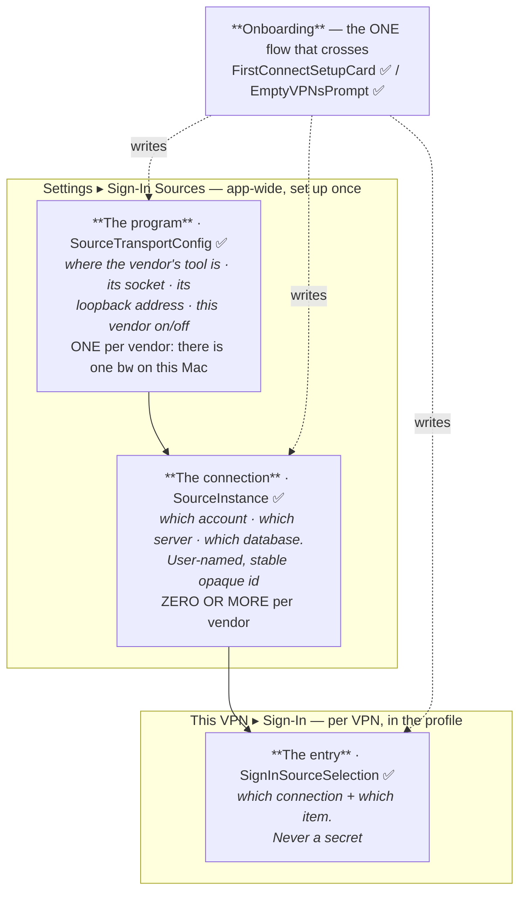
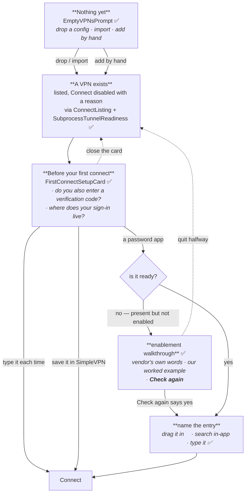
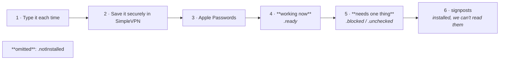
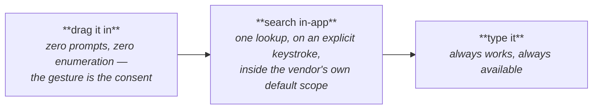
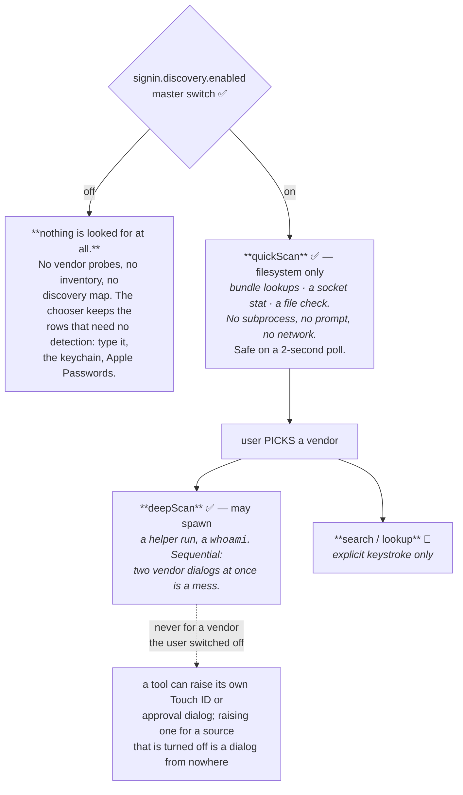

# First run: the first VPN, and the first sign-in

Somebody arrives with a `.ovpn` file and a password in a password app. Getting from there to a
working Connect button crosses two configurations that live in two different places for the rest of
the app's life. **Onboarding is the one flow allowed to cross that boundary**, because a first-time
user does not know there is a boundary.

Naming follows `ONTOLOGY.md`: **password app** in anything a user reads, **sign-in source** in code,
"sign in" and never "log in", and **"credential" never appears in UI copy** (asserted by test).

Status markers, as `Docs/SecretsAndSync.md` uses them:

- ✅ **BUILT** — in the tree, tested.
- 📐 **DESIGNED** — decided, with reasoning, not implemented.
- ❓ **OPEN** — needs a decision, a spike, or **a human with a real vault**.

The last of those carries more weight in this document than in any other, and section 9 says why:
much of what a first-run flow claims about a password app is a claim nobody here can verify on one
Mac with one password app installed.

---

## 1. The two halves, and the seam between them



**After onboarding, each half is edited only in its own place, and neither screen duplicates the
other.** A second VPN reuses the app-wide half silently: being asked to set 1Password up again on
the second VPN would be the clearest possible sign the separation had been got wrong, so
`SecondVPNReusesConnectionTests` pins it.

### Why there is no configured "scope" level

An earlier sketch of this feature had a level between the connection and the entry: *which vaults
inside the account do we search*. **It is deliberately absent, and that is the single most important
decision in this document.**

Every password app already has its own answer to "what do I search". Attaching to the vendor's own
default scope, rather than enumerating and re-asking, buys two things at once:

- **No enumeration, therefore no prompt.** Asking 1Password to list its vaults raises 1Password's own
  authorization dialog. A first-run screen that swept every vault before the user had picked a vendor
  would violate this app's standing rule outright — permissions and lookups are opt-in, off by
  default, requested only on an explicit action (`Docs/CredentialSources.md`).
- **Drag-in becomes the privacy-ideal path.** When the user drags their entry out of the password
  app, they hand us the coordinates directly. There is nothing to scan, nothing to enumerate, and no
  prompt — the gesture *is* the consent. That resolves the opt-in tension rather than complying with
  it under protest.

So there are three levels, not four, and the code's existing `SignInConfigLevel` — `.transport`,
`.instance`, `.perVPN` — is retained verbatim. **Renumbering a shipped enum to match prose would
create the second vocabulary `ONTOLOGY.md` exists to forbid.** The mapping is:

| This document says | `SignInConfigLevel` | Type | Cardinality |
|---|---|---|---|
| the program | `.transport` | `SourceTransportConfig` ✅ | one per vendor |
| the connection | `.instance` | `SourceInstance` ✅ | **zero or more** per vendor |
| the scope | — | *nothing* | not configured, by design |
| the entry | `.perVPN` | `SignInSourceSelection` ✅ | one per VPN |

---

## 2. Does the existing model already hold several connections per vendor?

Asked directly, because the answer decides whether this feature is a schema change or a wiring job.

**`SourceInstance` already models many-per-vendor, correctly and completely** ✅. It has everything a
connection needs and every one of these was already built:

- a **stable opaque id** (`SourceInstanceID`), explicitly *not* derived from a path or a name, with a
  comment saying why: renaming must not repoint a profile;
- a **user-settable display name** with a non-empty fallback;
- **per-field values** stored one defaults key per (instance, field), so MDM pinning through
  `objectIsForced`, validation and the value-versus-suggestion rule all keep working per connection
  with no second mechanism;
- a **profile-side reference** — `SignInSourceSelection.instance`, carried on disk as
  `CredentialSource.instanceID`;
- **four-way resolution** (`SourceInstanceResolution`: `.sole`, `.resolved`, `.noneConfigured`,
  `.chosenIsGone`) that refuses to silently substitute a different connection, because reading the
  wrong person's vault because a list changed order is the worst outcome available here;
- **MDM pinning of the whole list**, with ids derived from the administrator's ordering
  (`managed-1`, …) so one profile shipped fleet-wide names the same connection on every Mac;
- **removal warnings that name the VPNs still pointing at it**
  (`SignInSourceSteps.removalWarning`).

**`SourceTransportConfig` models one-per-vendor, and that is also correct** ✅ — it is not the
connection. There is one `bw` executable on this Mac and one KeePassXC browser socket per login
session. A path to a program is not an account.

So the schema is right. **What is wrong is the per-vendor `cardinality` declaration**, which says
`.single` for vendors that can genuinely have several *connections* because it was reasoning about
several *vaults*:

> `.onePassword` — SINGLE. […] 1Password accounts and vaults are real and a person may have several,
> but they are 1Password's own namespace and are already addressed PER VPN
> (`CredentialSource.account` / `.vault`), which is level 3 where they belong.

That reasoning was sound for vaults and wrong for accounts, and the difference is exactly the
distinction section 1 draws. A **vault** is scope, and scope is not configured. An **account** is
*which 1Password we are talking to at all* — it is a connection, it is app-wide, and today it is
modelled by a single app-wide string (`OnePasswordAccountMemory.defaultsKey`,
`"onePassword.defaultAccount"`) with a per-VPN override. That is a hand-rolled singleton connection
sitting beside a general mechanism built for exactly this.

### The fix, and its blast radius ✅

1Password is now `SourceCardinality.multiple`, with one instance-level field holding the **account
identifier** (`VendorConfigFieldKind.accountIdentifier`, level `.instance`). Its `defaultsKey` is
the *existing* `onePassword.defaultAccount`, which makes `SourceInstanceMigration.migrateIfNeeded()`
turn a remembered account into connection #1, named after it, for free — the migration machinery
already reads legacy single-valued keys and writes instance #1 from them.

A test already asserted that a `.single` vendor declares no instance-level fields, so the two halves
of this change cannot drift. Everything else came free from the general mechanism: the account
precedence is `OnePasswordAccountMemory.effective(profile:connection:remembered:)`, the settings pane
renders the row through the machinery every other field uses, MDM can pin the list, removal names the
VPNs that use it, and the per-VPN chooser's two-step "which account, then which entry" picker
(`SignInInstanceEntryPicker`) appears for 1Password without a line of 1Password-specific view code.

**The user-facing noun is "account", not "vault"** — `LocalVaultVendor.instanceNoun`. Asking for the
wrong one would ask somebody for the wrong string, and the vaults inside the account are the thing
this design deliberately never asks about.

**Verdict on the other vendors** — cardinality is a fact about the vendor, not a preference, so each
is argued rather than assumed:

| Vendor | Connections | Why, from the tool |
|---|---|---|
| **1Password** | 📐 **multiple** | Several accounts (personal + work tenant) can be signed in at once in the desktop app, and the SDK takes an account name or UUID per call. |
| **Bitwarden** | ❓ **probably multiple** | `bw` holds one signed-in account per **data directory**. Two accounts means two `BITWARDEN_APPDATA_DIR`s, plus a `serverURL` for self-hosted. That is connection-shaped — but the data-directory field is not declared today, so declaring `.multiple` now would give a list whose rows differ in nothing. **Blocked on a field, not on a decision.** |
| **KeePass file** | ✅ **multiple** | A `.kdbx` is a file, with its own key file and security-key slot. Already `.multiple`. |
| **pass / gopass** | ✅ **multiple** | `PASSWORD_STORE_DIR` exists precisely so one person can keep several stores. Already `.multiple`. |
| **Passbolt** | ✅ **multiple** | A Passbolt is a *server*; `go-passbolt-cli`'s config holds exactly one `serverAddress`, so a second server needs a second `--config`. Already `.multiple`. |
| **KeePassXC** | **single** | One running app, one browser-integration socket per login session. The app decides which of its open databases matches; we never name one. |
| **Keeper** | **single** | Commander keeps one configuration and one persistent-login session, and we pass no `--config` — **Keeper's own documentation warns that sharing a config revokes sessions**, so we must not. |
| **Dashlane** | **single** | Settled by reading `dcli`: one SQLite database at a path with no variable in it, one OS-keychain entry, and no `--config`/`--profile`/`--account` in `src/commands`. |
| **LastPass** | **single** | `agent_save` writes a single `username`; `login` overwrites it. Two accounts would mean two `LPASS_HOME`s, and we pin that to the directory we probed. |
| **Proton Pass** | **single** | One session file, one signed-in account, and `pass-cli logout` is how you change accounts. Its *vaults* are named inside the item reference — which is scope, addressed at level 3. |

---

## 3. A connection may hold a secret 📐

Most connection fields are paths, addresses and names, and hold nothing secret. Two shapes do not:

| Field | Secret? | Where it goes |
|---|---|---|
| 1Password account name or UUID | **no** — it is the string 1Password shows at the top of its sidebar | the connection's defaults key |
| A 1Password **service-account token** | **yes** | the keychain, referenced by the connection's id; **never** in defaults, `providerConfiguration`, an export, a log or argv |
| Passbolt server address, tool config-file path | no | the connection's defaults key |
| A `.kdbx` master password / Passbolt passphrase | **yes**, and already handled | memory, or the Touch ID keychain (`KeePassUnlock`, `PassboltUnlock`) — never a connection field, never `UserDefaults` |

The rule to hold: **a connection stores a reference to a secret, never a secret.** `SourceInstance`
has no field a secret could be put in, which is structural rather than remembered, and the
`Docs/SecretsAndSync.md` exclusion tests plus `Portability`'s `Mirror` walk fail the build if a
secret-looking field appears unclassified.

> ❓ **We do not offer a service-account token path today** and this document does not add one. It is
> listed because it is the one connection field that *would* be secret, and because a service-account
> token is scoped to exactly one vault — which makes it a connection *and* a scope, the only case
> where section 1's "scope is not configured" rule would need an exception. Deciding that needs a
> real service account, which nobody here has.

---

## 4. The flow



**Step 1 — the first VPN.** `EmptyVPNsPrompt` ✅ already exists and is already right: the primary
path is a dropped or imported configuration file, with "Add VPN…" as the alternative, and the type is
detected rather than asked for (`ConfigDetector`). Most people arrive with a file. Nothing in this
design replaces it.

**Step 2 — its sign-in, in the same flow.** `FirstConnectSetupCard` ✅ already exists, already
appears exactly when the flow needs it (a VPN that has never connected successfully), already asks
the verification-code question the chooser's wording refers to, and already hosts
`SignInSourceChooser` ✅ — which offers only the sources actually present on this Mac, in
non-technical language, with the password apps we *cannot* read listed separately as signposts rather
than hidden.

That card's own header records the invariant this design must respect:

> This card is deliberately the ONE first-run surface — extended, not joined by a competitor.

**So there is no wizard.** A wizard would have to duplicate the card's OTP question, its chooser, its
per-vendor detail and its drag well, and then argue with it about which of them was showing. It would
also animate between steps, and this app has a real layout-loop crash on record from putting a
platform-backed view — a spinner, an `NSTextView`, a `Switch` — inside a transform-animated
container. **The absence of a wizard is a safety property, not a shortcut.** What is missing is not a
container; it is the link from step 1 to step 2, and per-vendor entry naming inside step 2.

**Step 3 — if it is a password app, set it up there and then.** The card already does this for every
vendor: choosing a row that needs setup shows the walkthrough inline, and choosing a ready row shows
the field that names the entry. What is added is drag-in and in-app search where the vendor supports
them (section 6).

### The seam from step 1 to step 2 already closes ✅

Checked rather than assumed, because it was the one thing this document expected to have to build:
`VPNController.handleImport(of:)` **already sets `selectedID` to the newly imported profile**. So a
dropped `.ovpn` selects itself, `ConnectionDetailView` draws for it, `SignInFlow.step` returns
`.chooseHowToSignIn` because nothing is set up and it has never connected, and the card is on screen.
Empty state → first VPN → its sign-in is one continuous flow with no wizard and no new surface.

Two details worth recording so they are not "fixed" later:

- The card's appearance is a `.blurReplace` transition (`.opacity` under Reduce Motion), **not a
  transform**. That is what keeps the platform-backed controls inside it — the checkbox, the text
  fields — out of a transform-animated container, which is the shape that caused this app's real
  layout-loop crash. **A step transition must not animate a live control**, and the reason there is no
  animated wizard shell is this, not expedience.
- A Cisco import lands in its own store and has no row here, so `handleImport` deliberately does not
  clobber the selection. That is correct and is not a gap.

### What is still missing 📐

1. **`FirstConnectSetupCard` has a per-vendor `switch` with a hand-written `TextField` arm for each of
   the ten vendors.** That is where drag-in and search have to be generalised, and it is ten copies
   of one shape today. Section 6 gives the two protocol methods that collapse it.
2. **Search and drag-in for the vendors beyond 1Password** — section 6's table, and section 9's
   boundary.

---

## 5. Which sources are offered, and in what order 📐

Already true ✅: a vendor whose availability is `.notInstalled` produces **no row at all**
(`SignInSourceCatalog.vaultOption` returns nil), so a first-run screen never lists ten products the
user does not own. "Type it each time" and "Save it securely in SimpleVPN" are **always** present,
whatever was detected, and "Type it each time" is the **first row** — it is the answer for somebody
who wants no integration at all, and it must never be buried.

Also already true ✅: "Save it securely in SimpleVPN" carries the note that the item goes into the
**Apple keychain**, protected by macOS rather than by us, and that SimpleVPN never sees it again
after saving.

**What changed** ✅ — vendor rows used to be emitted in `LocalVaultVendor.allCases` order regardless of
their state, so a vendor waiting on a toggle could sit above one that already worked.
`SignInSourceCatalog.vendorRows(_:)` now orders them:



Within groups 4 and 5, `FeatureMaturity` breaks the tie ✅, so a `.tested` source is offered ahead of
one that has never run — with `.partlyVerified` between them, because folding it into either would be
the lie its own case exists to avoid. **An untested source still carries its Untested banner and its
feedback link** — `SignInSourceOption.maturityNotice` ✅ — and a test asserts that ordering it lower is
never mistaken for having warned somebody. First run is exactly where an untried adapter gets met, so
that would be the worst place to hide it.

**`.unchecked` sits above `.needsSetup`** ✅, and that is the deliberate part: "we will know once you
try" is nearer to working than "go and switch this on", and ranking it below would imply we know it is
worse — the exact certainty an `.unchecked` row exists to disclaim. The final tie-break is the enum's
own order, and the sort is stable by hand, because Swift's `sorted(by:)` is not.

**This ordering is not an endorsement and must not read as one.** It orders by *what will work with
the fewest steps on this Mac right now*, which is a fact about the Mac. The copy says nothing about
which product is better, and `FeatureMaturity` only ever ranks *our* confidence in *our* code.

### What ordering may never claim

`Docs/CredentialSources.md` records that `suppliesOTP` is false for three genuinely different
reasons — unproven, unknowable-until-fetch, and impossible — and `LocalVaultAvailability` separates
`.ready` from `.unchecked(ceiling)` for the same kind of reason. So:

- A row may claim **the tool was found**. That is a filesystem fact.
- A row may **not** claim the source works. `.unchecked(.checkOwedOnUse)` says a check is coming;
  `.wouldSignInToServer` / `.wouldPromptTheUser` / `.wouldSpendSingleUseCode` say it never will,
  because running it would spend somebody else's rate limiter, raise a dialog from nowhere, or burn a
  single-use code.
- A first-run screen that implies certainty it does not have is worse than one that says "we will know
  once you try". ✅ `vaultOption` already forces a note onto every `.unchecked` row for exactly this
  reason.

---

## 6. Naming the entry: drag-in, search, or type it

Three ways to answer "which item is this VPN's sign-in?", in preference order:



**Prefer drag-in wherever the vendor supports it.** It is the only path that needs no enumeration, no
subprocess and no prompt: the user hands us the coordinates.

### Per vendor: what can be dragged, what can be searched

Evidence column says *how we know*, because "probably" is not a design.

| Vendor | Drag-in | Search in SimpleVPN | Evidence |
|---|---|---|---|
| **1Password** | ✅ **BUILT** | ✅ **BUILT** | Drag: `OnePasswordDropItem` reads `org.chromium.web-custom-data` (1Password 8 is Electron), which carries **account, vault and item UUIDs** — a one-gesture setup. Search: `OnePasswordNative.lookup(query:)` — one helper run, one authorization, ranked. |
| **pass / gopass** | 📐 drag a **store folder** (a connection, not an entry) | 📐 **free and prompt-free** | Entries are files on disk; `PasswordStoreLocation.file(forEntry:)` already resolves a name to a path. A directory walk needs no subprocess, no unlock and no prompt — **the only vendor where search costs nothing.** |
| **KeePass file** | 📐 drag a **`.kdbx`** (a connection) | 📐 channel exists | `keepassxc-cli search` is already in `readOnlySubcommands` and `searchArguments(_:)` is already written. Needs the database unlocked, so it costs a password prompt — an explicit action, not a first-frame scan. |
| **Bitwarden** | ❓ | 📐 channel exists | `list items --search <ref>` is already the read path (`bw` arm) and `list/object/items?search=` the `bw serve` arm. Widening from one hit to a list is small. |
| **Proton Pass** | ❓ | 📐 channel exists | `item list <vault> --output json` is already used to resolve a vault address. |
| **LastPass** | ❓ | ❓ `lpass ls` exists, unwired | Only `show --json` is wired today. |
| **Keeper** | ❓ | ❓ Commander has `search`/`ls`, unwired | Nothing in `KeeperProvider` enumerates. **Read-only is non-negotiable here**: we pass no `--config` because Keeper's docs warn sharing one revokes sessions. |
| **Passbolt** | ❓ | ❓ | Its resources are addressed by identifier; enumeration would be a **network call to somebody else's server**, which is exactly the `.wouldSignInToServer` ceiling. |
| **Dashlane** | ❓ | ❌ **filter, not enumerate** | `dcli` matches an entry's **address or title** and returns one; `--output json` avoids the interactive picker when a filter matches twice. There is no list verb we would use. |
| **KeePassXC** | ❓ | ❌ **impossible through this channel** | Its browser protocol's actions are `associate`, `test-associate`, `get-databasehash`, `get-logins`, `get-totp`. **`get-logins` matches a URL; there is no enumeration action at all.** So KeePassXC is named by the address its entry's URL field matches — which is what the card already asks for. Not a gap in our code: a property of the protocol. |
| **Apple Passwords** | ❌ | ❌ | Safari's and the Passwords app's items live under the `com.apple.cfnetwork` access group, which this app's entitlement does not contain. **Unreachable by construction.** What works is macOS's own AutoFill — the key in the field — driven by the user. |

**Every ❓ in the drag-in column is the same ❓**, and it is honest to say so once: `OnePasswordDropItem`
parses **1Password's** payload. Generalising means observing what each other app puts on the drag
pasteboard, which needs a Mac with that app on it. Section 9.

### The generalisation 📐

The drop well and the search field are the same two shapes for every vendor, so they belong in the
seam rather than in ten `switch` arms:

```swift
protocol LocalVaultAdapter {
    // …existing…
    /// What a drag out of this vendor's app resolves to, or nil when this vendor
    /// has no drag we can read. Pure parsing of pasteboard flavours; never a call
    /// to the vendor.
    func entry(fromDrag: DragFlavors) -> SourceEntryReference?
    /// Search inside the vendor's OWN default scope. Called ONLY from an explicit
    /// keystroke or click — never on appear, never on a poll. `nil` return means
    /// this vendor cannot be searched, which is a fact to state, not to hide.
    func search(_ query: String, connection: SourceInstance?) async -> [SourceEntryMatch]?
}
```

Both get a default returning nil, so the eight vendors that can do neither need no code and the two
that can are one method each. The card's per-vendor `switch` collapses to: the drop well when
`entry(fromDrag:)` is implemented, the search field when `search` is, and the typed field always.

---

## 7. "Walk them through it" — and the limit, precisely

The user asked to "walk the user through configuring them if they're not already sdk/cli enabled".
There is a hard limit on how far that can go, and stating it is part of the design:

- **We never bundle, download or install a vendor's tool.** Not behind a confirmation, not "just this
  once", and not for a tool we would otherwise have to ask somebody to fetch. Settled policy, stated
  in `AboutView.swift` and enforced by `AcknowledgementsTests`. **If any part of this flow starts to
  want an installer, that is the signal to stop and report it, not to add a confirmation dialog.**
  What we may do is show the command and let the user run it — which is what the enablement banner's
  copyable example already is.
- **We never mutate a user's vault or its configuration.** Read only, every vendor, always. Keeper's
  own documentation warns that sharing a config revokes sessions — so we pass no `--config` and we
  write nothing.

So the walkthrough is **instructions plus verification**, never automation. ✅ Already built, per
vendor, in `LocalVaultCopyBook` and rendered by `EnablementBanner`:

1. **the vendor's own documentation link**, plus **our** short worked example for the **current**
   release only — no version matrices, no "on older versions this toggle was called…";
2. **the exact toggle or command in the vendor's own words**, in `code` spans or quotation marks per
   `ONTOLOGY.md` rule 2 — 1Password's `Settings ▸ Developer ▸ Developer Integrations ▸ "Integrate
   with 1Password SDKs"`, Keeper's `this-device persistent-login on`;
3. **a "Check again" affordance** that re-probes and reports the new state.

**Point 3 is the whole difference between a link and a walkthrough**, and it is the part most likely
to be left out. It was ✅ for 1Password (`OnePasswordSetupCard`'s `onCheckAgain`) and ✅ *implicitly* for
every vendor, via `SignInSourceAvailability.recheckIfDue()` on the card's two-second poll. But an
implicit re-probe gives no straight yes-or-no at the moment somebody comes back from the vendor's own
Settings — it gives them a row that may have updated while they were looking away.

✅ **Every vendor row that is not `.ready` now carries an explicit "Check Again" button**
(`SignInSourceChooser.onRecheck`), gated by the same `readinessRank` the ordering uses so the two can
never disagree about what "waiting" means. It forces `deepScan(force: true)`, then **announces the
answer either way** — including "nothing has changed yet", because silence after a button press reads
as "the button did nothing" and sends somebody pressing it again. The poll stays as the belt to that
braces.

It re-probes **every** vendor rather than the one whose button was pressed. `deepScanAll` is the only
pass there is, it already skips vendors the user has switched off, and the thing somebody just enabled
is frequently not the row they pressed — installing `keepassxc-cli` settles the KeePass-file row, not
the KeePassXC one.

**Bundled instructions are explicitly sanctioned, and belong in `manual.html`.** A "how to enable
this" step may carry our own short worked example in the app itself, not only an outbound link. That
prose goes behind its own manual anchor and is linked to from the flow, the way `#exporting` works —
which keeps it searchable, keeps `ManualAnchorParityTests` satisfied, and means the instructions are
one artifact rather than copy duplicated between a step and the manual. 📐 The per-vendor examples
currently live in `LocalVaultCopyBook` as Swift strings; moving them behind anchors is the remaining
half of this, and it is a relocation rather than new prose.

📐 **When the app is present but its CLI or API is not**, the existing per-vendor enablement content is
reused rather than re-composed — including the honest third state
`.blocked(.toolOutsideAllowList)` ✅, which says *"it is installed, just not somewhere we will run
from"* and names the path, rather than claiming it is missing. `LocalToolRunner` **never consults
`PATH`**, resolves from an allow-list and refuses world-writable directories; discovery may look
anywhere (`Docs/ToolDiscovery.md`), execution may not. **Do not weaken that for convenience.**

### How discovery stays opt-in



**Detecting that an app is installed is a filesystem probe and is fine for the whole set. Talking to
any of them happens only when the user picks it.** ✅ Both halves are already enforced:
`deepScanAll(quick:skipping:)` skips disabled vendors, and `FirstConnectSetupCard.choose(_:)` runs the
1Password preflight *only* when 1Password is chosen — "the only moment this card is allowed to raise
its approval prompt".

---

## 8. Cancelling, and resuming

**Onboarding is never the only route to a working app**, and quitting halfway must not leave a broken
half-profile.

| The user stops at | What exists afterwards | What they see |
|---|---|---|
| the empty state | nothing | the empty state again |
| after import, before the sign-in | **the imported VPN, listed** | Connect disabled, with the reason — from `ConnectListing` + `SubprocessTunnelReadiness` ✅ |
| mid-walkthrough | the VPN, and the vendor chosen | the same card, at the same step, with "Check again" |
| after choosing a vendor, before naming an entry | the VPN and the choice | `AuthSatisfaction.typedInstead(.nothingLinked)` ✅ — "nothing linked yet" |

**There is no second notion of "not finished".** The reason Connect is disabled comes from
`ConnectNeed`, which the detail Connect button, the menu bar and the row all already share. A
first-run flow that invented its own "incomplete" flag would be a second source of truth for the same
sentence, and the two would disagree.

**Resumability is a property of the card, not of saved wizard state**: the card is derived from the
profile every time it draws — has this VPN connected successfully? what is its source set to? is that
source usable? — so there is no cursor to persist and nothing to corrupt. Closing it hides it until
next launch; it returns until a connect succeeds. ✅

**Deleting a connection** must not silently break the VPNs pointing at it. Two mechanisms, both
already built, and they are deliberately different:

- **Before**: `SignInSourceSteps.removalWarning(vendor:name:usedBy:)` ✅ **names the VPNs** that use
  it. A silently orphaned profile fails at connect time, days later, with no clue that a setting
  somewhere else caused it.
- **After**: a profile naming a connection that is gone resolves to
  `SourceInstanceResolution.chosenIsGone` ✅ → `AuthSatisfaction.broken(locus: .instance)` → Connect
  disabled with "the vault this VPN used isn't set up any more. Choose which one to use." **It is
  never quietly repointed at another connection.**

We orphan visibly rather than refuse, because refusing means a connection can be un-deletable, and
the fix — pick another one — is a sentence the user can act on. ✅

**Export/import**: the profile carries `instanceID`, an opaque id that survives a rename, so a
`ConfigTransfer` round-trip keeps pointing at the same connection ✅. A profile imported onto a Mac
that has no such connection lands on `.chosenIsGone`, which is the correct answer and already has
copy — **not** a silent repoint.

**Onboarding creates exactly one connection and never mentions the concept.** A first-time user must
never meet the words "multiple accounts": they set up the one they have, and the card writes it
through `instanceForImplicitWrite` ✅, which creates connection #1 if the list is empty. The second
connection is added later, from Settings, by somebody who now knows they need one — and adding it
must not disturb the first.

---

## 9. What needs a human with real vaults

This is the honest boundary, and it is large. One Mac, and realistically one password app, cannot
verify most of what a first-run flow asserts about ten products.

**Cannot be verified here at all:**

- **Every drag payload except 1Password's.** `OnePasswordDropItem`'s four-flavour reading was settled
  by *live testing* — dragging an item row versus a field versus "Copy Private Link" — and the same
  has to be done per vendor. Guessing a flavour list is how you ship a drop well that silently
  accepts a file URL and shows it as success.
- **1Password with two accounts signed in at once**, which is the case that named this feature. See
  below.
- **`suppliesOTP` per vendor.** It is a promise Connect relies on, and being wrong costs a failed
  sign-in *and* a burned code, which some gateways count toward lockout. False until verified against
  a real vault.
- **Whether any vendor's AutoFill extension is switched on.** There is no public API:
  `ASCredentialIdentityStore` reports the *calling* app's own extension, and SimpleVPN ships none. So
  every AutoFill sentence says "if you have switched it on" ✅ and never claims it works.
- **Whether Apple Passwords' AutoFill menu offers anything in *our* fields.** Nobody here has watched
  it. The copy is deliberately modest for that reason ✅.
- **Bitwarden's second data directory**, LastPass's `lpass ls`, Keeper Commander's `search`, Passbolt
  enumeration, Proton Pass and Dashlane drags — each needs an account with that vendor.

### What the 1Password path can genuinely enumerate 📐/❓

Asked precisely, because the user's mental model and the SDK's capabilities do not match, and the
discrepancy is worth more than a workaround built quietly.

**The user's model:** "1Password has a default set of vaults it searches, we should attach to that."

**What the SDK actually offers**, read from `Vendor/onepassword-native/src/main.go` and
`OnePasswordNative.swift`:

| Question | Answer |
|---|---|
| Can we list the account's **vaults**? | ✅ yes — `c.Vaults().List(ctx)`, overviews only (id + title), nothing about contents. |
| Can we list **items** without naming a vault? | ❌ **no. The SDK's item list is strictly per-vault** — `listItems` refuses an empty vault and `handleList` requires one. |
| Can we search **by name across vaults**? | ✅ yes, but only because **we built it**: the helper's `lookup` mode does `Vaults().List` then fans out over the candidates **inside one helper run and one authorization**, ranking on `FuzzyMatch`'s ladder. An empty query is a bounded browse of everything. |
| Can we read 1Password's own **"default vaults searched"** preference? | ❌ **no. It is not exposed through the SDK at all.** |
| Can we enumerate the **accounts** the app is signed into? | ❌ **no.** `WithDesktopAppIntegration(account)` takes an account *in*; nothing hands a list *out*. |

So, plainly: **there is no "attach to 1Password's default scope" API.** What we have instead is *every
vault the account can show*, which is a superset of whatever 1Password's own default happens to be,
gathered in one prompt. For finding a VPN entry that is almost certainly indistinguishable in
practice — and it is honest to describe it as "searches your 1Password", never as "searches the vaults
1Password searches".

**And the account cannot be discovered — it must be supplied**, which is the sharpest constraint in
this whole document. The desktop integration rejects an account it cannot match, **the empty string
included**, with "Account not found". So before *any* 1Password call works, we need an account name or
UUID, and we cannot ask 1Password for one.

There are exactly two ways to get it, and this is why drag-in is not a nicety:

- **A drag** carries the account UUID in 1Password's own payload ✅, and the SDK takes a UUID as
  readily as the sidebar name. **One gesture answers "which account?" with no prompt and no typing.**
- **The user types it** — the name at the top of 1Password's sidebar ✅ (`asksForAccount`).

❓ **What no one here can confirm** is what a drag out of a Mac with *two* accounts signed in carries,
and whether the account UUID in the payload is the one the SDK will accept for a *shared* vault. Both
need a second 1Password tenant. Until then: the connection list works, migration works, the drag seeds
connection #1 — and whether a *second* connection can be created **by dragging** rather than by typing
its account name is unverified.

---

## 10. Build order, and where it got to

1. ✅ **This document.**
2. ✅ **`SourceCardinality` for 1Password → `.multiple`**, with the `accountIdentifier` field kind and
   free migration from `onePassword.defaultAccount`. Foundations first: retrofitting "actually there
   can be two" onto a singleton is a schema migration, and this schema had not shipped, so getting it
   right cost nothing.
3. ✅ **Empty state → first-connect card** — already closed by `handleImport`, verified rather than
   built.
4. ✅ **Ordering, and "Check Again" on every waiting row.**
5. 📐 **`entry(fromDrag:)` / `search(_:connection:)` on `LocalVaultAdapter`**, with the card's ten-arm
   `switch` collapsed onto them — 1Password and `pass` first, since those are the two whose channels
   need nothing new.
6. 📐 **Move the per-vendor worked examples out of `LocalVaultCopyBook` and behind manual anchors**, so
   the in-app instructions and the manual are one artifact.
7. ❓ **Bitwarden's data-directory field**, which is what its `.multiple` is blocked on.

Register maturity honestly at every step. A flow that cannot be exercised against every vendor here
is **not** "tested", and untested is not an insult — it is the difference between this document being
useful and being a liability.
