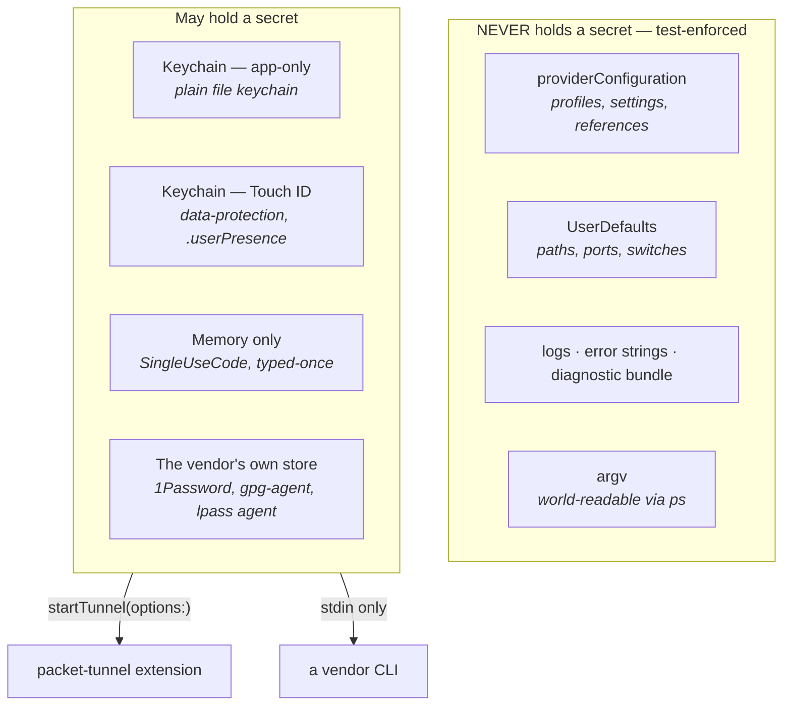
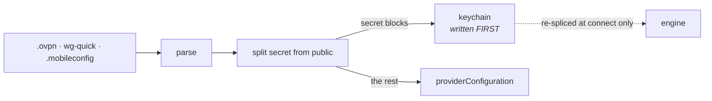
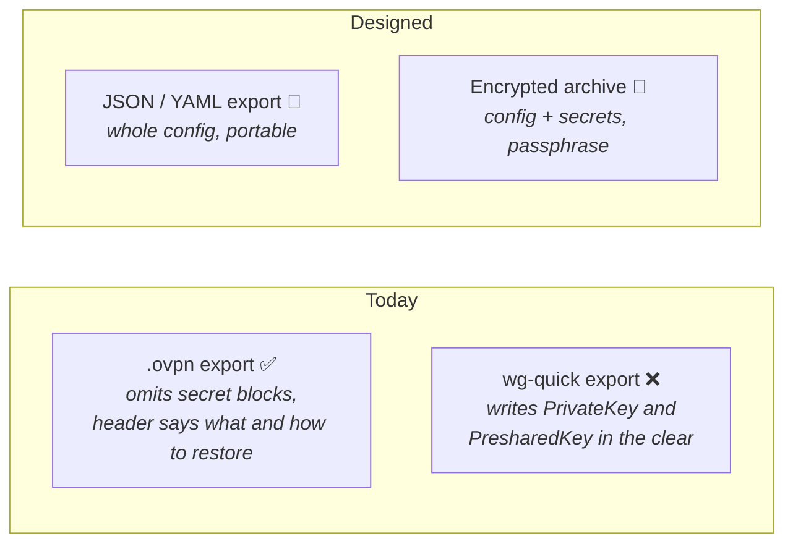
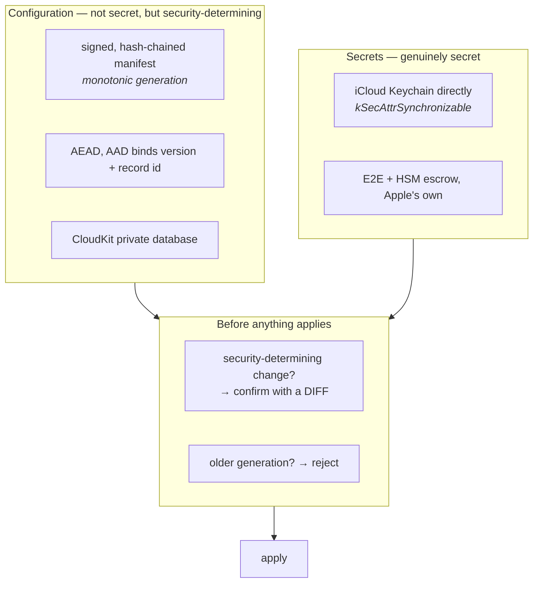

# Secrets, Touch ID, import/export, backup and sync

Where every secret lives, what leaves the Mac and how, and the design for sync.

**Read the status markers.** Roughly half of this is shipped and half is designed-not-built. A
document that blurred the two would be worse than none, because the untrue half is exactly the part
someone would rely on.

- ✅ **BUILT** — in `main`, tested.
- 📐 **DESIGNED** — decided, with reasoning, not implemented.
- ❓ **OPEN** — needs a decision or a spike before it can be built.

Naming follows `ONTOLOGY.md`. See `Docs/AuthArchitecture.md` for how sources are reached, and
`Docs/SecretSyncResearch.md` for the vendor research behind the sync design.

---

## 1. Where a secret can be ✅

Four stores, chosen by what the secret *is*:

| Store | What goes in it | Survives | Prompts |
|---|---|---|---|
| **App keychain** (`KeychainCredentialStore`) ✅ | a VPN's saved password, `.ovpn` inline key material | reboot | no |
| **Touch ID keychain** (`BiometricCredentialStore`) ✅ | the same, when the user opts in; a `.kdbx` master password; a Passbolt passphrase | reboot, **this Mac only** | yes, per app run |
| **Memory** ✅ | a typed one-time code, a YubiKey OTP, a `BW_SESSION` | until quit | — |
| **The vendor's** ✅ | 1Password's own unlock, `gpg-agent`'s cached passphrase, `lpass`'s agent key | vendor's rules | vendor's own |

**The best outcome is the fourth row**: a secret we never hold. That is why the SSH agent and PKCS#11
paths are preferred where they exist — see `.possession` in the architecture doc.

### Touch ID, precisely ✅

A Touch-ID item is a data-protection keychain item with a `.userPresence` access control. Three
consequences, all load-bearing:

1. **It cannot sync.** `kSecAttrSynchronizable` and `.userPresence` are mutually exclusive — a
   biometric item is device-bound by construction. This is the single fact that shapes the whole
   sync design below.
2. **A background process cannot silently read it.** That is the actual protection: not secrecy from
   a remote attacker, but that *something running as you* cannot use it without you.
3. **`kSecAttrAccessible` on the plain file-keychain path is a documented no-op.** On macOS those
   attributes only take effect with `kSecAttrSynchronizable` or `kSecUseDataProtectionKeychain`. The
   item is still ACL- and unlock-protected; it does not have the protection class the old comment
   claimed.

Where a secret is *high-value* — a `.kdbx` master password opens everything its owner has — the rule
is **nowhere by default, Touch ID by opt-in, never the ordinary keychain**, because in the ordinary
keychain macOS would release it to us silently and make SimpleVPN a silent decryptor of the whole
vault.

---

## 2. Import ✅

**Secrets are stripped at import, before the profile is saved**, so key material never reaches
`providerConfiguration` even momentarily. Eight `.ovpn` blocks are treated as secret — `<key>`,
`<tls-auth>`, `<tls-crypt>`, `<tls-crypt-v2>`, `<secret>`, `<pkcs12>`, `<auth-user-pass>`,
`<http-proxy-user-pass>` — and five deliberately are **not**: `<ca>`, `<cert>`, `<extra-certs>`,
`<crl-verify>`, `<dh>` are public, and the CA is *integrity-critical*, so it belongs where a diff can
see it. A test asserts the two lists cannot overlap.

**Existing profiles migrate on load, verifying before destroying**: write to the keychain, read back,
compare byte-for-byte, and only then rewrite the stored config. Any failure leaves the profile
completely untouched — working, still leaky — and badges it. Losing somebody's only copy of a client
key would be worse than the leak being fixed.

❓ **Under `lockConfiguration` the rewrite is skipped**, so managed profiles keep inline keys
indefinitely. A defensible reading of the policy, and one that needs an explicit decision.

---

## 3. Export ✅ / 📐

**`.ovpn` export omits secrets with no opt-out** ✅. An exported file leaves every protection the app
has — mail, a shared folder, a repo, a backup — and cannot be recalled; a consent dialog is a thing
people click through, and once clicked the file exists. The material is recoverable (still in the
keychain; the issuer can reissue). Tunnelblick made the same call; Viscosity's plaintext tarball is
the other road.

❌ **`WireGuardView.export()` still writes `PrivateKey` and `PresharedKey` in the clear.** Known, not
yet fixed, and the trade-off genuinely differs: a `wg-quick` file *without* a private key is useless
to the receiving client, whereas an `.ovpn` without one still describes the server. So the answer is
probably explicit consent rather than omission — which is why it was not fixed by copying the `.ovpn`
decision.

📐 **JSON/YAML export/import of the whole configuration.** Human-readable and portable, secret-free by
default, and the same serialisation the sync design needs — which is why it is worth building first
even if sync never follows.

📐 **Encrypted archive** for a real backup: config *and* secrets, under a passphrase the user chooses,
AEAD, no opt-out on the encryption. This is the honest answer to "back up my whole setup" and it
sidesteps every cloud question.

---

## 4. Sync — designed, not built 📐

### What the research settled

**Do not build a recovery key.** The vendors moved the other way: iCloud Keychain is end-to-end
encrypted under *standard* data protection with SRP-verified HSM escrow; Apple stores the FileVault
recovery key in the keychain and syncs it; Mozilla has declined a Sync-only passphrase for twelve
years as "contagiously bad" UX; Google is migrating users *off* its custom passphrase onto HSM
escrow. Rate-limited escrow won; the extra secret lost. Keep FileVault's *several-independent-wrappers*
shape so one can be added later without redesign.

**The integrity problem dominates.** Config is not very secret — server addresses, maybe usernames —
but it is **security-determining**. Someone who can modify a synced profile can point you at their
server or weaken certificate verification, and **rollback of an older, valid, correctly-signed blob**
is a real attack that encryption alone does not stop. No researched vendor solves it: all five
password managers have AEAD and no counter or chain, Bitwarden's MAC has no associated data so
ciphertexts can be relocated, and Chrome's Nigori still does not authenticate its IV.

### The two-track design

**Two tracks because the two kinds of data want different things.** Secrets go through iCloud
Keychain, where Apple's E2E and escrow is better than anything we would build. Config goes through
CloudKit **encrypted *and signed by us***, because CloudKit's private database is not E2E by default
and because we need the integrity guarantees nobody else provides.

**Touch ID and sync are mutually exclusive for the same item** (§1), so this is *not* a compromise to
be engineered around — it is a split by what the data is. A synced secret is protected by the Apple
account and the devices' passcodes; a Touch-ID secret is protected by presence and stays on one Mac.
Say that plainly in the UI rather than implying both.

**Default off**, and the copy must not overclaim: "your Apple account and your devices can read this",
never "only you can read it" unless that is precisely true.

### Requirements 📐

- **Conflict resolution that cannot silently lose a profile.** Two Macs editing one profile is the
  normal case. Last-writer-wins only if the loser is preserved and surfaced.
- **Security-determining changes need confirmation with a diff** — certificate verification, a pinned
  CA, a host key, a server address. Otherwise compromising sync compromises the tunnel.
- **Policy-routing scripts are security-determining too.** A Tcl script chooses where traffic goes, so
  if scripts sync, pinning them stops being optional: always pending-with-diff.
- **MDM must be able to forbid it.** A managed Mac may not permit configuration leaving the device.
- **Turning it off** says what happens to the cloud copy and offers to delete it.
- **Key rotation** with re-encryption.
- Ships **untested** in the maturity registry — it cannot be proven with one Mac.

### Open ❓

- **Does CloudKit work with `ENABLE_APP_SANDBOX: NO`?** The container app is deliberately
  unsandboxed. Spike before committing. Fallbacks: a ubiquity container, or
  `NSUbiquitousKeyValueStore` (~1 MB total — a hard wall a config with certificates can hit).
- **Entitlement changes must be re-checked against AMFI.** This project has shipped a notarized build
  that would not launch; the launch check after any entitlement edit is mandatory, not advisory.
- Fifteen further unverified items are named in `Docs/SecretSyncResearch.md` §10.

---

## 5. The order to build it in 📐

1. **JSON/YAML export/import** — useful alone, and it is the serialisation everything else needs.
2. **Encrypted archive backup** — answers "back up my setup" with no cloud involved.
3. **Fix `wg-quick` export** — a known leak, and it belongs with the export work.
4. **Secrets sync via iCloud Keychain** — a migration rather than a new capability, since
   `kSecAttrSynchronizable` forces the data-protection keychain and `BiometricCredentialStore`
   already writes there.
5. **Config sync via CloudKit**, signed and chained, with the confirmation gate — last, because it
   carries the integrity design and the open CloudKit question.

Steps 1–3 are worth doing whether or not sync is ever built, which is the argument for that order.
