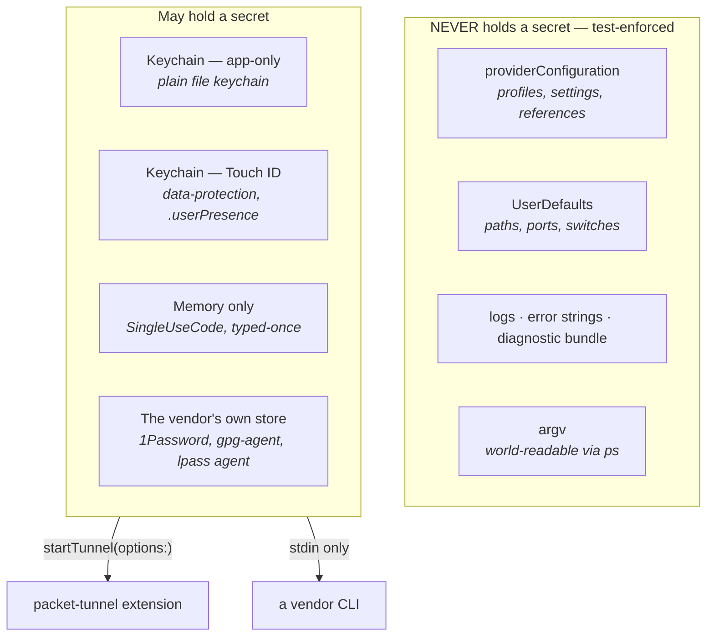
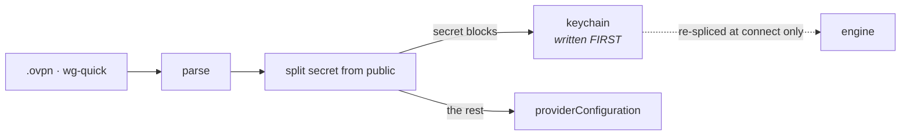
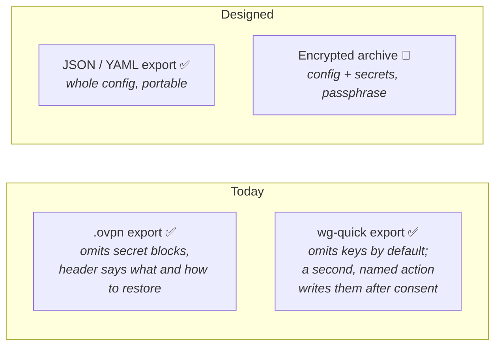
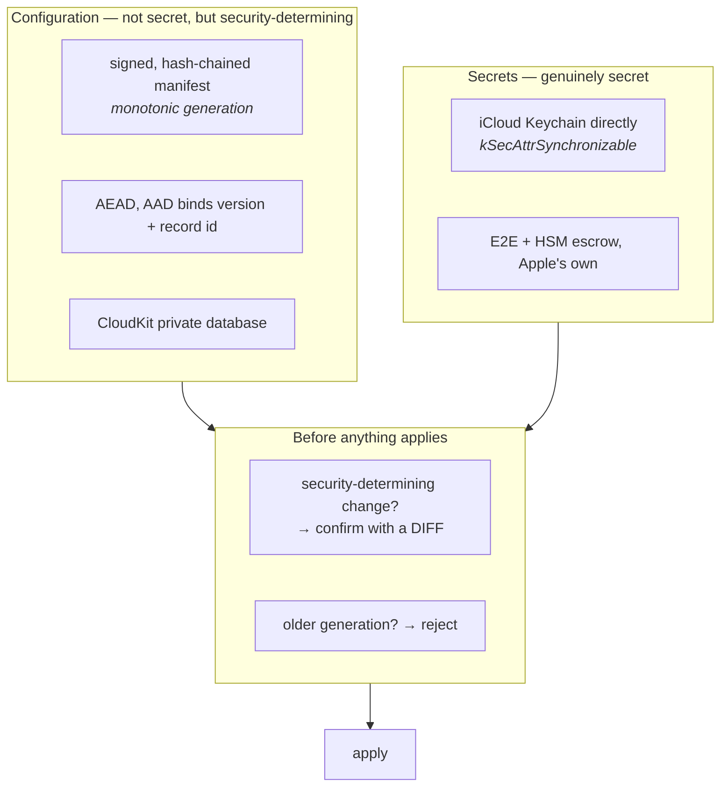

# Secrets, Touch ID, import/export, backup and sync

Where every secret lives, what leaves the Mac and how, and the design for sync.

**Read the status markers.** Roughly half of this is shipped and half is designed-not-built. A
document that blurred the two would be worse than none, because the untrue half is exactly the part
someone would rely on.

- ✅ **BUILT** — in `main`, tested.
- 📐 **DESIGNED** — decided, with reasoning, not implemented.
- ❓ **OPEN** — needs a decision or a spike before it can be built.

Naming follows `ONTOLOGY.md`. See `Docs/AuthArchitecture.md` for how sources are reached, and
`Docs/SecretSyncResearch.md` for the vendor research behind the sync design.

---

## 1. Where a secret can be ✅

Four stores, chosen by what the secret *is*:

| Store | What goes in it | Survives | Prompts |
|---|---|---|---|
| **App keychain** (`KeychainCredentialStore`) ✅ | a VPN's saved password, `.ovpn` inline key material | reboot | no |
| **Touch ID keychain** (`BiometricCredentialStore`) ✅ | the same, when the user opts in; a `.kdbx` master password; a Passbolt passphrase | reboot, **this Mac only** | yes, per app run |
| **Memory** ✅ | a typed one-time code, a YubiKey OTP, a `BW_SESSION` | until quit | — |
| **The vendor's** ✅ | 1Password's own unlock, `gpg-agent`'s cached passphrase, `lpass`'s agent key | vendor's rules | vendor's own |

**The best outcome is the fourth row**: a secret we never hold. That is why the SSH agent path is
preferred where it exists — see `.possession` in the architecture doc. (A PKCS#11 token was the other
example of the same virtue; smartcard sign-in has since been removed for reasons that have nothing to
do with this argument — `Docs/AuthSecPKCS11.md`.)

### Touch ID, precisely ✅

A Touch-ID item is a data-protection keychain item with a `.userPresence` access control. Three
consequences, all load-bearing:

1. **It cannot sync.** `kSecAttrSynchronizable` and `.userPresence` are mutually exclusive — a
   biometric item is device-bound by construction. This is the single fact that shapes the whole
   sync design below.
2. **A background process cannot silently read it.** That is the actual protection: not secrecy from
   a remote attacker, but that *something running as you* cannot use it without you.
3. **`kSecAttrAccessible` on the plain file-keychain path is a documented no-op.** On macOS those
   attributes only take effect with `kSecAttrSynchronizable` or `kSecUseDataProtectionKeychain`. The
   item is still ACL- and unlock-protected; it does not have the protection class the old comment
   claimed.

Where a secret is *high-value* — a `.kdbx` master password opens everything its owner has — the rule
is **nowhere by default, Touch ID by opt-in, never the ordinary keychain**, because in the ordinary
keychain macOS would release it to us silently and make SimpleVPN a silent decryptor of the whole
vault.

---

## 2. Import ✅

**`.mobileconfig` is an export, not an import.** It used to be listed here as a third source; no code
reads one to create a profile — `NativeVPNConfig.mobileconfig` only *writes* one, for L2TP. Corrected
after `Docs/Networking.md` traced the actual path.

**Secrets are stripped at import, before the profile is saved**, so key material never reaches
`providerConfiguration` even momentarily. Eight `.ovpn` blocks are treated as secret — `<key>`,
`<tls-auth>`, `<tls-crypt>`, `<tls-crypt-v2>`, `<secret>`, `<pkcs12>`, `<auth-user-pass>`,
`<http-proxy-user-pass>` — and five deliberately are **not**: `<ca>`, `<cert>`, `<extra-certs>`,
`<crl-verify>`, `<dh>` are public, and the CA is *integrity-critical*, so it belongs where a diff can
see it. A test asserts the two lists cannot overlap.

**Existing profiles migrate on load, verifying before destroying**: write to the keychain, read back,
compare byte-for-byte, and only then rewrite the stored config. Any failure leaves the profile
completely untouched — working, still leaky — and badges it. Losing somebody's only copy of a client
key would be worse than the leak being fixed.

### Managed profiles: the rewrite is skipped, and the profile is badged ✅

**Decided: under `lockConfiguration` SimpleVPN does not rewrite the stored configuration, and the
profile carries a visible badge saying its key is stored alongside its settings.** It used to be
skipped *silently*, logged and nothing more, which was the part that was actually wrong.

The argument for leaving the profile alone:

- **The material is already inside the trust boundary that produced it.** An MDM-delivered profile's
  inline key was put there by the organisation, in a profile the organisation pushed to a Mac it
  manages. This is the fact that makes a managed profile genuinely different from a user's own, where
  nobody but SimpleVPN was ever going to fix it. Here the party who can fix it properly — by pushing
  a profile that keeps the block out, or by unlocking configuration — is the same party that created
  it.
- **Every other `lockConfiguration` site in the app refuses to write.** A single silent exception is
  how a policy stops meaning anything, and we cannot see *why* the lock was set: an administrator may
  be comparing the stored profile against a known-good baseline, in which case a rewrite reads as
  tampering rather than as hygiene.
- **A rewrite of managed state cannot be recalled**, and a re-push re-leaks anyway.

**And the case against, which is real and was nearly decisive.** Moving a secret into the keychain is
not a *configuration* edit in the sense the policy means. The profile's meaning is unchanged, the
tunnel connects identically, the engine gets a byte-identical configuration — and an administrator who
locked settings meant "the user must not change these values", not "the private key must stay readable
in the VPN preferences". Under that reading this preserves a leak out of deference to a policy that
never contemplated it. Nor is "it will be re-pushed" a complete answer: many profiles are pushed once
and never again, so a one-time strip would be a real reduction, not churn.

What settles it is that the choice is not between *fixing* and *not fixing* — it is between two parties
fixing it, and only one of them has the authority and the durable fix. So the outcome is made
**visible instead of silent**: the same `key.slash.fill` badge a failed migration raises, on the same
row, with copy that says the VPN works normally and names who can change it — and that deliberately
does *not* offer the user the failure path's fix ("unlock your keychain and reopen SimpleVPN"), which
would send them chasing a cause that is not the cause. `OVPNSecretMaterial.managedInlineSecretNotice`
owns that wording; the decision itself is recorded on `VPNController.migrateInlineOVPNSecrets`.

Two tests hold it, and the second is the one that matters most: `aLockedProfileIsLeftAloneAndBadged`
pins the ordering in the source (the badge is set and the branch exits *before* anything touches the
keychain or `providerConfiguration`), and `anUnmanagedProfileIsStillStripped` is its
over-redaction counterpart — "leave it and badge it" must never become the universal answer, because
that is the original bug wearing a warning label.

---

## 3. Export ✅ / 📐

**`.ovpn` export omits secrets with no opt-out** ✅. An exported file leaves every protection the app
has — mail, a shared folder, a repo, a backup — and cannot be recalled; a consent dialog is a thing
people click through, and once clicked the file exists. The material is recoverable (still in the
keychain; the issuer can reissue). Tunnelblick made the same call; Viscosity's plaintext tarball is
the other road.

✅ **`wg-quick` export: omission by default, keys only by explicit consent.** It used to write
`PrivateKey` and `PresharedKey` in the clear, unannounced, on the only export button there was.

**Why not the `.ovpn` answer.** Both halves of the `.ovpn` argument fail here:

- `wg-quick up` **refuses** a configuration with no `PrivateKey`, so a secret-free WireGuard file
  cannot be used by the receiving client at all — where a secret-free `.ovpn` is still a working
  description of the server.
- A WireGuard public key is **derived from** the private key and registered against that peer on the
  server. "Ask whoever set up the VPN to reissue it" is not something the user can do alone the way an
  OpenVPN CA reissue is: a new key pair means the server's own peer entry has to change too.

So omission-with-no-opt-out would mean the app can never move a working WireGuard VPN onto a phone or
a second Mac, which is the commonest reason anyone exports one. **The argument that was rejected** is
exactly that one — copy the `.ovpn` rule for consistency and accept the loss — and it was rejected
because consistency between two exporters is worth less than the feature the rule would delete, and
because the honest way to describe that rule would have been "SimpleVPN can import a WireGuard VPN but
cannot export one".

**What makes consent more than a dialog**, given that a dialog is a thing people click through:

- **Two actions, not one action with a checkbox.** `Export .conf…` cannot produce a file with a key in
  it — so there is no dialog whose default button leaks, and nothing to click *through* to. The leaky
  path is a separately named button, `Export .conf with Keys…`.
- **The confirmation is specific.** It names the material ("private key and pre-shared key"), the
  consequence ("anyone who can read the file can connect to this VPN as this Mac"), the
  irrevocability, and the safe alternative. No generic "are you sure" — asserted by test.
- **The confirming button says what it does** — "Export With Private Key", never "OK" — carries the
  destructive role, and nothing claims the default action, so Return and Escape both cancel.
- **Consent is asked before the save panel**, not after: asking once the user has named a file makes
  the question read as a formality on the way to a file they have already decided to create.
- **Either file says what it contains in its own header**, which is the `.ovpn` exporter's precedent
  and the half that survives the file being forwarded, renamed, or found in a backup by someone who
  never saw the dialog. One says "No secrets are in this file"; the other says "THIS FILE CONTAINS
  SECRETS" and tells the reader to delete it.
- **The secret-free file is honest about being unusable as-is**: its header says wg-quick will refuse
  it and where the key goes back. A silently incomplete configuration that fails on the other machine
  with no explanation would be worse than the leak it replaced.

Details worth knowing: the redacted body is literally `redactedForStorage()`'s output — one redaction,
shared with the `providerConfiguration` guard — and a marker comment sits under `[Interface]` and
`[Peer]` where each key belonged. Neither the redacted file nor the app's own notice ever writes the
token `PrivateKey`, so a plain grep for it is a real check rather than one the explanatory prose
defeats: the same discipline as `OVPNSecretMaterial` never writing `<key>`.

Pinned by `SimpleVPNTests/Import/WireGuardExportTests.swift`, in the shape of
`SimpleVPNTests/Portability/`'s exclusion tests: a canary private key and pre-shared key that must not
reach the file, and the over-redaction counterpart asserting the endpoint, the peer's public key, the
allowed networks, the MTU and both export-only settings **survive**. Plus source-level guards that
nothing writes a raw `serialize()` to a file, that only the consented action passes
`includingSecrets: true`, and that the consent precedes the save panel.

✅ **JSON/YAML export/import of the whole configuration.** Human-readable and portable, secret-free
with **no** opt-out, and the same serialisation the sync design needs — which is why it was worth
building first even if sync never follows. Lives in `SimpleVPN/Portability/`.

Two decisions in it that a reader of this document should know:

- **Secret-free is proved, not asserted.** The exclusion test hands the exporter a snapshot whose
  secrets are *present* and fails if a canary reaches either encoding — and separately asserts the
  public `<ca>` and `cipher` line **survive**, because over-redaction is its own failure. A `Mirror`
  walk fails the build if a field whose *name* looks like a secret is neither withheld nor recorded as
  reviewed-not-secret with a reason, so next year's `rotationPassword` breaks the build until someone
  classifies it, and is withheld at runtime meanwhile.
- **Two key vocabularies, on purpose.** `settings:` uses the stable descriptor ids, which
  `ONTOLOGY.md` records as the contract that never changes. But `custom-routing:`, `endpoints:` and
  `interface:` carry the app's own persisted JSON keys verbatim, because those settings have no
  descriptor ids and some are structures no flat id could name. Stated in the exported file's own
  header so nobody has to infer it.

Import produces a **plan**, never a change, and refuses anything that would weaken verification —
`ssh.strict-host-key: no`, `StrictHostKeyChecking=no`, `--no-cert-check`, `tlsSkipVerify` and the rest
of a declared token list, wherever they appear including inside the `.ovpn` text. The app has no
option to disable certificate verification anywhere, and must not acquire one through a file format.

📐 **Encrypted archive** for a real backup: config *and* secrets, under a passphrase the user chooses,
AEAD, no opt-out on the encryption. This is the honest answer to "back up my whole setup" and it
sidesteps every cloud question.

---

## 4. Sync — designed, not built 📐

### What the research settled

**Do not build a recovery key.** The vendors moved the other way: iCloud Keychain is end-to-end
encrypted under *standard* data protection with SRP-verified HSM escrow; Apple stores the FileVault
recovery key in the keychain and syncs it; Mozilla has declined a Sync-only passphrase for twelve
years as "contagiously bad" UX; Google is migrating users *off* its custom passphrase onto HSM
escrow. Rate-limited escrow won; the extra secret lost. Keep FileVault's *several-independent-wrappers*
shape so one can be added later without redesign.

**The integrity problem dominates.** Config is not very secret — server addresses, maybe usernames —
but it is **security-determining**. Someone who can modify a synced profile can point you at their
server or weaken certificate verification, and **rollback of an older, valid, correctly-signed blob**
is a real attack that encryption alone does not stop. No researched vendor solves it: all five
password managers have AEAD and no counter or chain, Bitwarden's MAC has no associated data so
ciphertexts can be relocated, and Chrome's Nigori still does not authenticate its IV.

### The two-track design

**Two tracks because the two kinds of data want different things.** Secrets go through iCloud
Keychain, where Apple's E2E and escrow is better than anything we would build. Config goes through
CloudKit **encrypted *and signed by us***, because CloudKit's private database is not E2E by default
and because we need the integrity guarantees nobody else provides.

**Touch ID and sync are mutually exclusive for the same item** (§1), so this is *not* a compromise to
be engineered around — it is a split by what the data is. A synced secret is protected by the Apple
account and the devices' passcodes; a Touch-ID secret is protected by presence and stays on one Mac.
Say that plainly in the UI rather than implying both.

**Default off**, and the copy must not overclaim: "your Apple account and your devices can read this",
never "only you can read it" unless that is precisely true.

### Requirements 📐

- **Conflict resolution that cannot silently lose a profile.** Two Macs editing one profile is the
  normal case. Last-writer-wins only if the loser is preserved and surfaced.
- **Security-determining changes need confirmation with a diff** — certificate verification, a pinned
  CA, a host key, a server address. Otherwise compromising sync compromises the tunnel.
- **Policy-routing scripts are security-determining too.** A Tcl script chooses where traffic goes, so
  if scripts sync, pinning them stops being optional: always pending-with-diff.
- **MDM must be able to forbid it.** A managed Mac may not permit configuration leaving the device.
- **Turning it off** says what happens to the cloud copy and offers to delete it.
- **Key rotation** with re-encryption.
- Ships **untested** in the maturity registry — it cannot be proven with one Mac.

### Open ❓

- **Does CloudKit work with `ENABLE_APP_SANDBOX: NO`?** The container app is deliberately
  unsandboxed. Spike before committing. Fallbacks: a ubiquity container, or
  `NSUbiquitousKeyValueStore` (~1 MB total — a hard wall a config with certificates can hit).
- **Entitlement changes must be re-checked against AMFI.** This project has shipped a notarized build
  that would not launch; the launch check after any entitlement edit is mandatory, not advisory.
- Fifteen further unverified items are named in `Docs/SecretSyncResearch.md` §10.

---

## 5. The order to build it in 📐

1. ~~**JSON/YAML export/import**~~ ✅ **built** — `SimpleVPN/Portability/`, Settings ▸ General ▸
   Export & Import. It was useful alone, and it is the serialisation everything below needs.
2. ~~**Fix `wg-quick` export**~~ ✅ **built** — omission by default, keys by explicit consent (§3).
3. **Encrypted archive backup** — answers "back up my setup" with no cloud involved. It is also the
   thing that would let the consented `wg-quick` export become rarer: a passphrase-protected archive
   is a better answer than a plaintext `.conf` for every case except "this other client only speaks
   wg-quick", which is the case that keeps the consented export honest rather than lazy.
4. **Secrets sync via iCloud Keychain** — a migration rather than a new capability, since
   `kSecAttrSynchronizable` forces the data-protection keychain and `BiometricCredentialStore`
   already writes there.
5. **Config sync via CloudKit**, signed and chained, with the confirmation gate — last, because it
   carries the integrity design and the open CloudKit question.

Steps 1–3 are worth doing whether or not sync is ever built, which is the argument for that order —
and two of the three are now done.
