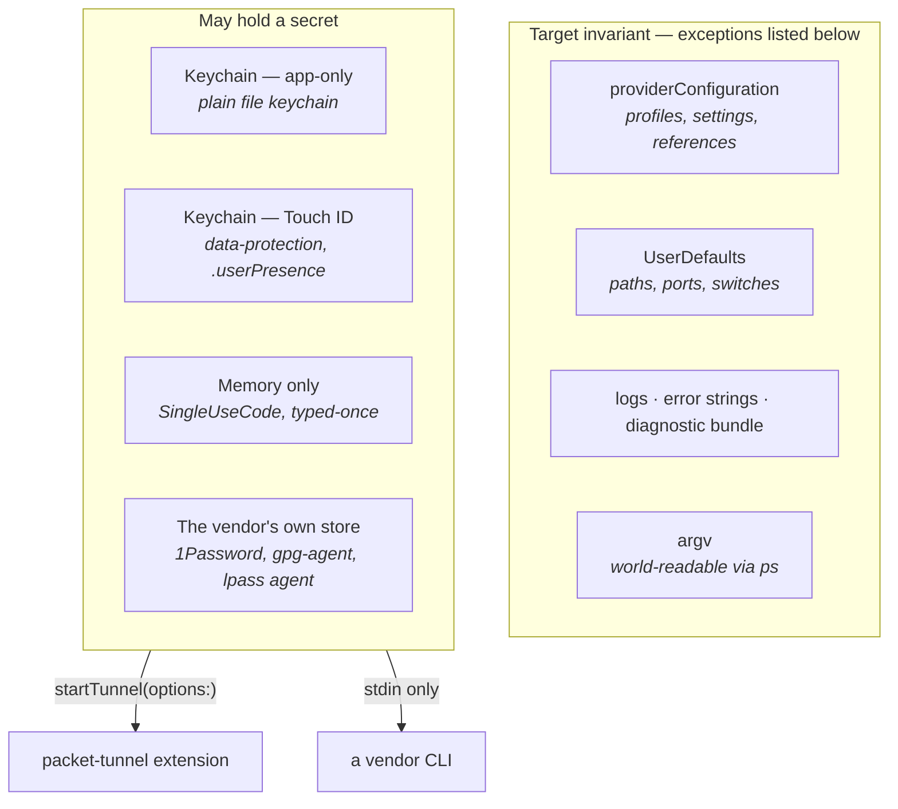
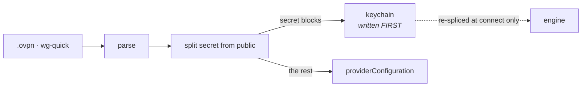
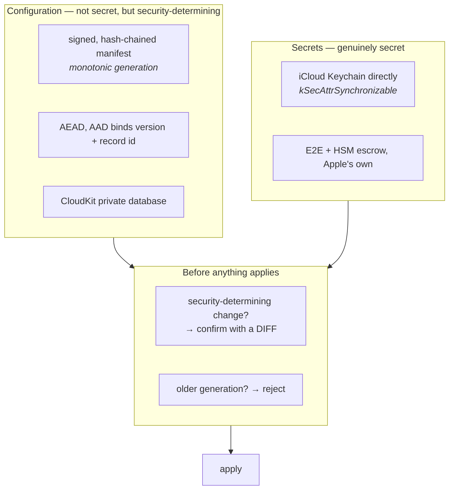

# Secrets, Touch ID, import/export, backup and sync

Where every secret lives, what leaves the Mac and how, and the design for sync.

**Read the status markers.** Roughly half of this is shipped and half is designed-not-built. A
document that blurred the two would be worse than none, because the untrue half is exactly the part
someone would rely on.

- ✅ **BUILT** — in `main`, tested.
- 📐 **DESIGNED** — decided, with reasoning, not implemented.
- ❓ **OPEN** — needs a decision or a spike before it can be built.

Naming follows `ONTOLOGY.md`. See `Docs/AuthArchitecture.md` for how sources are reached, and
`Docs/SecretSyncResearch.md` for the vendor research behind the sync design.

---

## 1. Where a secret can be ✅

```mermaid
flowchart TB
    subgraph Never["Target invariant — exceptions listed below"]
        PC["providerConfiguration<br/><i>profiles, settings, references</i>"]
        UD["UserDefaults<br/><i>paths, ports, switches</i>"]
        LG["logs · error strings · diagnostic bundle"]
        AV["argv<br/><i>world-readable via ps</i>"]
    end
    subgraph Holds["May hold a secret"]
        K1["Keychain — app-only<br/><i>plain file keychain</i>"]
        K2["Keychain — Touch ID<br/><i>data-protection, .userPresence</i>"]
        MEM["Memory only<br/><i>SingleUseCode, typed-once</i>"]
        VEND["The vendor's own store<br/><i>1Password, gpg-agent, lpass agent</i>"]
    end
    Holds -->|"startTunnel(options:)"| EXT["packet-tunnel extension"]
    Holds -->|"stdin only"| CLI["a vendor CLI"]
```

Four stores, chosen by what the secret *is*:

| Store | What goes in it | Survives | Prompts |
|---|---|---|---|
| **App keychain** (`KeychainCredentialStore`) ✅ | a VPN's saved password, `.ovpn` inline key material | reboot | no |
| **Touch ID keychain** (`BiometricCredentialStore`) ✅ | the same, when the user opts in; a `.kdbx` master password; a Passbolt passphrase | reboot, **this Mac only** | yes, per app run |
| **Memory** ✅ | a typed one-time code, a YubiKey OTP, a `BW_SESSION` | until quit | — |
| **The vendor's** ✅ | 1Password's own unlock, `gpg-agent`'s cached passphrase, `lpass`'s agent key | vendor's rules | vendor's own |

**The best outcome is the fourth row**: a secret we never hold. That is why the SSH agent path is
preferred where it exists — see `.possession` in the architecture doc. (A PKCS#11 token was the other
example of the same virtue; smartcard sign-in has since been removed for reasons that have nothing to
do with this argument — `Docs/AuthSecPKCS11.md`.)

### Storage exceptions found in the October 2026 review

The invariant above is not universal today. Tailscale's root-owned state file stores node
identity; it is restricted to its owner, but it is not in the user's Keychain. Managed
OpenVPN profiles whose configuration cannot be rewritten, and migrations whose Keychain
write fails, can retain inline material with a visible migration notice. Native proxy
authentication is attached to `NEProxyServer` in the saved system VPN configuration;
its persistence boundary needs verification. User-selected `.ssh` and other key files
remain file-backed by choice. These gaps are registered in `Docs/Drift.md` and detailed
in `Docs/AppReview.md`; do not describe all app secrets as Keychain-only.

### Touch ID, precisely ✅

A Touch-ID item is a data-protection keychain item with a `.userPresence` access control. Three
consequences, all load-bearing:

1. **It cannot sync.** `kSecAttrSynchronizable` and `.userPresence` are mutually exclusive — a
   biometric item is device-bound by construction. This is the single fact that shapes the whole
   sync design below.
2. **A background process cannot silently read it.** That is the actual protection: not secrecy from
   a remote attacker, but that *something running as you* cannot use it without you.
3. **`kSecAttrAccessible` on the plain file-keychain path is a documented no-op.** On macOS those
   attributes only take effect with `kSecAttrSynchronizable` or `kSecUseDataProtectionKeychain`. The
   item is still ACL- and unlock-protected; it does not have the protection class the old comment
   claimed.

Where a secret is *high-value* — a `.kdbx` master password opens everything its owner has — the rule
is **nowhere by default, Touch ID by opt-in, never the ordinary keychain**, because in the ordinary
keychain macOS would release it to us silently and make SimpleVPN a silent decryptor of the whole
vault.

---

## 2. Import ✅

```mermaid
flowchart LR
    F[".ovpn · wg-quick"] --> P["parse"]
    P --> SPLIT["split secret from public"]
    SPLIT -->|"secret blocks"| KC["keychain<br/><i>written FIRST</i>"]
    SPLIT -->|"the rest"| PROF["providerConfiguration"]
    KC -.->|"re-spliced at connect only"| ENG["engine"]
```

**`.mobileconfig` is an export, not an import.** It used to be listed here as a third source; no code
reads one to create a profile — `NativeVPNConfig.mobileconfig` only *writes* one, for L2TP. Corrected
after `Docs/Networking.md` traced the actual path.

**Secrets are stripped at import, before the profile is saved**, so key material never reaches
`providerConfiguration` even momentarily. Eight `.ovpn` blocks are treated as secret — `<key>`,
`<tls-auth>`, `<tls-crypt>`, `<tls-crypt-v2>`, `<secret>`, `<pkcs12>`, `<auth-user-pass>`,
`<http-proxy-user-pass>` — and five deliberately are **not**: `<ca>`, `<cert>`, `<extra-certs>`,
`<crl-verify>`, `<dh>` are public, and the CA is *integrity-critical*, so it belongs where a diff can
see it. A test asserts the two lists cannot overlap.

**Existing profiles migrate on load, verifying before destroying**: write to the keychain, read back,
compare byte-for-byte, and only then rewrite the stored config. Any failure leaves the profile
completely untouched — working, still leaky — and badges it. Losing somebody's only copy of a client
key would be worse than the leak being fixed.

### Managed profiles: the rewrite is skipped, and the profile is badged ✅

**Decided: under `lockConfiguration` SimpleVPN does not rewrite the stored configuration, and the
profile carries a visible badge saying its key is stored alongside its settings.** It used to be
skipped *silently*, logged and nothing more, which was the part that was actually wrong.

The argument for leaving the profile alone:

- **The material is already inside the trust boundary that produced it.** An MDM-delivered profile's
  inline key was put there by the organisation, in a profile the organisation pushed to a Mac it
  manages. This is the fact that makes a managed profile genuinely different from a user's own, where
  nobody but SimpleVPN was ever going to fix it. Here the party who can fix it properly — by pushing
  a profile that keeps the block out, or by unlocking configuration — is the same party that created
  it.
- **Every other `lockConfiguration` site in the app refuses to write.** A single silent exception is
  how a policy stops meaning anything, and we cannot see *why* the lock was set: an administrator may
  be comparing the stored profile against a known-good baseline, in which case a rewrite reads as
  tampering rather than as hygiene.
- **A rewrite of managed state cannot be recalled**, and a re-push re-leaks anyway.

**And the case against, which is real and was nearly decisive.** Moving a secret into the keychain is
not a *configuration* edit in the sense the policy means. The profile's meaning is unchanged, the
tunnel connects identically, the engine gets a byte-identical configuration — and an administrator who
locked settings meant "the user must not change these values", not "the private key must stay readable
in the VPN preferences". Under that reading this preserves a leak out of deference to a policy that
never contemplated it. Nor is "it will be re-pushed" a complete answer: many profiles are pushed once
and never again, so a one-time strip would be a real reduction, not churn.

What settles it is that the choice is not between *fixing* and *not fixing* — it is between two parties
fixing it, and only one of them has the authority and the durable fix. So the outcome is made
**visible instead of silent**: the same `key.slash.fill` badge a failed migration raises, on the same
row, with copy that says the VPN works normally and names who can change it — and that deliberately
does *not* offer the user the failure path's fix ("unlock your keychain and reopen SimpleVPN"), which
would send them chasing a cause that is not the cause. `OVPNSecretMaterial.managedInlineSecretNotice`
owns that wording; the decision itself is recorded on `VPNController.migrateInlineOVPNSecrets`.

Two tests hold it, and the second is the one that matters most: `aLockedProfileIsLeftAloneAndBadged`
pins the ordering in the source (the badge is set and the branch exits *before* anything touches the
keychain or `providerConfiguration`), and `anUnmanagedProfileIsStillStripped` is its
over-redaction counterpart — "leave it and badge it" must never become the universal answer, because
that is the original bug wearing a warning label.

---

## 3. Export ✅ / 📐

JSON and YAML exports now offer **Placeholders** (the default) or **Include Secrets**.
Both encodings carry the same settings. Manage VPNs offers the same choices for one VPN
through its context menu. Recovery snapshots always omit credentials.

A placeholder is a structured instruction under `secrets:`, not a dummy password. Import
skips that record until the user supplies its real value. An explicit secret export collects
only the app's known accounts for those VPNs. Protected records require device-owner
authentication; one authenticated context serves a whole export. The file header says
`CONTAINS SECRETS IN PLAIN TEXT`, and the writer opens an exclusive temporary file with
mode 0600 before writing bytes, then atomically replaces the chosen destination.

Imported secrets are validated against a closed set of roles and fields. Account names
are derived from the **new** profile ID, so an input file cannot select arbitrary existing
Keychain accounts. Review describes the number of credential records, without exposing
values in the settings diff. Custom Routing credentials are rebound to that new identity.

| Format | Default | Explicit secret action |
|---|---|---|
| JSON / YAML | Placeholder records | Saved VPN credentials, key material and protected records |
| OpenVPN `.ovpn` | Omit secret blocks, with restoration instructions | Reassemble the Keychain's inline blocks |
| WireGuard `.conf` | Omit private and pre-shared keys | Reassemble the first peer and additional peers' Keychain keys |
| L2TP `.mobileconfig` | Placeholder shared secret, with restoration instructions | Saved shared secret and PPP password |

WireGuard's additional peer PSKs are stored by peer public key, so reordering peers does
not reattach a key to a different peer. Config text retains blank slots. The live WireGuard
engine still supports the first peer only; this preserves multi-peer import/export material.

These exports do **not** extract private keys from SSH agents, export external vaults,
copy provider-wide unlock credentials, or back up Tailscale node identity. They are not a
complete backup of the user's Keychain. An external file key remains a path unless it has
been explicitly imported into SimpleVPN's Keychain. Export stops on failed or malformed
Keychain reads; protected reads report authentication failure.

`SecretExportTests` checks both encodings, placeholders that cannot become passwords,
secret-free recovery, malformed records, multi-peer PSK redaction, and destination mode.
`WireGuardExportTests` and the existing portability exclusion tests continue to guard the
default exporter. The manual describes the opt-in choices.

📐 **Encrypted archive** remains designed rather than implemented. Explicit secret exports
are plaintext. They have owner-only permissions locally, but a copy sent elsewhere has no
Keychain protection.

---

## 4. Sync — designed, not built 📐

### What the research settled

**Do not build a recovery key.** The vendors moved the other way: iCloud Keychain is end-to-end
encrypted under *standard* data protection with SRP-verified HSM escrow; Apple stores the FileVault
recovery key in the keychain and syncs it; Mozilla has declined a Sync-only passphrase for twelve
years as "contagiously bad" UX; Google is migrating users *off* its custom passphrase onto HSM
escrow. Rate-limited escrow won; the extra secret lost. Keep FileVault's *several-independent-wrappers*
shape so one can be added later without redesign.

**The integrity problem dominates.** Config is not very secret — server addresses, maybe usernames —
but it is **security-determining**. Someone who can modify a synced profile can point you at their
server or weaken certificate verification, and **rollback of an older, valid, correctly-signed blob**
is a real attack that encryption alone does not stop. No researched vendor solves it: all five
password managers have AEAD and no counter or chain, Bitwarden's MAC has no associated data so
ciphertexts can be relocated, and Chrome's Nigori still does not authenticate its IV.

### The two-track design

```mermaid
flowchart TB
    subgraph Config["Configuration — not secret, but security-determining"]
        C1["signed, hash-chained manifest<br/><i>monotonic generation</i>"]
        C2["AEAD, AAD binds version + record id"]
        C3["CloudKit private database"]
    end
    subgraph Secrets["Secrets — genuinely secret"]
        S1["iCloud Keychain directly<br/><i>kSecAttrSynchronizable</i>"]
        S2["E2E + HSM escrow, Apple's own"]
    end
    subgraph Gate["Before anything applies"]
        G1["security-determining change?<br/>→ confirm with a DIFF"]
        G2["older generation? → reject"]
    end
    Config --> Gate
    Secrets --> Gate
    Gate --> Apply["apply"]
```

**Two tracks because the two kinds of data want different things.** Secrets go through iCloud
Keychain, where Apple's E2E and escrow is better than anything we would build. Config goes through
CloudKit **encrypted *and signed by us***, because CloudKit's private database is not E2E by default
and because we need the integrity guarantees nobody else provides.

**Touch ID and sync are mutually exclusive for the same item** (§1), so this is *not* a compromise to
be engineered around — it is a split by what the data is. A synced secret is protected by the Apple
account and the devices' passcodes; a Touch-ID secret is protected by presence and stays on one Mac.
Say that plainly in the UI rather than implying both.

**Default off**, and the copy must not overclaim: "your Apple account and your devices can read this",
never "only you can read it" unless that is precisely true.

### Requirements 📐

- **Conflict resolution that cannot silently lose a profile.** Two Macs editing one profile is the
  normal case. Last-writer-wins only if the loser is preserved and surfaced.
- **Security-determining changes need confirmation with a diff** — certificate verification, a pinned
  CA, a host key, a server address. Otherwise compromising sync compromises the tunnel.
- **Policy-routing scripts are security-determining too.** A Tcl script chooses where traffic goes, so
  if scripts sync, pinning them stops being optional: always pending-with-diff.
- **MDM must be able to forbid it.** A managed Mac may not permit configuration leaving the device.
- **Turning it off** says what happens to the cloud copy and offers to delete it.
- **Key rotation** with re-encryption.
- Ships **untested** in the maturity registry — it cannot be proven with one Mac.

### Open ❓

- **Does CloudKit work with `ENABLE_APP_SANDBOX: NO`?** The container app is deliberately
  unsandboxed. Spike before committing. Fallbacks: a ubiquity container, or
  `NSUbiquitousKeyValueStore` (~1 MB total — a hard wall a config with certificates can hit).
- **Entitlement changes must be re-checked against AMFI.** This project has shipped a notarized build
  that would not launch; the launch check after any entitlement edit is mandatory, not advisory.
- Fifteen further unverified items are named in `Docs/SecretSyncResearch.md` §10.

---

## 5. The order to build it in 📐

1. ~~**JSON/YAML export/import**~~ ✅ **built** — `SimpleVPN/Portability/`, Settings ▸ General ▸
   Export & Import. It was useful alone, and it is the serialisation everything below needs.
2. ~~**Fix `wg-quick` export**~~ ✅ **built** — omission by default, keys by explicit consent (§3).
3. **Encrypted archive backup** — answers "back up my setup" with no cloud involved. It is also the
   thing that would let the consented `wg-quick` export become rarer: a passphrase-protected archive
   is a better answer than a plaintext `.conf` for every case except "this other client only speaks
   wg-quick", which is the case that keeps the consented export honest rather than lazy.
4. **Secrets sync via iCloud Keychain** — a migration rather than a new capability, since
   `kSecAttrSynchronizable` forces the data-protection keychain and `BiometricCredentialStore`
   already writes there.
5. **Config sync via CloudKit**, signed and chained, with the confirmation gate — last, because it
   carries the integrity design and the open CloudKit question.

Steps 1–3 are worth doing whether or not sync is ever built, which is the argument for that order —
and two of the three are now done.
