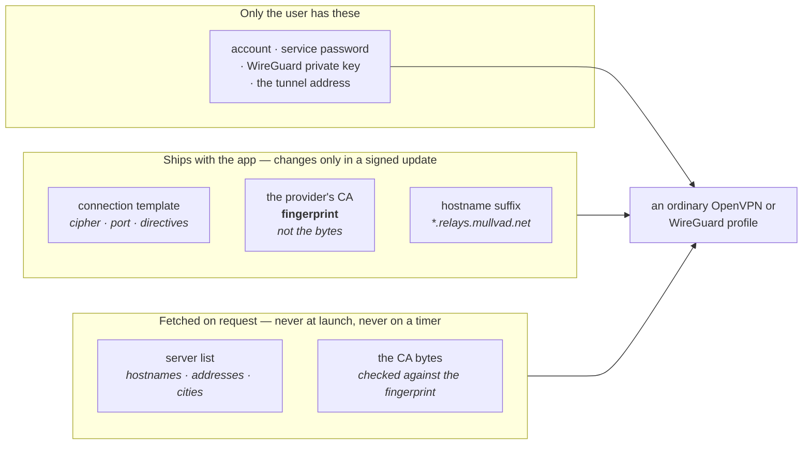
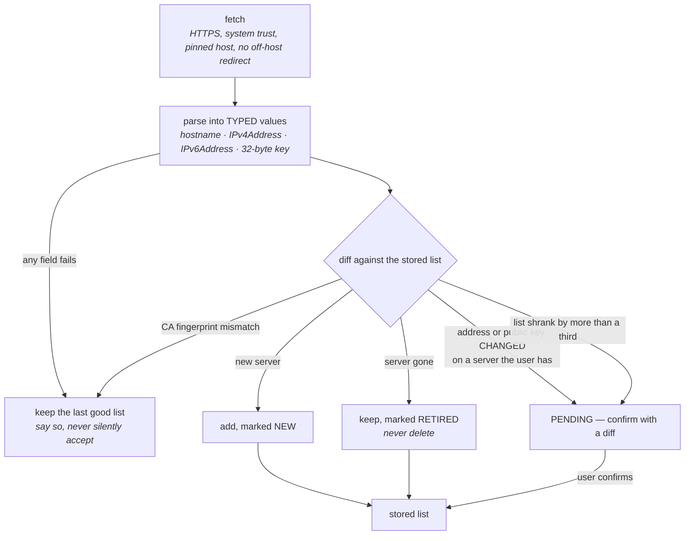

# Provider server lists

What SimpleVPN can honestly do with Mullvad's, NordVPN's, IPVanish's and Proton VPN's published
server lists — and, more importantly, what it cannot.

**Read the status markers.** Almost none of this is built. A document that blurred designed and
built would be worse than none, because the untrue half is exactly the part someone would rely on.

- ✅ **BUILT** — in `main`, tested.
- 📐 **DESIGNED** — decided, with reasoning, not implemented.
- ❓ **OPEN** — needs a decision, a spike, or an answer from a vendor before it can be built.

Every claim marked *verified* below was fetched live on **2026-08-07** and the exact URL and result
are given, so a reader can re-run it. Everything I could not reach is marked ❓ with what was tried.
`WebSearch` was unavailable for this work, so the coverage is "what these four hosts answered",
not "what the internet says".

Naming follows `ONTOLOGY.md` — see §7, which had to be written *before* any of this, because the
first thing this feature gets wrong is its own name.

---

## 1. The one-paragraph version

A VPN provider publishes two things: **one connection template** (cipher, port, CA, the standard
directives — the same for every server) and **a list of servers** (a few thousand hostnames). The
template is what you already have if you have ever connected; the list is what changes. So the
feature worth building is not "download a working VPN from Mullvad" — it is **"fill in this
profile's server list from the provider's own published list, so you do not type forty hostnames"**.
It saves typing. It does not sign anyone in, and the UI must never suggest otherwise.



**The split is the security design, not a convenience.** Everything integrity-critical — the CA, the
cipher, `verify-x509-name`, the directive set — ships inside the app and therefore inside a
Sparkle-signed update. The fetched part carries hostnames, IP literals, place names and (for
WireGuard) peer public keys, and nothing else. A fetched payload can never introduce a directive,
because it is never treated as text (§4).

---

## 2. What each provider can and cannot give us

This is the table the whole feature turns on. **"You must still supply" is the column that decides
whether the feature is honest.**

| Provider | List reachable without an account? | Protocols we could use | A template? | You must still supply | Verdict |
|---|---|---|---|---|---|
| **Mullvad** | ✅ yes — public JSON, no auth | **WireGuard only** | we write it (their published one needs an account) | account, **private key**, **tunnel address** | 📐 build first |
| **IPVanish** | ✅ yes — open directory | **OpenVPN only** | ✅ they publish a real one | account username + password | 📐 designed, blocked on terms (§6) |
| **NordVPN** | ✅ yes — public JSON + CDN | **OpenVPN** (WireGuard needs an account) | derivable, not published as such | **service credentials** (not the NordAccount login) | 📐 designed, terms unread ❓ |
| **Proton VPN** | ❌ **no** — account token required | — | — | — | ❌ **not supported** |

### Mullvad ✅ verified

`GET https://api.mullvad.net/www/relays/all/` → **200**, no authentication, 300,032 bytes of JSON.
`.../relays/wireguard/` is the same shape. `.../relays/openvpn/` → **404**.

The live payload contains **580 relays: 567 `type: "wireguard"` and 13 `type: "bridge"`. Zero
OpenVPN.** 50 countries, 91 cities, 25 flagged inactive, 120 `owned: true`. That is not an inference
from a blog post — it is what the endpoint returned, and the 404 on the OpenVPN path agrees with it.
**Mullvad is a WireGuard-only provider now**, and any design that offers a Mullvad `.ovpn` is wrong.

Fields present: `hostname`, `country_code`, `country_name`, `city_code`, `city_name`, `fqdn`,
`active`, `owned`, `provider`, `ipv4_addr_in`, `ipv6_addr_in`, `network_port_speed`, `stboot`,
`type`, `status_messages`, `pubkey`, `multihop_port`, `socks_name`, `socks_port`, `daita`, and on
bridge rows `ipv4_v2ray`, `ssh_fingerprint_md5`, `ssh_fingerprint_sha256`.

**Every relay has its own peer public key.** That is the single most consequential fact in this
document for the data model: a Mullvad server list is not a list of addresses sharing one peer, it
is a list of *(address, public key)* pairs, and `VPNEndpoint` has nowhere to put the second half
today (§5).

**What Mullvad cannot give us, and it is the whole gap.** A WireGuard tunnel needs a private key and
a tunnel `Address`, and Mullvad assigns the address when a public key is registered against an
account. Neither is in the list and neither can be without account integration, which is out of
scope. So the user's path is:

1. Sign in at `mullvad.net`, generate a WireGuard configuration, download the `.conf`.
2. Import it into SimpleVPN — **this already works** (`Docs/SecretsAndSync.md` §2).
3. *Then* fill the server list from the public list: one endpoint becomes 567.

Step 3 is the feature. Steps 1–2 are the user's, and the UI says so before it fetches anything.

❓ **Unverified for Mullvad**: `api.mullvad.net/app/documentation/` returns 200 but is a JavaScript
shell with no readable content, so there is no vendor-documented contract for `/www/relays/all/` —
it is a URL that works, not a URL that is promised. The DNS address a Mullvad tunnel uses
(`10.64.0.1` is the widely-repeated value) was **not** verified here and must not be hard-coded on
my say-so; it arrives in the user's downloaded `.conf` anyway, which is the correct source.

### IPVanish ✅ verified, and it is the textbook case

`https://configs.ipvanish.com/configs/` is an **open directory index** (200, 2,085,461 bytes of
HTML). It lists `configs.zip` (1,283,217 bytes), `ca.ipvanish.com.crt`, `guideCRT.txt`, and one
`.ovpn` per server named `ipvanish-<CC>-<City>-<code>-<cNN>.ovpn`.

I downloaded and unpacked the zip: **3,577 entries — 3,576 `.ovpn` files and one CA certificate.**
Then I normalised every `.ovpn` by replacing `[A-Za-z0-9.-]+\.ipvanish\.com` with a placeholder and
hashed the result. **All 3,576 produce the same SHA-256.** There is exactly one template and 3,576
hostnames. This is precisely the shape the user remembered.

The template, in full (374 bytes, no inline certificate):

```
client
dev tun
proto udp
remote {{server}} 443
resolv-retry infinite
nobind
persist-key
persist-tun
persist-remote-ip
ca ca.ipvanish.com.crt
verify-x509-name {{server}} name
auth-user-pass
comp-lzo
verb 3
auth SHA256
cipher AES-256-CBC
keysize 256
tls-cipher TLS-DHE-RSA-WITH-AES-256-CBC-SHA:TLS-DHE-DSS-WITH-AES-256-CBC-SHA:TLS-RSA-WITH-AES-256-CBC-SHA
```

The CA is a separate self-signed `IPVanish CA` (O=IPVanish, OU=IPVanish VPN, Winter Park FL),
notBefore 2022-05-09, notAfter 2082-04-24, also served verbatim as `guideCRT.txt`.

The user must still supply their IPVanish username and password. Nothing else is missing — for
IPVanish this really is "a list plus a template plus your sign-in".

❓ **Unverified**: whether IPVanish publishes WireGuard configuration anywhere public. Nothing in
that directory is WireGuard, and I could not search. Treat IPVanish as OpenVPN-only until someone
with an account says otherwise.

⚠️ **IPVanish's terms bar us from redistributing this.** See §6 — it changes the design, not just
the paperwork.

### NordVPN ✅ verified, same shape, more work

`GET https://api.nordvpn.com/v1/servers?limit=1` → **200**, no authentication. A server object has
`id`, `created_at`, `updated_at`, `name`, `station`, `ipv6_station`, `hostname`, `load`, `status`,
`locations`, `services`, `technologies`, `groups`, `specifications`, `ips`.

The WireGuard peer key is real and reachable:

```json
{ "id": 35, "name": "Wireguard", "identifier": "wireguard_udp",
  "metadata": [ { "name": "public_key", "value": "V1WC7wt34kcSDyqPuUhN56NJ0v+GlqY9TwZR5WlzzB4=" } ] }
```

and `?filters[servers_technologies][identifier]=wireguard_udp` works as a filter.

The OpenVPN configurations are on a CDN, one file per server:
`https://downloads.nordcdn.com/configs/files/ovpn_udp/servers/<host>.nordvpn.com.udp.ovpn` → 200,
2,925 bytes; the `ovpn_tcp` sibling likewise. The whole archive
`https://downloads.nordcdn.com/configs/archives/servers/ovpn.zip` is **86,070,317 bytes** — 86 MB,
because the CA and the TLS-auth key are inlined into every one of ~7,000 files.

**They are one template.** `us5063` and `uk2000` are byte-identical once IPv4 literals and
`*.nordvpn.com` hostnames are normalised, and their `<ca>` and `<tls-auth>` blocks hash identically
(`1c15d415…` and `9b659ffd…`). So Nord does not *publish* a template, but one is derivable and the
86 MB archive is 7,000 copies of the same 2.9 KB.

Two things make Nord more work than IPVanish:

- **`remote` is an IP literal, not a hostname**, with four ports (1231–1234), and the hostname
  appears separately as `verify-x509-name CN=<host>.nordvpn.com`. So substitution needs *two* values
  per server, and both come from the API (`station` and `hostname`). Substituting only one produces
  a configuration that either dials nowhere or fails the name check.
- **NordLynx (WireGuard) needs an account.** The peer key is public but the private key and tunnel
  address are issued by Nord's authenticated API, exactly as with Mullvad — and unlike Mullvad,
  Nord's client does that automatically rather than handing you a `.conf` to keep. ❓ *I could not
  verify that a Nord user can obtain a durable WireGuard configuration by hand at all.* Until
  someone with an account confirms it, **Nord is OpenVPN-only in this design.**

Nord's OpenVPN sign-in uses **service credentials** issued in the Nord dashboard, which are not the
NordAccount email and password. The UI must say that, because typing the account login and getting
an auth failure is the commonest Nord support question. ❓ Not verified this session — the terms page
was unreadable and I did not attempt an authenticated flow.

❓ **Unverified for Nord**: the terms (see §6), rate limits, and whether `api.nordvpn.com/v1` carries
any stability promise.

### Proton VPN ❌ verified as *not possible*, and this is a finding rather than a gap

Two hosts, both tried:

- `https://api.protonvpn.ch/vpn/logicals` → the TCP connection is **reset** (curl exit 35), through
  both `WebFetch` and `curl`. Unreachable from here for reasons I cannot distinguish from blocking.
- `https://api.protonmail.ch/vpn/logicals`, which *does* answer:
  - with no headers → **400** `{"Code":5002,"Error":"Missing x-pm-appversion header"}`
  - with a stale version → **422** `{"Code":5003,"Error":"This version of the app is no longer supported, please update to continue using the app"}`
  - with a current-looking version → **401** `{"Code":401,"Error":"Invalid access token"}`

So Proton's list sits behind **both** an app-version gate and an account token. Reaching it means
holding a Proton account token *and* impersonating an official Proton client — and Proton's terms
(read in full at `protonvpn.com/terms-and-conditions`) prohibit "*Accessing the Services through
automated means (including but not limited to bots, scripts, or similar technologies) in a manner
that is distinguishable from the standard client behavior of human users*", permitting automated
access only where "*the resulting traffic remains indistinguishable from the standard client
behavior of human users*". Spoofing a version string to read `logicals` is the thing that sentence
is about.

**Decision: SimpleVPN does not support Proton server lists.** What a Proton user gets instead is
what they already have — download the OpenVPN configuration from `account.protonvpn.com` and import
it, which works today. The Proton row in the provider picker exists and says exactly that, with the
reason, rather than being absent (`ConnectListing`'s rule: never hide a thing the user came looking
for; disable it and say why).

❓ **Unverified**: whether Proton publishes *any* unauthenticated list or generic template
elsewhere. The two API hosts above are all I could try.

### The finding the shape of the feature turns on

The coordinator asked whether it holds that "for most of these a bundle can only ever be a list of
servers to paste into a config you already have". **It holds, and the reason is uniform:** every one
of these providers ties the last mile to an account, and the account is out of scope. But the
*severity* differs, and lumping them together would hide the useful case:

| | What the list is worth |
|---|---|
| **IPVanish** | Nearly everything. Template + list + your username/password = a working VPN. |
| **NordVPN** | Nearly everything, for OpenVPN. Same as IPVanish once the two-value substitution is handled. |
| **Mullvad** | A lot, but strictly *after* you have imported one config. 1 endpoint → 567. |
| **Proton** | Nothing. Not reachable. |

So it is not "three of four are useless" — it is **"one of four is impossible, and the other three
are a genuine convenience that never becomes a sign-in"**.

---

## 3. Integrity 📐

A server list decides where the user's traffic goes. `Docs/SecretsAndSync.md` §4 worked out the
reasoning for synced configuration and every line of it applies: **encryption is not the problem —
substitution and rollback are.**

### The strongest control is free, and it is the ship/fetch split

Nothing security-determining is fetched. The cipher, the directives, `verify-x509-name`, the port
and the CA **fingerprint** all live in the app binary, so they change only in a Sparkle update,
which is already EdDSA-signed. The only integrity mechanism this feature has to invent is the one
covering hostnames, addresses and WireGuard peer keys.

### The asymmetry between OpenVPN and WireGuard, which is the crux

**For OpenVPN, the shipped CA does the work and a substituted list fails closed.** IPVanish's
template carries `ca ca.ipvanish.com.crt` and `verify-x509-name <server> name`; Nord's carries an
inline `<ca>` and `verify-x509-name CN=<host>`. An attacker who replaces a hostname or an IP in the
fetched list sends the client to a machine that cannot present a certificate chaining to the
provider's CA, and OpenVPN refuses. The list is *availability*-determining, not
*confidentiality*-determining.

**For WireGuard, nothing does.** There is no certificate. The peer public key **is** the
authentication, and it arrives in the same fetched payload as the address it authenticates. Swap
both together and the handshake succeeds against the attacker's server and every packet goes to
them. This is a complete traffic redirection with no error, no warning and no failure mode.

So the confirmation gate below is **mandatory for WireGuard providers and prudent for OpenVPN ones**,
and the design does not pretend the two are the same risk.

### The rules 📐



1. **Transport.** HTTPS only, the system trust store, and **never an option to disable verification**
   (unchanged policy). Additionally the host is a hard-coded constant per provider and a redirect to
   a different host is refused rather than followed. Certificate *pinning* beyond that is
   deliberately **not** done: pinning a commercial CA chain we do not control turns a routine
   rotation into a bricked feature, and the fetched payload is already constrained to fields that
   cannot hurt us (§4). ❓ Revisit if any of these providers starts publishing a signed artefact.

2. **Never silently accept.** A fetch that fails transport, fails to parse, yields zero servers, or
   fails the CA fingerprint check leaves the stored list **exactly as it was** and surfaces the
   failure. A stale list that works beats a fresh list that might not be the provider's.

3. **A change to a server the user has is pending, not applied.** If a server already in the user's
   list changes its address or — far worse — its WireGuard public key, the update is held and shown
   as a diff, in the same shape `Docs/SecretsAndSync.md` §4 requires for a changed CA or host key.
   The user confirms or keeps what they had.

4. **Removal is an attack too, and this is the rule most designs miss.** An attacker who can *shrink*
   your list to the one server they control has chosen your exit as surely as one who substitutes an
   address. So a server that vanishes from the provider's list is **marked retired and kept**, not
   deleted, and a list that lost more than a third of its servers is held pending confirmation
   whether or not the user had selected any of them.

5. **A new server is added quietly but stays marked** until it is used. The first time a server that
   arrived in a list update is selected, the row says when it appeared. Cheap, and it is the only
   defence WireGuard has against "the attacker added one very fast-looking server in your country".

6. **No signature, and we say so.** ❓ **I found no signed manifest for any of these lists.** Mullvad
   publishes signed *release artefacts* for its own app; I found nothing covering `/www/relays/all/`
   and cannot verify a negative. If Mullvad does sign it, verifying that signature is strictly better
   than everything above and should replace rule 1's host pinning as the primary control. **This is
   the single highest-value open question in the document.**

7. **Rollback is not solved, and pretending otherwise would be the dishonest part.** With no
   signature there is no monotonic counter to check, so a replayed older-but-genuine list is
   indistinguishable from a current one. What blunts it: rules 3–5 mean a replay that *removes*
   servers or *reverts* a key is held pending confirmation, which is the only shape of rollback that
   hurts. Recorded here rather than hidden.

8. **MDM can forbid the whole feature.** A managed Mac may not permit fetching lists at all, and
   `lockConfiguration` must also prevent an applied list from rewriting a managed profile's servers —
   the same deference `Docs/SecretsAndSync.md` §2 settled for inline key material.

---

## 4. Substitution is a security boundary 📐

**The template is trusted because we ship it. The list is untrusted because it arrived over the
network.** Everything about the parsing seam follows from that one sentence.

**Nothing from a fetched list is ever interpolated as text.** Every field is parsed into a typed
value and re-rendered from that value:

| Field | Parsed as | Rejected if |
|---|---|---|
| hostname | a validated DNS name | any character outside `[a-z0-9.-]`, a label >63 chars, total >253, leading/trailing `-` or `.`, **or it does not end in the provider's declared suffix** |
| IPv4 / IPv6 | `IPv4Address` / `IPv6Address` | it does not parse; the literal is re-serialised from the parsed value, never echoed |
| WireGuard peer key | 32 bytes | not exactly 44 base64 characters decoding to 32 bytes; re-encoded canonically |
| country / city code | two-letter and three-letter codes | anything else; the *display* name is used only as a label and is escaped, never placed in a config |
| port | `UInt16` | outside 1…65535 |

A list entry containing a newline therefore cannot inject an OpenVPN directive, because it never
reaches the rendered file as text — it fails the hostname validator first. The **declared suffix**
(`*.relays.mullvad.net`, `*.ipvanish.com`, `*.nordvpn.com`) is in the shipped template, so even a
fully compromised list cannot point the user at an unrelated domain.

**And the generated configuration goes through the existing import path**, not a private one. That
means `ConfigImport`'s refusal list — `ssh.strict-host-key: no`, `StrictHostKeyChecking=no`,
`--no-cert-check`, `tlsSkipVerify` and the rest — polices provider templates exactly as it polices a
file a user opens. There must not be a second notion of "is this configuration safe", for the same
reason `ConnectListing` exists: a second answer is a divergent answer.

**The CA is fetched but fingerprint-pinned.** We ship the provider's CA **SHA-256 fingerprint** (a
fact about the world, unarguably ours to state) and fetch the bytes from the provider's own URL. A
mismatch refuses the whole update and tells the user the provider may have rotated its certificate
and an app update is needed. This is better than shipping the bytes on two counts: a CA rotation
becomes a loud failure rather than a silent mismatch, and we redistribute nothing (§6).

---

## 5. How it fits what already exists 📐

**There is no new tunnel concept and no "bundle profile" type.** A provider list produces an ordinary
OpenVPN or WireGuard profile with a populated server list. That is the whole of it.

### The server list feeds `SimpleVPN/Geo/`, not a parallel list

`VPNEndpointList` (`SimpleVPN/Geo/VPNEndpoints.swift`) already holds what the Servers table shows,
ranks, probes and reorders. Two constraints in it shape the design:

- **The stored blob holds only what the user AUTHORED** — labels, corrected countries, manual order.
  Addresses are re-read from the configuration every time, so re-importing picks up new servers.
  Three thousand provider hostnames must therefore **not** be written into that blob, and must not
  be written into `providerConfiguration` either.
- **`userAdded` means "the user typed this in".** A provider-supplied server is a third provenance
  and must not borrow that flag, or a list refresh will look like the user's own work and survive
  when it should not.

📐 So: the fetched list is a **per-provider cache** (application support, not
`providerConfiguration`) which `EndpointDiscovery` reads as an additional source of `Endpoint`s
alongside the configuration scan, while the user's annotations stay exactly where they are today.
Provenance becomes three-valued — *from the configuration*, *from a provider list*, *typed by the
user* — and the Servers table shows which, because "where did this server come from" is the question
a person asks when one of them behaves oddly.

📐 **`VPNEndpoint` needs somewhere to put a peer public key.** Mullvad's 567 relays each have their
own, so a WireGuard endpoint list is a list of *(address, key)* pairs. The blob's hand-written
decoder already tolerates unknown fields, so adding one is backward-compatible in both directions,
but it must be added deliberately: a WireGuard profile whose selected server changes must change its
peer key at the same instant, and getting that wrong is a silent failure to connect at best.

📐 **Do not add three thousand rows to anybody's Servers table.** Adding servers from a provider asks
which countries or cities first. A 3,576-row table is not a feature; it is the feature failing.

### Readiness uses `ConnectListing`, not a new mechanism

A profile created from a provider list has servers and no sign-in. That is exactly what
`ConnectListing` and `SubprocessTunnelReadiness` exist for: **list it, disable Connect, say what is
missing, and link to the place that fixes it.** For a Nord profile the reason names *service
credentials* specifically; for Mullvad it names the missing private key and tunnel address and says
where to get them. No bundle ever looks ready when it is not, and there is no second notion of
"configured".

### Portability

A provider-derived profile is an ordinary profile, so `SimpleVPN/Portability/` round-trips it with no
change. The exported file records *which provider* a profile's servers came from and *when the list
was fetched*, as plain metadata — enough for a reader to know the servers are not hand-typed. The
cached list itself is not exported: it is reconstructible, it is not the user's data, and shipping
someone else's server list inside our export file would reintroduce §6.

### Maturity

📐 A fourth table in `FeatureMaturityRegistry`, keyed by provider, same shape as `signInSources` and
with the same safe default (unlisted ⇒ `.untested`).

| Provider | Claim | Because |
|---|---|---|
| Mullvad | `.partlyVerified` | the live list has been fetched and every field the parser uses is proven against the real payload — but no tunnel has ever been raised to a relay chosen this way |
| NordVPN | `.untested` | the API and a CDN config have been read here; no Nord account exists on this machine |
| IPVanish | `.untested` | the directory and all 3,576 configs have been read here; no IPVanish account exists on this machine |
| Proton VPN | n/a | there is nothing to be confident about; the row states an absence |

All of them carry the Untested banner and the feedback link, because the user's friends use three of
the four and a report is the only thing that clears a row.

---

## 6. Redistribution 📐 / ❓

**Nothing is embedded. Every list is fetched on request.** That is not a technical preference; it is
where the terms landed, and it makes the feature smaller and safer, which is the outcome the brief
predicted.

| Provider | What their terms say | Verified? | Consequence |
|---|---|---|---|
| **IPVanish** | *"You may not copy or download any content from the IPVanish Services except with the prior written approval of IPVanish. Furthermore, without the prior written approval of IPVanish, you may not distribute, publicly perform or display, lease, sell, transmit, transfer, publish, edit, copy, create derivative works from, rent, sub-license, distribute, decompile, disassemble, reverse engineer or otherwise make unauthorized use of Site content or Services. Any commercial use is expressly prohibited."* | ✅ read in full at `ipvanish.com/tos/` (the `/terms/` path 404s) | **Must not embed.** An express bar on redistribution *and* on derivative works. A subscriber fetching the configs IPVanish publishes for subscribers is the ordinary use those files exist for; us shipping them is not. |
| **Mullvad** | **No clause at all** on redistribution, API reuse, server lists, trademarks or third-party clients. The only nearby line prohibits using the service *"to provide a service similar to that provided by Mullvad"* — i.e. no reselling VPN. | ✅ read in full at `mullvad.net/en/help/terms-service` | **Silence is not permission.** Do not embed. ❓ Worth writing to Mullvad and asking; they are the likeliest of the four to say yes in writing, and a written yes would let the Mullvad list ship embedded with a fetch to refresh. |
| **NordVPN** | ❓ **unread** — `nordvpn.com/terms-of-service/` returns **403** to us (Cloudflare). | ❌ | Treated as IPVanish is, by precaution. Do not embed. |
| **Proton VPN** | Prohibits automated access distinguishable from a normal client. | ✅ read in full | Moot — there is nothing reachable to redistribute. |

**What we ship is our own.** The shipped half of a provider entry is: a list of standard OpenVPN or
WireGuard directives, a hostname suffix, a URL, and a SHA-256 fingerprint. Directive lists are facts
about how to connect to a service, written by us; a fingerprint is a fact about a certificate. The
provider's *bytes* — their CA, their server list — are fetched from the provider, by the user, on
request. That is both the licence-safe answer and, as §4 argues, the better security answer.

❓ Also unresolved: whether using a provider's **name** in a picker needs anything (nominative use is
normally fine; none of these four has a trademark policy I could read). No provider logos, ever.

---

## 7. Naming 📐 — and why there is no word for "bundle"

`ONTOLOGY.md` must gain its row **before** any code uses these words. The proposed row, and the
reasoning, because the reasoning is the decision:

**There is no user-facing noun for "the thing you install".** The request called it a *service
bundle*, and the temptation is to make that a first-class object with a name — a bundle, a pack, a
preset, a profile template. Every one of those words promises completeness, and this feature can
never deliver completeness, because the last mile is an account we deliberately do not touch. A user
who reads "Mullvad bundle" and cannot connect has been misled by the noun before they reached the
error message.

So the vocabulary is:

| Concept | House term | Never |
|---|---|---|
| A company that sells VPN service and publishes its servers | **provider** | vendor (taken: password apps and tool authors), service, brand |
| The servers a provider publishes | **the provider's server list** — short form **server list** | relay list, node list, logicals, POPs, edges |
| The connection settings a provider uses for every server | **the provider's settings** (UI) / `template` (code only) | bundle, pack, preset, profile template |
| Adding servers from a provider | **"Add servers from a provider"** | install, subscribe, provision, sync |
| A server that came from a fetched list rather than from your configuration or your typing | **from *provider*'s list** | imported, synced, discovered |

**Banned as our label: "bundle", "service bundle", "pack", "preset".** Allowed only where a provider
uses the word for its own thing, in a `code` span or quotes (ONTOLOGY rule 2).

Two more copy rules that are really design rules:

- **The picker row states the gap before the fetch, not after.** Mullvad's row reads, in substance:
  *"567 WireGuard servers. You will still need a Mullvad account and a configuration downloaded from
  mullvad.net — SimpleVPN cannot sign you in."* If that sentence cannot be written truthfully for a
  provider, the provider does not get a row that does anything.
- **Proton's row exists and is disabled**, saying that Proton's server list needs an account
  SimpleVPN does not ask for, and pointing at "download your configuration from Proton and import
  it" — which works today. An absent row is indistinguishable from a bug.

---

## 8. Privacy 📐

**Off by default. No background refresh. No fetch at launch, on a timer, on opening a profile, or on
connecting.** Asking a provider for its server list tells that provider that someone at your address
is running this app, and roughly when. That is a lookup, and this repo's standing rule is that
lookups are opt-in, off by default, and requested only on an explicit action
(`Docs/SecretsAndSync.md`'s sibling rule; the shipped precedents are `LocationAuthority.enabledKey`,
default false, and the public-address lookup's Privacy section in Settings ▸ General).

Concretely 📐:

- **A refresh is a button, never a schedule.** The stored list carries its fetch date and the UI
  shows staleness as a caption, not as a reason to go and fetch.
- **The first fetch for a provider asks, and the sheet names the host** — `api.mullvad.net`,
  `api.nordvpn.com`, `configs.ipvanish.com` — says what the provider learns, and says what the app
  will *not* do (no account, no sign-in, nothing sent about you). One provider at a time: consenting
  to Mullvad is not consenting to Nord.
- **Prefer to refresh through the tunnel.** If a VPN to that provider is connected, the fetch goes
  out of the provider's own exit and they learn essentially nothing new — they are already carrying
  your traffic. If nothing is connected, the sheet says plainly that the provider will see your real
  address, and offers to wait until you next connect. This is the one place the feature can be
  meaningfully better than a browser, and it costs nothing.
- **An import setting cannot turn it on.** `ConfigAppSettings.Entry.importable = false`, the same
  treatment `app.location` already has, for the same reason: a file that could flip an opt-in would
  turn "opt in" into "opt in on somebody else's behalf".
- **MDM can forbid it outright** (§3 rule 8).

Two settings, both needing stable ids and `manual.html` anchors or `ManualAnchorParityTests` fails:

| id | Default | Copy |
|---|---|---|
| `app.provider-lists` | **off** | "Get server lists from VPN providers — Lets you fill in a VPN's server list from Mullvad's, NordVPN's or IPVanish's own published list. Nothing is fetched until you ask for it, and SimpleVPN never signs you in to a provider. Default: off." |
| `app.provider-lists-only-connected` | **on** | "Only refresh while connected — Waits until you are connected to that provider before asking it for its server list, so the request comes from the VPN rather than from your own address. Default: on." |

---

## 9. What is built ✅ and what is not 📐

**Nothing user-visible is built, and nothing fetches.** What landed is the pure core — the part that
is testable without a network and is where the security lives.

✅ **Built**, in `SimpleVPN/Providers/`:

- `VPNServiceProviders.swift` — the catalogue of four, with the ship/fetch split of §1 as its
  structure. `stillNeeded` is the honesty rule made into a field, and it is **test-enforced**: a
  provider either states what the user must still supply or states why it cannot be used, never
  neither, and its copy may not contain "bundle", "pack" or "preset" (§7) or promise a sign-in.
- `ProviderServerList.swift` — the §4 seam. `ProviderHostname` and `ProviderPeerKey` are types
  rather than validated strings, so "did anyone check this?" is answered by the compiler at every
  later use instead of by a comment.
- `ProviderListParsing.swift` — Mullvad, NordVPN and IPVanish, each reading a short allow-list of
  fields and dropping any row that fails, with every field name taken from a live payload rather
  than from documentation.
- `ProviderServerListDiff.swift` — rules 1–5 of §3, including *removal is an attack too* and the
  all-or-nothing confirmation gate.
- A fourth table in `FeatureMaturityRegistry` (§5), with Mullvad `.partlyVerified`, NordVPN and
  IPVanish `.untested`, and Proton absent because its row states an absence rather than a claim.

✅ **45 tests in 4 suites**, on real fixtures: a Mullvad relay and a Nord server copied verbatim out
of the 2026-08-07 payloads, and IPVanish's real directory index. Half of them are hostile — a
newline in a hostname, another domain in an `href`, a 31-byte peer key — and assert that the parsers
produce *nothing* rather than something slightly wrong.

**Two design corrections came out of writing those tests**, and both are worth recording because
they are the kind that would otherwise have shipped:

- **Case folding is per-field, not per-payload.** Lowercasing IPVanish's whole HTML index before
  parsing put `dubai` on a label a person reads. Hostnames and country codes are folded where they
  are built; the city name keeps its case because it is display text and never reaches a config file.
- **"Must carry a maturity claim" keys off *intent*, not off `canFetch`.** `canFetch` is
  additionally false while a CA fingerprint is unpinned, so keying the claim off it would have
  silently un-claimed NordVPN and IPVanish the moment somebody removed a pin — which is exactly the
  unclaimed-by-omission failure the registry exists to prevent.

📐 **Not built**, in the order to do it in:

1. **The fetch**, with rules 1–2 of §3 (transport, never-silently-accept) and the privacy sheet of
   §8. Small and provable, and useless without step 2.
2. **Wiring the confirmation gate to a real diff view.** The rules exist and are tested; the sheet
   that shows them does not. **Mullvad must not ship before this** — for WireGuard the gate is the
   only thing standing between a substituted peer key and a silent traffic redirection.
3. **Endpoint provenance and the peer-key field** in `SimpleVPN/Geo/` (§5). The one change with a
   migration story, which is why it is not first.
4. **The picker, the location filter, and the readiness reasons** via `ConnectListing`; the two
   settings of §8 with their `manual.html` anchors.
5. **The CA fingerprints** for NordVPN and IPVanish, which are what turns `canFetch` on for them.

Steps 1–2 are worth having whether or not the picker is ever built, which is the argument for that
order.

### The open questions, in the order they matter ❓

1. **Does Mullvad sign `/www/relays/all/`?** A signature replaces most of §3. Unanswerable without
   search; ask Mullvad directly.
2. **Will Mullvad grant written permission to embed the list?** Their terms are silent, which is not
   a yes. A yes turns "fetch on request" into "bundled and refreshed" for the one provider that
   matters most here.
3. **What do NordVPN's terms say?** Their terms page 403s us. Until somebody reads it, Nord is
   fetch-only by precaution.
4. **Can a NordVPN user obtain a durable WireGuard configuration by hand?** If not, Nord is
   permanently OpenVPN-only in SimpleVPN and the design is simpler.
5. **Does IPVanish publish WireGuard configuration anywhere public?** Nothing in their configs
   directory is WireGuard.
6. **Are Nord's service credentials really distinct from the NordAccount login?** Believed yes;
   not verified. It changes one sentence of readiness copy and it is the sentence a Nord user needs.
7. **Does Proton publish anything unauthenticated?** Two hosts tried, both gated.
8. **Is `10.64.0.1` Mullvad's tunnel DNS?** Widely repeated, not verified here, and deliberately not
   hard-coded — it arrives in the user's own downloaded configuration.
9. **Do these APIs carry any stability promise?** None found for any of the four.
